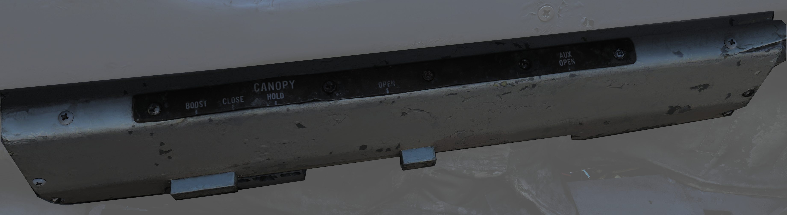

## Canopy Control Handle

The canopy control handle controls canopy operation and is located on the right cockpit wall. The handle is mounted downwards beneath the box containing the handle mechanism and the handle position texts. The canopy control handle is duplicated in the RIO cockpit.

| No. | Control | Function                                                                                               |
|-----|---------|--------------------------------------------------------------------------------------------------------|
| 1   | BOOST   | Closes the canopy using boost, used during cold weather or with a strong headwind.                      |
| 2   | CLOSE   | Closes the canopy, default position during flight.                                                     |
| 3   | HOLD    | Holds the canopy at the current position for any position other than closed.                           |
| 4   | OPEN    | Opens the canopy.                                                                                      |
| 5   | AUX OPEN| Allows manual opening of the canopy if system pressure is too low.                                      |