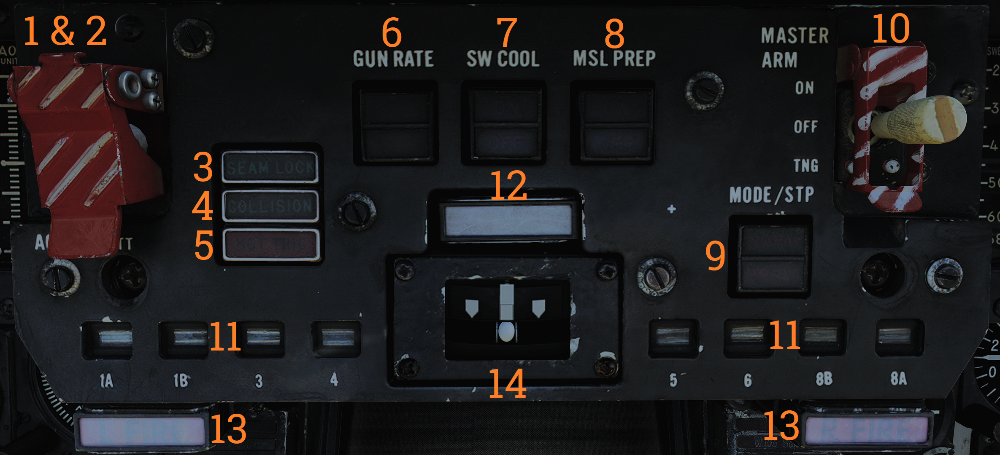
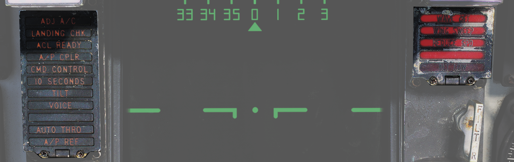
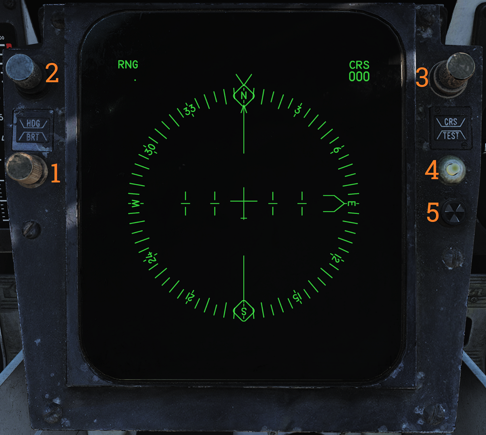
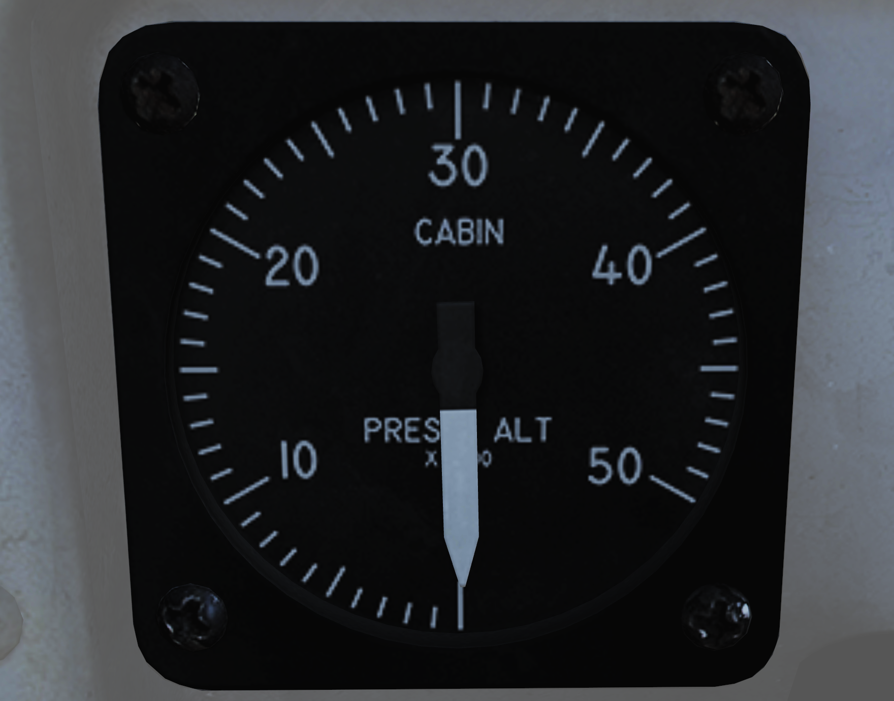
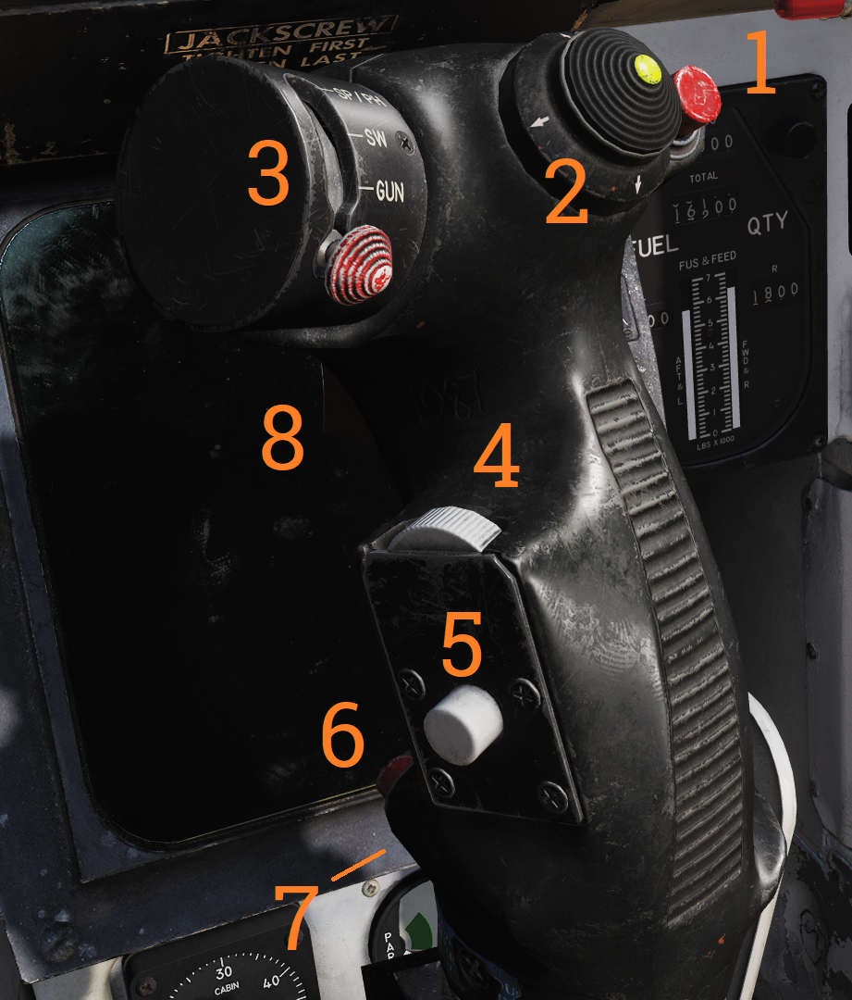

# Center Panel

### Heads-Up Display

Projects flight and weapons data onto the forward section of the canopy/windscreen. Night mode can be selected using the control on the right side of the VDI.

Has two engine stall warning lights (L STALL & R STALL) mounted on the left and right sides, respectively. They indicate the presence of an engine stall condition in their respective engine.

**Note:** For more information see relevant chapters under Navigation and Weapons and Weapons Employment Overview.

### Cockpit Television Sensor (CTVS)

The cockpit television sensor (CTVS) records the HUD for registration of weapons delivery.

**Note:** Not implemented in DCS.

### Air Combat Maneuver Panel

Main pilot armament control panel.

| No. | Control/Indicator      | Function                                                                                     |
|-----|------------------------|----------------------------------------------------------------------------------------------|
| 1   | ACM switch/cover       | Lifting the ACM (Air combat maneuver) cover activates the ACM mode and allows access to the ACM jettison button. |
| 2   | ACM JETT button        | Button under the ACM cover that enables jettison of stores selected on the RIO’s ARMAMENT panel. Will not jettison Sidewinders regardless if selected. |
| 3   | SEAM LOCK light        | Light that illuminates to show that Sidewinder acquisition is in progress while in slaved and boresight SEAM modes. Lights up during the 4.5 second SEAM acquisition attempt and remains lit thereafter if the seeker has locked onto a target. |
| 4   | COLLISION light        | Light that illuminates to show that collision steering has been selected during AWG-9 STT operation. |
| 5   | HOT TRIG light         | Red light that indicates that the HOT TRIGGER conditions are met. When this is lit, the trigger will release a weapon. |
| 6   | GUN RATE switch        | Toggle switch with light indication of selected option. HIGH - Selects gun rate of 6,000 rounds per minute. Normally for A/A operation. LOW - Selects gun rate of 4,000 rounds per minute. Normally for A/G operation. Automatically set to HIGH when ACM mode is selected. |
| 7   | SW COOL switch         | Toggle switch with light indication of selected option. Manual control of Sidewinder seeker cooling. Automatically set to ON when ACM mode is selected. |
| 8   | MSL PREP switch        | Toggle switch with light indication of selected option. Commands WCS to prepare AIM-54 and AIM-7 missiles. Automatically set to ON when ACM mode is commanded. |
| 9   | MSL MODE switch        | Toggle switch with light indication of selected option. Selects NORM (normal) or BRSIT (boresight) operation for missile launch. Controlled by WCS when in ACM mode. |
| 10  | MASTER ARM switch      | Enables weapons release and selective and auxiliary jettison. OFF - Disables electrical power to release circuitry. ON - Enables electrical power to release circuitry. Position locked until the master arm cover is lifted. TNG (training) - Enables the in-flight training mode. |
| 11  | Station status flags   | Shows indication of weapon status for the different stations. BLACK - Station not loaded or weapon not ready. WHITE - Station and weapon ready. CHECKERBOARD - Weapon is selected and ready for launch. On the ground indicates that fuselage rails are up and locked and that loaded weapons are armed. |
| 12  | MASTER CAUTION light and button | Flashes to indicate status change on the pilot caution/advisory panel. Press to reset and turn off light until the next event. |
| 13  | L FIRE and R FIRE lights | Engine fire warning lights. Illuminates when a fire has been detected in the respective engine. |
| 14  | Turn-and-Slip indicator | Indicator showing rate of turn around the aircraft vertical axis. The upper part contains an electrically driven pointer, one needle deflection equaling a 360° turn in 4 minutes. The lower part contains an inclinometer with a ball suspended in a dampening fluid. |

### Vertical Display Indicator (VDI)

Display that complements the HUD in displaying flight and weapons data.

| No. | Control/Indicator       | Function                                                                                      |
|-----|-------------------------|-----------------------------------------------------------------------------------------------|
| 1   | HUD BRT control         | Controls HUD brightness.                                                                      |
| 2   | VDI BRT control         | Controls VDI brightness.                                                                      |
| 3   | VDI CONT control        | Controls VDI contrast.                                                                        |
| 4   | FILTER handle           | When pulled inserts filter for HUD night operation.                                           |
| 5   | HUD TRIM control        | Allows adjustment/trim of pitch lines on HUD.                                                 |
| 6   | VDI TRIM control        | Allows adjustment/trim of pitch lines on VDI.                                                 |
| 7   | VDI caution lights      | VDI-mounted caution lights. See images and tables below.                                      |

Data link warning and caution lights situated at the VDI panel.

| No. | Indicator      | Function                                                                                           |
|-----|----------------|----------------------------------------------------------------------------------------------------|
| 1   | ADJ A/C        | Advisory light indicating other aircraft close to own traffic pattern.                             |
| 2   | LANDING CHK    | Advisory light indicating carrier has a channel ready for ACL and that the crew should prepare for carrier landing. |
| 3   | ACL READY      | Warning light indicating CATCC has acquired the aircraft and is transmitting glidepath information to the aircraft. |
| 4   | A/P CPLR       | Warning light indicating CATCC is ready to control the aircraft.                                   |
| 5   | CMD CONTROL    | Warning light indicating the aircraft is under data link control for landing.                      |
| 6   | 10 SECONDS     | Warning light indicating that carrier motion is added to data link info and commands during landing. Indicates 10 seconds to arrival at the next point in approach pattern in other modes. |
| 7   | TILT           | Warning light indicating no data link command received for the last 2 seconds during ACL. When not in ACL, it indicates no data link messages during the last 10 seconds. |
| 8   | VOICE          | Warning light indicating CATCC not ready for ACL, switch to standard voice procedures.             |
| 9   | A/P REF        | Warning light indicating autopilot selected but not engaged. Exception: altitude and heading hold.  |
| 10  | WAVEOFF        | Warning light indicating waveoff commanded.                                                        |
| 11  | WING SWEEP     | Warning light indicating failure in both wing-sweep channels or disengagement of spider detent.    |
| 12  | REDUCE SPEED   | Warning light indicating flap retraction failure with greater than 225 knots indicated airspeed. Also indicates safe Mach number exceeded. |
| 13  | ALT LOW        | Non-functional, light on radar altimeter is used instead.                                           |

### Horizontal Situation Display Indicator (HSD)

The horizontal situation display is used to display navigational information to the pilot. It can also be used to repeat the RIO’s TID to the pilot.

| No. | Control/Indicator        | Function                                                                                      |
|-----|--------------------------|-----------------------------------------------------------------------------------------------|
| 1   | BRT control              | Controls HSD brightness.                                                                      |
| 2   | HDG control              | Controls heading reference bug in TACAN mode.                                                 |
| 3   | CRS control              | Controls desired course in MAN (manual) and TACAN mode.                                       |
| 4   | TEST button              | Allows reset of the HSD to re-enable display if the overload protection is tripped. Also displays the HSD IR field test display on the HSD. |
| 5   | BIT indicator            | Indicates failure in HSD by showing white flags. Reset by rotating it clockwise.              |

**Note:** For more information see relevant chapters under Navigation and for the TID repeat Tactical Information Display (TID) and Associated Controls.

### Cabin Pressure Altimeter

Displays cabin pressure in 1,000-foot increments from 0 to 50,000 feet.

### Emergency Brake Pressure Indicator

Displays hydraulic pressure available from the emergency brake accumulators to the auxiliary and parking wheel brake systems.

| No. | Indicator       | Function                                                                                     |
|-----|-----------------|----------------------------------------------------------------------------------------------|
| 1   | PARK            | Shows brake pressure available for parking brakes. Green segment indicates 2,150 to 3,000 psi, red indicates 1,900 to 2,150 psi. When green there is pressure enough for approximately 3 applications. |
| 2   | AUX             | Shows brake pressure in the auxiliary brake pressure which can be used via the toe brakes on the pedals. Green segment indicates 2,150 to 3,000 psi (approximately 13 to 14 applications) while red indicates 1,900 to 2,150 psi (approximately 5 applications). |

### Control Stick

Used to control aircraft roll and pitch. Also various other functions according to table below.

| No. | Control                       | Function                                                                                     |
|-----|-------------------------------|----------------------------------------------------------------------------------------------|
| 1   | Bomb release button           | Stores release button, used for air-to-ground ordnance (except rockets) and loaded external countermeasures. |
| 2   | Pitch and roll trim hat       | Hat used to control trim, up/down trims pitch and left/right trims roll.                      |
| 3   | Weapon select hat             | Selector hat moveable up and down and depressable. SP or PH - Selects AIM-7 or AIM-54, depression toggles between types. SW - Selects AIM-9, depression toggles between stations. GUN - Selects M-61A1 Vulcan gun. OFF - Inhibits weapon release. |
| 4   | DLC & maneuver flap command wheel | Thumbwheel used to control DLC or maneuver flaps. With DLC engaged forward rotation extends spoilers and aft rotation retracts spoilers. With flaps up and DLC disengaged forward rotation retracts maneuvering flaps/slats and aft rotation extends them. The logic behind the function being that pulling the wheel towards you increases lift and pushing it away decreases lift. |
| 5   | DLC engage/disengage & countermeasure dispense button | Momentary depression with flaps down, throttles less than MIL and no spoiler system failure engages DLC. With flaps up button sends command to ALE-39 to dispense chaff or flares according to RIO setting. DLC is disengaged by further momentary depression of the button, raising flaps, or advancing either throttle to MIL. |
| 6   | Autopilot reference & nosewheel steering button | Button toggling nosewheel steering with weight on wheels. Without weight on wheels is used to engage enabled autopilot modes. |
| 7   | Autopilot emergency disengage paddle | Disengages all autopilot modes and DLC and releases all autopilot switches and roll and pitch SAS switches to OFF position. With weight on wheels additionally reverts throttle mode to MAN (manual) while depressed. |
| 8   | Weapon firing trigger         | Two-stage trigger. First detent enables CTVS and gun camera. Second detent releases selected forwards firing weapon. |

**Note:** CTVS not implemented in DCS.
