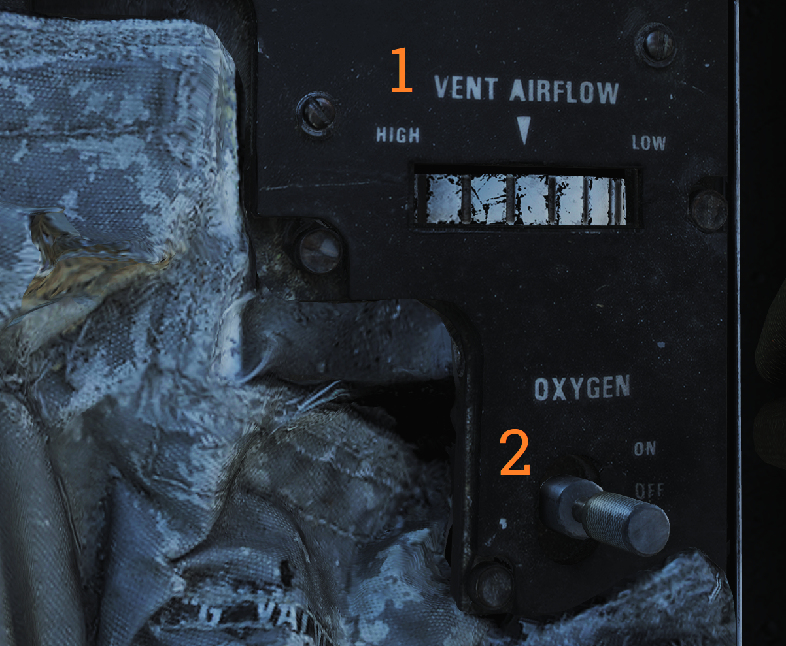
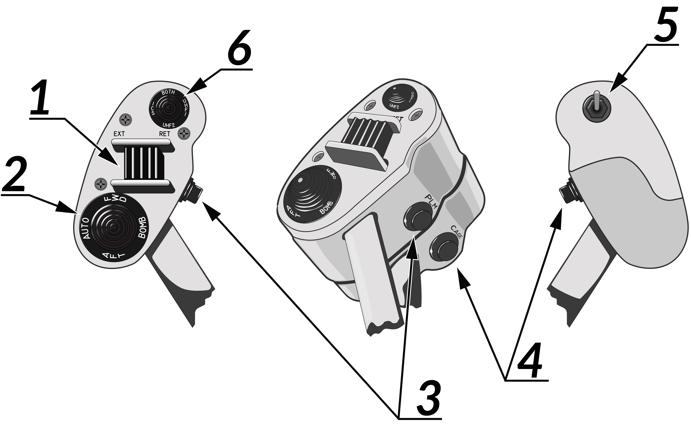

# Left Side Console

## G-valve Button

Pressed to test inflation of g-suit.

## Oxygen-Vent Airflow Control Panel

Controls ventilation airflow to pressure suit or seat cushions and oxygen to pilot mask.

| No. | Control            | Function                                                                                    |
|-----|--------------------|---------------------------------------------------------------------------------------------|
| 1   | VENT AIRFLOW dial  | Used to control airflow through the pressure suit or seat cushions if no pressure suit is worn. |
| 2   | OXYGEN switch      | Switch with ON/OFF positions. Controls oxygen flow to the mask.                              |

## Volume/TACAN Command Panel

Panel controlling volume to Pilot headset and crewmember in control of TACAN.

| No. | Control/Indicator | Function                                                                                       |
|-----|-------------------|------------------------------------------------------------------------------------------------|
| 1   | ALR-67 knob       | Controls audio volume from the ALR-67 to the pilot.                                             |
| 2   | SW knob           | Controls volume of Sidewinder audio tone to the pilot.                                          |
| 3   | V/UHF 2 knob      | Controls volume of audio from AN/ARC-182 to the pilot.                                          |
| 4   | TACAN CMD switch  | Sets crewmember in command of the TACAN. Also indicates current setting.                        |

## TACAN Control Panel

TACAN control panel letting the pilot control TACAN if in command of it.

| No. | Control/Indicator | Function                                                                    |
|-----|-------------------|-----------------------------------------------------------------------------|
| 1   | Dual rotary switch| Outer dial selects first two digits and inner dial selects last digit for TACAN channel selection. |
| 2   | GO & NO-GO lights | Lights indicating result of TACAN BIT.                                      |
| 3   | BIT button        | Button initiating TACAN BIT.                                                |
| 4   | MODE switches     | Switches mode for TACAN operation and selects X or Y channels. INVERSE mode not functional. |
| 5   | VOL knob          | Volume control knob for TACAN audio to the pilot.                           |
| 6   | Mode knob         | Selects TACAN mode (OFF, REC, T/R, A/A, BCN).                               |

## ICS Control Panel

Control panel for ICS.

| No. | Control                    | Function                                                                                                 |
|-----|----------------------------|----------------------------------------------------------------------------------------------------------|
| 1   | VOL knob                   | Volume control knob for intercommunication audio from the RIO to the pilot.                              |
| 2   | Amplifier selection knob   | Knob selecting which amplifier to use for pilot’s headset audio.                                         |
| 3   | ICS switch                 | Selects ICS function. RADIO OVERRIDE - Makes ICS audio override radio audio. HOT MIC - Allows talking to the RIO without pressing the PTT. COLD MIC - Allows talking to the RIO only while the PTT is pressed. |

## AFCS Control Panel

Control panel for AFCS and autopilot.

| No. | Control               | Function                                                                                           |
|-----|-----------------------|----------------------------------------------------------------------------------------------------|
| 1   | PITCH switch          | Enables pitch stability augmentation.                                                              |
| 2   | ROLL switch           | Enables roll stability augmentation.                                                               |
| 3   | YAW switch            | Enables yaw stability augmentation.                                                                |
| 4   | VEC/PCD/ACL switch    | Switch controlling the remote control modes of autopilot.                                          |
| 5   | ALT switch            | ON/OFF switch, enables altitude hold. Engaged by NWS button on pilot stick.                        |
| 6   | HDG switch            | Selects HDG hold mode.                                                                             |
| 7   | ENGAGE switch         | ENGAGE/OFF. Engages autopilot. Note: All switches are spring-loaded to OFF position but held in position with solenoid to enable automatic disengagement when applicable. |

## UHF 1 (AN/ARC-159) Radio

UHF radio 1. Radio and controls.

| No. | Control/Indicator        | Function                                                                                         |
|-----|--------------------------|--------------------------------------------------------------------------------------------------|
| 1   | VOL knob                 | Controls volume of UHF 1 audio to pilot headset.                                                 |
| 2   | SQL switch               | ON/OFF switch enabling squelch.                                                                  |
| 3   | Frequency select switches| Toggle switches selecting set frequency.                                                         |
| 4   | FREQ/(CHAN) display      | Readout display showing selected frequency or channel.                                           |
| 5   | READ button              | Button toggling display of selected channel while held.                                          |
| 6   | BRT knob                 | Knob controlling display brightness.                                                             |
| 7   | LOAD button              | Button toggling load of set frequency to set channel.                                            |
| 8   | Function selector knob   | Selector knob selecting radio function (ADF, BOTH, MAIN, OFF).                                   |
| 9   | CHAN SEL knob            | Selects preset channel to use. Preset channels chart used to record frequencies or use for preset channels. |
| 10  | Mode selector knob       | Knob selecting radio frequency select mode.                                                      |
| 11  | TONE button              | Transmits a TONE on current frequency.                                                           |

## ASYM Limiter/Engine Mode Select (F-14B only)

Control panel for the asymmetric thrust limiter system and the control mode of each engine.

| No. | Control                   | Function                                                                         |
|-----|---------------------------|----------------------------------------------------------------------------------|
| 1   | ASYM LIMITER switch       | ON/OFF switch enabling afterburner thrust asymmetry limiter.                     |
| 2   | ENG MODE SELECT switches  | Switches selecting engine mode for their respective engine (PRI, SEC).            |

## Target Designate Switch

Used to designate ground targets on the HUD and to control pilot ACM radar modes except PLM. Can be moved up/down and forward which is the designate position.

## Inlet Ramps/Throttle Control Panel

Control panel for various engine systems, throttle settings and rudder trim.

| No. | Control                 | Function                                                                                        |
|-----|-------------------------|-------------------------------------------------------------------------------------------------|
| 1   | THROTTLE MODE           | Switch selecting throttle operation mode (AUTO, BOOST, MAN).                                    |
| 2   | THROTTLE TEMP           | Switch selecting throttle computer gain (HOT, NORM, COLD).                                       |
| 3   | INLET RAMPS             | Switches selecting operational modes for respective engine inlet ramps (STOW, AUTO).             |
| 4   | ENG CRANK               | Selector switch selecting engine crank for either left or right engine.                         |
| 5   | BACK UP IGNITION        | Switch toggling engine backup ignition ON or OFF.                                               |
| 6   | RUDDER TRIM             | Switch adjusting rudder trim.                                                                   |

## Throttle

The throttle grips contains various flight controls and HOTAS functions.

| No. | Control                 | Function                                                                                        |
|-----|-------------------------|-------------------------------------------------------------------------------------------------|
| 1   | Speed brake switch      | Switch controlling extension of the speed brake.                                                |
| 2   | Wing-sweep switch       | Switch controlling wing-sweep function. Manual mode only allows positions aft of CADC set position. |
| 3   | PLM button              | Button used to command pilot lockon mode of AWG-9. Also used to disengage autopilot while in ACL. |
| 4   | CAGE/SEAM button        | Button used to command CAGE/SEAM to AIM-9 initiating lockon. Also used to disengage APC when in use. |
| 5   | Exterior light switch   | Switch used to control exterior lights.                                                          |
| 6   | ICS PTT switch          | Switch allowing pilot to key one or both radios and intercommunication to RIO.                  |

## Throttle Quadrant
 
The main throttle quadrant contains the two main-engine throttle controls, the flap lever and manual wing-sweep handle in addition to the HOTAS controls on the throttles themselves.

## Hydraulic Hand Pump
The hydraulic hand pump is located inboards of the throttle quadrant, near the pilot’s left leg. It is used to manually add hydraulic pressure for brake operation (with gear handle in the down position) or for refueling probe operation in case of a failure in the hydraulic system.
