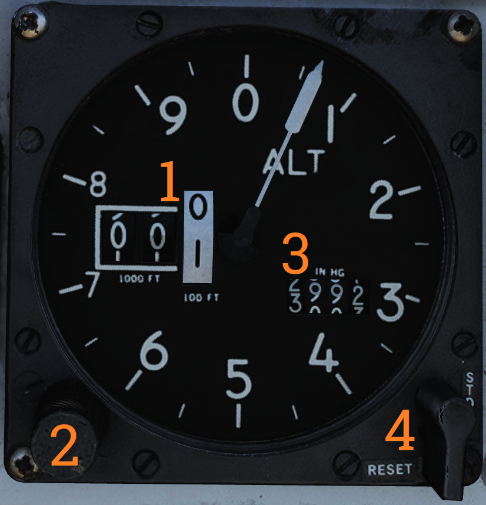
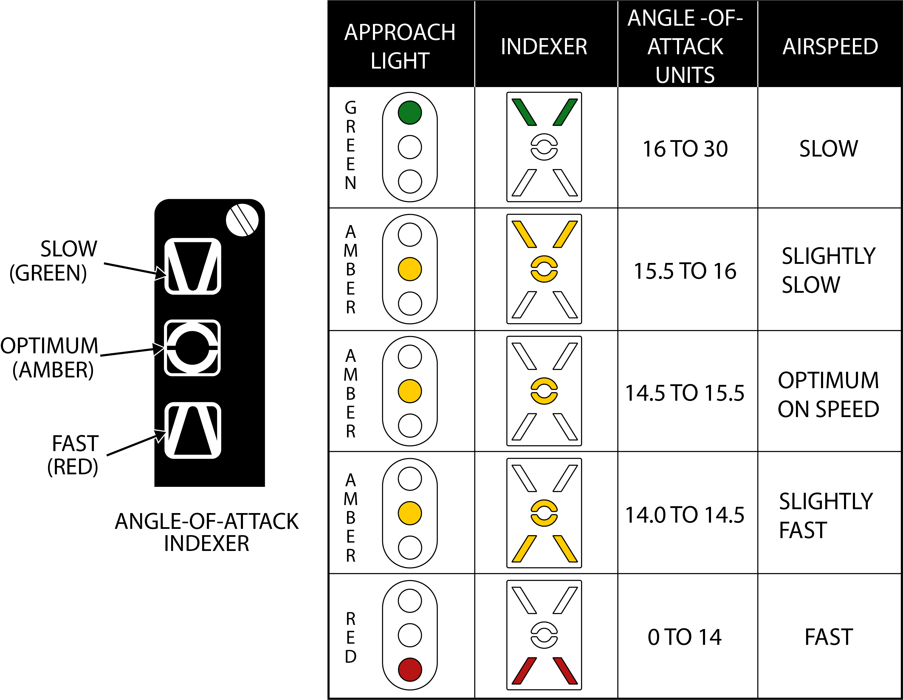
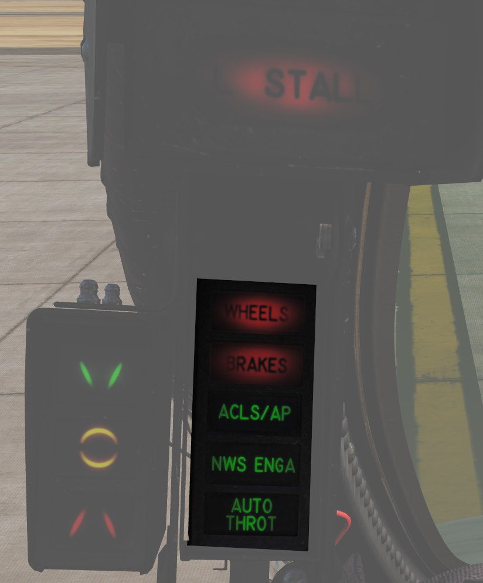

# Left Knee Panel

### Hydraulic Pressure Indicator

Shows hydraulic pressure of the combined and flight hydraulic systems. The SPOIL (Spoiler) ON/OFF-flag indicates pressurization of the outboard spoiler module. EMER FLT HI ON/OFF-flags indicate backup flight hydraulic system pressures when HI or LOW is selected respectively.

### Oil Pressure Indicator

Displays oil pressure for each engine. Range is 0 - 100 psi, normal range is 25 - 65 psi, varying with engine rpm.

### Exhaust Nozzle Position Indicator

Displays position of engine nozzles. Range 0 – 5 with 5 being fully open.

### Electronic Instrument Group

Displays engine RPM (High-pressure compressor rotor speed (N2)), EGT (Exhaust Gas Temperature) and FF (Fuel Flow) for respective engine.

> **💡 Note:** Image shows TF-30 engine instruments, F110 EIG coming soon.

> **💡 Note 2:** FF is not indicated for the additional fuel used in afterburner.

### Radar Altimeter

| No. | Control/Indicator                | Function |
|-----|----------------------------------|----------|
| 1   | Radar altimeter control knob     | Fully counterclockwise position turns the altimeter off. Rotation clockwise sets the altitude warning level, increasing clockwise. Depressing the knob starts the altimeter BIT. |
| 2   | OFF flag                         | Shown if the system is off, power is off or the system loses ground lock. |
| 3   | Low altitude warning light       | Red light illuminated when below set altitude warning level. |
| 4   | Self-test light                  | Green light that should illuminate when the altimeter BIT is run. The readout should also display 100 feet +/- 10. |
| 5   | Low-altitude limit index         | Small triangular bug moving along outer edge, displays set altitude warning level. |

> **💡 Note:** Radio override does not disable low-altitude warning tone.

### Servopneumatic Altimeter

| No. | Control/Indicator                | Function |
|-----|----------------------------------|----------|
| 1   | Altimeter readout                | Displays altitude digitally on three drums showing 10 000, 1 000 and 100 of feet respectively. It also displays altitude on a pointer on a circular scale indicating 100’s of feet. |
| 2   | Baroset knob                     | Sets local pressure in inches of mercury (in.Hg). Only used locally on the altimeter readout, all other digital indicators (via CADC) uses a set 29.92 in.Hg value. |
| 3   | Mode switch                      | Three-position switch, springloaded to return from RESET. If power and altitude data from CADC is present, switch can be held in RESET for 3 seconds to allow normal (servoed) mode of operation. If set to STBY or power or CADC data is absent for more than 3 seconds system switches to backup (pressure) mode. |
| 4   | STBY flag                        | Red flag reading STBY that appears if system is in backup (stand-by) mode. |

> **💡 Note:** At high speeds and below 10,000 feet, due to pressure changes, errors in readout up to as much as 1,200 feet when transonic and up to as much as 4,000 feet when supersonic can occur.

### Airspeed Mach Indicator

| No. | Control/Indicator                | Function |
|-----|----------------------------------|----------|
| 1   | Airspeed dial                    | Shows indicated airspeed on three scales, two for indicated airspeed and one moving for Mach number. |
| 2   | Indicated airspeed scale (outer) | Readout for indicated airspeed up to 200 knots. |
| 3   | Indicated airspeed scale (inner) | Readout for indicated airspeed from 200 knots to 850 knots. Covered by airspeed dial until relevant. |
| 4   | Mach number scale                | Readout for Mach number. Moved to show correct Mach number relative indicated airspeed. |
| 5   | Indicated airspeed index pointer | Can be set to desired indicated airspeed. |
| 6   | Mach number index pointer        | Can be set to desired Mach number. Not visible in image. |
| 7   | Safe Mach number index pointer   | Shows safe Mach number calculated by the CADC. Not visible in image. |
| 8   | Index knob                       | Knob with a pull-out and push-in position. One sets indexer for indicated airspeed and the other for Mach number. |

### Vertical Velocity Indicator

Shows vertical velocity in thousands of feet. Can show erroneous readings if sudden or abrupt changes of attitude occur because of the changing airflow over the static probe.

### Left Engine Fuel Shutoff Handle

Pull to shut off fuel to the left engine in case of emergency. Push in to re-enable fuel-flow to the engine. Should not be used to secure the engine.

Left engine fire extinguishing button is located behind the handle, accessible when the handle is pulled out.

### Angle-of-Attack Indicator

Tape indicating angle of attack (AOA) on a scale of 0 to 30 units. (Equivalent to -10° to +40° rotation of the AoA probe.)

The indicator has markers on the right for climb (5), cruise (8.5), and stall (29), and a reference bar for on-speed approach (15).

### Left Windshield Frame
#### Approach Indexer

Contains three lights showing angle-of-attack (AOA) relative on-speed AOA: Green being too slow, amber being on-speed AOA, and red being too fast.

If the HOOK BY-PASS switch is set to CARRIER the lights will flash if the arresting hook is up while the landing gear is down.

These lights are repeated on the approach lights on the nosewheel strut, allowing the LSO to see aircraft AOA during carrier landings.

### Wheels Warning/Brakes Warnings/ACLS/AP Caution/NWS Engage Caution/Auto Throttle Caution Lights

| No. | Indicator        | Function |
|-----|------------------|----------|
| 1   | WHEELS           | Warning light flashes with landing gear not down and locked, flaps below 10° and either throttle below 85%. |
| 2   | BRAKES           | Warning light indicating antiskid or brake failure. Also lights when parking brake is set. |
| 3   | ACLS/AP          | Caution light indicating that ACLS or autopilot is disengaged. |
| 4   | NWS ENGA         | Caution light indicating nosewheel steering (NWS) is engaged. |
| 5   | AUTO THROT       | Caution light indicating disengagement of the automatic throttle control mode not resulting from the throttle mode switch. |
