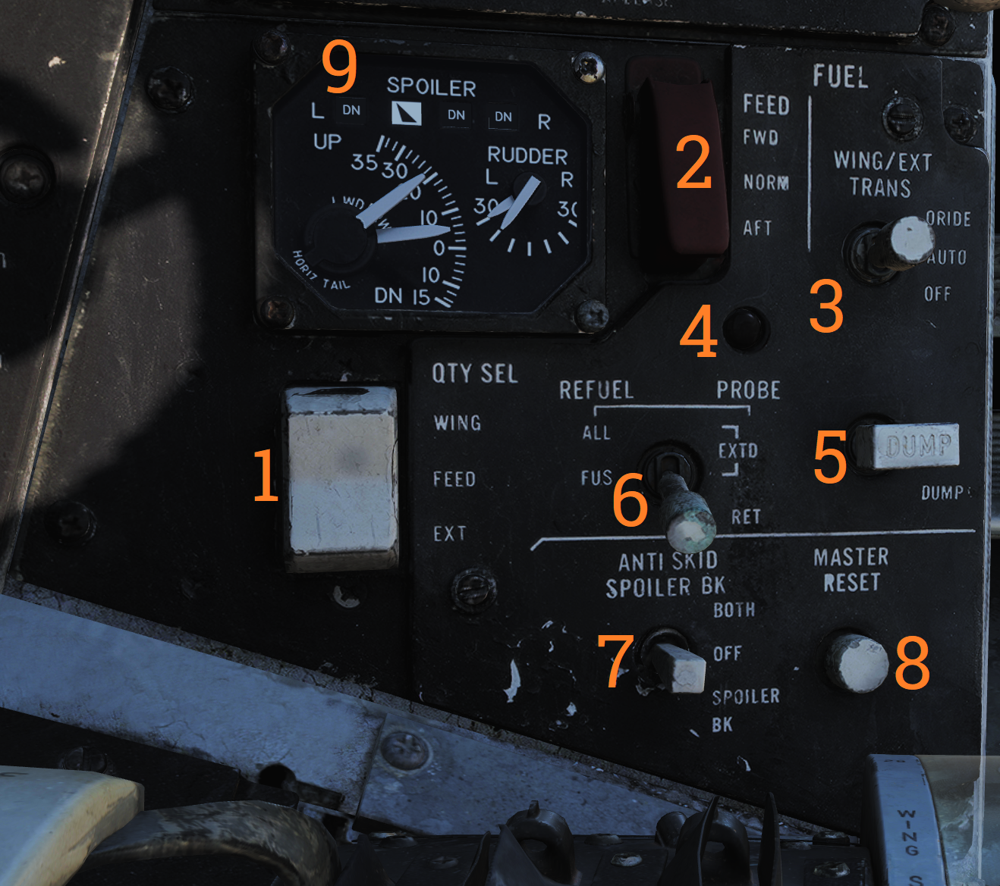

# Left Vertical Console

## Fuel Management Panel

Control panel for various fuel-related systems, CADC master reset, and the anti-skid system.

| No. | Control/Indicator         | Function                                                                                            |
|---|------------------------|----------------------------------------------------------------------------------------------------|
| 1 |QTY SEL switch            | Switch selecting what the fuel quantity tapes on the fuel quantity display shows. Spring-loaded to FEED. **FEED** - Shows respective feed and fuselage tank fuel quantity. **WING** - Shows respective wing tank fuel quantity. **EXT** - Shows respective external fuel tank quantity. |
| 2 | FEED switch               | Switch selecting fuel feed to the engines. Guard locks the switch to NORM until lifted.           |
| 3 |WING/EXT TRANS switch     | Switch selecting operation of the wing and external tanks. **ORIDE** - Override. **AUTO** - Normal position. **OFF** - Turns off fuel feed from the wing and external tanks. |
| 4 | Refueling probe indicator light | Transition light illuminated when refueling probe is not in extended or retracted position.       |
| 5 | DUMP switch               | OFF/DUMP switch. Allows fuel dump when speed brakes are retracted, afterburner off and weight off wheels. |
| 6 | REFUEL PROBE switch       | Selection switch toggling operation of refueling probe. **ALL EXTD** - All extended, extends refueling probe and allows refueling of all tanks. Also resets WING/EXT TRANS switch to AUTO. **FUS EXTD** - Fuselage extended, extends refueling probe and allows refueling of only fuselage tanks. RET - Retracted, retracts refueling probe. |
| 7 | ANTI SKID SPOILER BK switch | Selection switch determining operation anti-skid and spoiler brake systems. **BOTH** - Enables both anti-skid and spoiler brake function with weight on wheels. **OFF** - Turns off both systems. **SPOILER BK** - Spoiler brake, enables spoiler brake function with weight on wheels. |
| 8 | MASTER RESET button      | Resets CADC failure detection system and associated fault displays.                                  |

## Control Surface Position Indicator

Indicator for indication of control surface positions.

| No. | Indicator  | Function                                                                                        |
|----|--------|-------------------------------------------------------------------------------------------------|
| 1 | SPOILER    | Spoiler position indicators. **DN** - Down, flush with wings. **Up**-arrow - Extended above wing. **Down**-arrow - Drooped below wing surface. |
| 2 | RUDDER     | Rudder position indicators, shows position of left and right rudders, each marked L or R.       |
| 3 | HORIZ TAIL | Horizontal stabilizer position indicators, shows position of left and right stabilizer surfaces, marked L or R respectively. |

## Launch Bar Abort Panel

LAUNCH BAR – Selection switch – When held in ABORT lifts the launch bar for launch abortion. Spring-loaded to NORM (Normal) which is the standard position. Not currently used in DCS.

## Landing Gear Control Panel

Control panel for the main landing gear and emergency stores jettison.

| No. | Control/Indicator  | Function                                                                                         |
|----|----------------|--------------------------------------------------------------------------------------------------|
| 1 | LDG GEAR           | Landing gear handle. Selects gear UP or DOWN. For emergency extension in DOWN position, push handle in, turn clockwise and pull out. This releases a compressed nitrogen charge for emergency extension. |
| 2 | DOWN LOCK ORIDE    | Indicates weight on wheels when moved down by solenoid. Can be lifted up to override. Non-functional in DCS. |
| 3 | HYD ISOL           | Switch isolating landing gear, nosewheel steering and wheel brakes from the combined hydraulic system. Automatically moved to T.O./LDG by LDG GEAR in DOWN position. FLT - In flight operation, isolates systems listed above. T.O./LDG - Take-off/landing, connects systems listed above, allowing them to operate. |
| 4 | Transition light   | Illuminates to indicate landing gear position not corresponding to current LDG GEAR handle position. |
| 5 | EMERG STORES button | Emergency stores jettison. Illuminates to indicate activation when pressed.                       |
| 6 | NOSE STRUT switch  | Switch selecting nosewheel strut retraction. EXTD - Extend, extends nosewheel strut and raises and locks launch bar. OFF - Turns off nosewheel strut movement, spring-loaded to this position. KNEEL - Releases pressure from nosewheel strut to retract it, kneeling aircraft. Also unlocks launch bar. |
| 7 | BRAKE-PULL handle  | Parking brake, pull out to apply parking brake, push in to release.                               |
| 8 | EJECT CMD indicator| Indicates ejection system mode for the back seat. PILOT - Pilot ejects both crewmembers, RIO only himself. MCO - Each position ejects both crewmen. |

# Wheels and Flaps Position Indicator
 
Indicates position of flaps and slats, speed brakes, and the landing gear. The slats are indicated as follows:

|  | Power off or maneuver slats extended. |
|----------------------------------------------------------|--------------------------------------|
|  | Slats extended.                      |
|  | Slats retracted.                     |

Flap Position is displayed by an indicator moving between UP and DOWN. The first marked section of the indicator indicates maneuver flap-range. The landing gear is indicated as follows:

|  | Power off or unsafe gear.            |
|----------------------------------------------------------|--------------------------------------|
|  | Gear down.                          |
|  | Gear retracted and doors closed.    |

Speed brakes are indicated as follows:

|  | Speed brake system power off.        |
|----------------------------------------------------------|--------------------------------------|
|  | Speed brake partial extension, not in motion. |
|  | Speed brake fully extended.         |
|  | Speed brake retracted.               |

