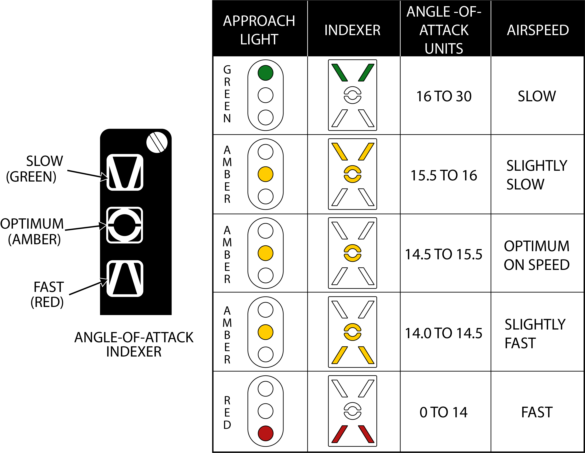

# Left Windshield Frame

### Approach Indexer

Contains three lights showing angle-of-attack (AOA) relative to on-speed AOA.

Green being too slow, amber being on-speed AOA, and red being too fast.

If the HOOK BY-PASS switch is set to CARRIER, the lights will flash if the arresting hook is up while the landing gear is down.

These lights are repeated on the approach lights on the nosewheel strut, allowing the LSO to see aircraft AOA during carrier landings.

### Wheels Warning/Brakes Warnings/ACLS/AP Caution/NWS Engage Caution/Auto Throttle Caution Lights

HUD left side indicators.

| No. | Indicator      | Function                                                                                           |
|-----|----------------|----------------------------------------------------------------------------------------------------|
| 1   | WHEELS         | Warning light flashes with landing gear not down and locked, flaps below 10°, and either throttle below 85%. |
| 2   | BRAKES         | Warning light indicating antiskid or brake failure. Also lights when parking brake is set.          |
| 3   | ACLS/AP        | Caution light indicating that ACLS or autopilot is disengaged.                                      |
| 4   | NWS ENGA       | Caution light indicating nosewheel steering (NWS) is engaged.                                       |
| 5   | AUTO THROT     | Caution light indicating disengagement of the automatic throttle control mode not resulting from the throttle mode switch. |
