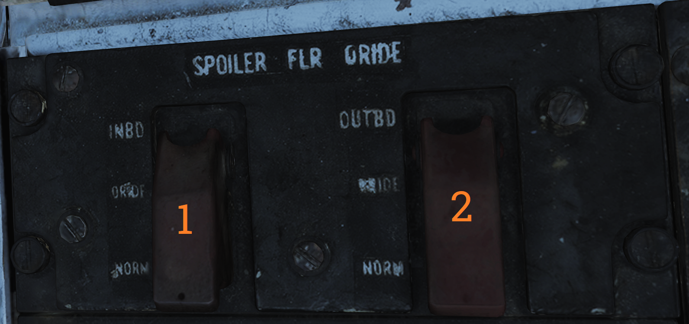
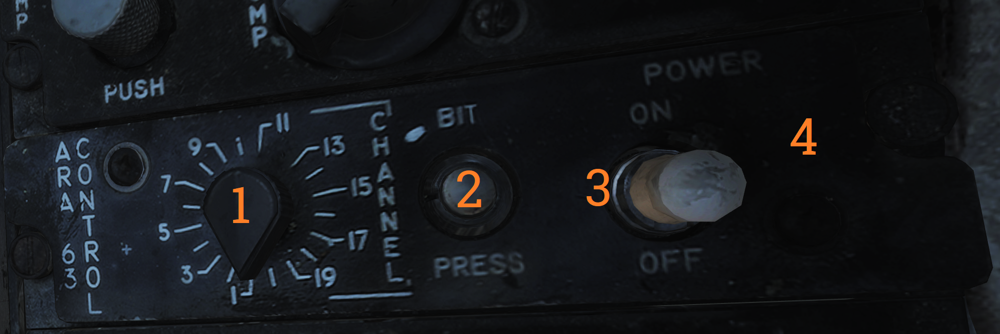
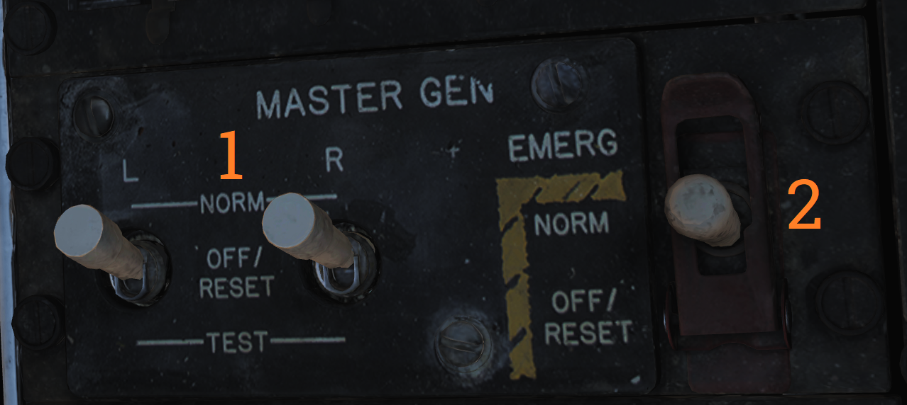

# Right Side Console

### Spoiler Failure Override

Contains controls to override failed spoiler sections, allowing the rest to continue to work after a MASTER RESET.

| No. | Control/Indicator   | Function                                                                                     |
|-----|---------------------|----------------------------------------------------------------------------------------------|
| 1   | INBD                | Inboard spoiler override switch. ORIDE - Overrides inboard spoiler symmetry protection, allowing a functional inboard spoiler to continue to operate after a MASTER RESET if one fails. NORM - Normal (guarded position), in this mode, if an inboard spoiler fails up the rest are commanded to droop and the SPOILERS light illuminates on the caution panel. |
| 2   | OUTBD               | Outboard spoiler override switch. ORIDE - Overrides outboard spoiler symmetry protection, allowing a functional outboard spoiler to continue to operate after a MASTER RESET if one fails. NORM - Normal (guarded position), in this mode, if an outboard spoiler fails up the rest are commanded to droop and the SPOILERS light illuminates on the caution panel. |

### Liquid Oxygen Quantity Indicator

Contains an indicator showing the remaining quantity of liquid oxygen available. Graduated in 1-liter increments. Also has an OFF flag that is shown in case of power failure to the indicator. The indicator is tested through the INST mode on the MASTER TEST panel and should read 2 liters.

### Compass Control Panel

The compass control panel contains controls for selecting compass mode when using AHRS.

| No. | Control/Indicator     | Function                                                                                     |
|-----|-----------------------|----------------------------------------------------------------------------------------------|
| 1   | SYNC IND              | Indicator showing sync between AHRS gyro and magnetic azimuth detector. Used in SLAVED mode. |
| 2   | N-S switch            | Switch used to select which hemisphere aircraft is in for DG and SLAVED modes. Critical for correct earth-rate correction. |
| 3   | LAT knob              | Control knob used to select latitude from 0º to 90º to allow for correct earth-rate correction in DG and SLAVED modes. |
| 4   | Mode switch           | Selects source of AHRS heading information. COMP - Compass, uses magnetic azimuth detector directly without stabilization from the directional gyro, used only for emergency operation and the displays automatically use the manual magnetic variation. SLAVED - Normal mode, uses the magnetic azimuth detector stabilized by the directional gyro. DG - Directional gyro mode, uses only the gyro and not the magnetic azimuth detector. |
| 5   | HDG knob/button       | Used in DG and SLAVED modes. In SLAVED mode it’s used to sync the directional gyro with the magnetic azimuth detector and set magnetic heading on the BDHI. Button should be held until the synchronization indicator needle is over the null mark. In DG mode the button is depressed and rotated to select desired heading on the BDHI. The button can also be used to fast erect pitch and roll of the AHRS by depressing the button for up to 3 minutes. A new fast erect attempt can be done if a 1-minute wait is first observed. |

### ARA-63 Control Panel

Panel used to control the AN/ARA-63 ILS (ICLS).

| No. | Control/Indicator        | Function                                                                                     |
|-----|--------------------------|----------------------------------------------------------------------------------------------|
| 1   | CHANNEL selector         | Selector selecting one of 20 available ICLS channels.                                        |
| 2   | BIT button               | Button used to test AN/ARA-63, displays landing symbology on the HUD and VDI if set up for ILS. |
| 3   | POWER switch             | ON/OFF switch to energize the AN/ARA-63, switch must be pulled out to allow OFF position.     |
| 4   | Indicator light          | Lights to indicate AN/ARA-63 power on.                                                       |

### Caution - Advisory Indicator

Main pilot caution panel.

| No. | Indicator        | Function                                                                                     |
|-----|------------------|----------------------------------------------------------------------------------------------|
| 1   | PITCH STAB 1 & 2 | Caution lights indicating inoperative pitch channels.                                         |
| 2   | ROLL STAB 1 & 2  | Caution lights indicating inoperative roll channels (roll SAS failure).                       |
| 3   | YAW STAB OP      | Caution light indicating one inoperative yaw channel.                                         |
| 4   | YAW STAB OUT     | Caution light indicating two inoperative yaw channels (yaw SAS failure).                      |
| 5   | EMERG JETT       | Caution light indicating activation of EMERG STORES JETT button.                              |
| 6   | LADDER           | Caution light indicating boarding ladder not correctly stowed.                                |
| 7   | ECS TURBINE      | Non-functional                                                                                |
| 8   | INLET ICE        | Caution light indicating accumulation of ice on the ice detector in the left engine inlet.    |
| 9   | FLAP             | Caution light indicating failure in the flap system or airspeed greater than 225 knots indicated airspeed with flaps down. |
| 10  | HZ TAIL AUTH     | Caution light indicating failure of lateral tail authority actuator (or CADC failure).        |
| 11  | RUDDER AUTH      | Caution light indicating failure of rudder authority actuators (or CADC failure).             |
| 12  | SPOILERS         | Caution light indicating spoiler system failure causing several or all spoilers to be locked down. |
| 13  | AUTO PILOT       | Caution light indicating failure in the auto pilot system.                                    |
| 14  | L & R INLET      | Caution lights indicating AICS programmer and/or system failure.                              |
| 15  | OIL PRESS        | Caution light indicating left or right engine oil pressure below 11 psi.                      |
| 16  | BLEED DUCT       | Caution light indicating high-temperature air leak in the engine compartments.                |
| 17  | L & R RAMPS      | Caution lights indicating ramps not locked in position during critical flight conditions.     |
| 18  | START VALVE      | Caution light indicating that the starter solenoid air valve is open after start. (F-14B only.) |
| 19  | OXY LOW          | Caution light indicating low oxygen pressure or less than 2 liters of oxygen remaining. (F-14A only.) |
| 20  | L & R ENG SEC    | Caution lights indicating that respective engine AFTC is in secondary mode. (F-14B only.)     |
| 21  | L & R OVSP/VALVE | Caution lights indicating engine starter system malfunction or N1 rotor overspeed in respective engine. (F-14A only.) |
| 22  | L & R GEN        | Caution lights indicating respective engine generator is inoperative.                         |
| 23  | CANOPY           | Caution light indicating that the canopy is not down and locked.                              |
| 24  | BINGO            | Caution light indicating aircraft fuel quantity at or below set BINGO quantity.               |
| 25  | L & R OIL HOT    | Caution lights indicating that respective engine oil is too hot.                              |
| 26  | CADC             | Caution light indicating failure in the air data computer.                                     |
| 27  | HYD PRESS        | Caution light indicating pressure in either engine hydraulic pump below 2,100 psi.            |
| 28  | L & R FUEL PRESS | Caution lights indicating pressure below 9 psi in the respective engine fuel boost pump.       |
| 29  | L & R FUEL LOW   | Caution lights indicating fuel quantity below 1,000 pounds in aft and left or forward and right fuel feed group respectively. |
| 30  | WING SWEEP       | Advisory light indicating failure of a single channel in the wing-sweep system.               |
| 31  | RATS             | Advisory light indicating RATS enabled. (F-14B only.)                                         |
| 32  | TRANS/RECT       | Advisory light indicating failure in one or both transformer-rectifiers.                      |
| 33  | MACH TRIM        | Advisory light indicating failure in Mach trim actuator.                                       |
| 34  | WSHLD HOT        | Advisory light indicating central windshield overheat.                                        |
| 35  | LAUNCH BAR       | Advisory light indicating either: Weight on wheels - Aircraft kneeled, either throttle below MIL and launch bar not up and locked. Weight off wheels - Launch bar not up and locked, launch bar not within 15º of center (cocked nosegear), or nose strut not fully extended. |
| 36  | INTEG TRIM       | Advisory light indicating failure in the trim system or computer failure.                     |
| 37  | AHRS             | Advisory light indicating unreliable attitude or heading information from AHRS.               |
| 38  | ENG FIRE EXT     | Advisory light indicating low pressure in the fire extinguishing container (90 psi below nominal 600 psi). |
| 39  | AUX FIRE EXT     | Advisory light indicating low pressure in the auxiliary fire extinguishing container (90 psi below nominal 600 psi). |

**Note:** F-14A specific lights not yet implemented.

### Master Generator Control Panel

Panel controlling left and right engine generator.

| No. | Control/Indicator     | Function                                                                                     |
|-----|-----------------------|----------------------------------------------------------------------------------------------|
| 1   | L & R MASTER GEN switch | Switches controlling connection and test of respective generator. Switch needs to be lifted to move from OFF/RESET. NORM - Normal, activating and connecting the generator to the main buses. OFF/RESET - Disconnects and deactivates the generator and resets tripped protection circuits. TEST - Activates the generator but does not connect it to the main buses, for testing purposes. |
| 2   | EMERG switch          | Guarded switch controlling connection of the emergency generator to the essential buses. (Guarded position is NORM) NORM - Normal, the generator is automatically connected to essential buses if both main generators fail. OFF/RESET - Disconnects the generator from the essential buses regardless of the main generator status. Resets protection circuits. |

### Master Light Control Panel

Master light control panel, controlling most lights in/on the aircraft.

| No. | Control/Indicator       | Function                                                                                     |
|-----|-------------------------|----------------------------------------------------------------------------------------------|
| 1   | ANTI COLLISION switch   | ON/OFF switch controlling anticollision lights.                                              |
| 2   | POSITION switch         | Switch controlling whether the wing or supplementary tail and position lights light up steadily or flash. With weight on wheels, the supplementary lights are always steady. |
| 3   | TAIL POSITION switch    | Switch controlling tail position lights, DIM and BRT (bright) settings available.            |
| 4   | WING POSITION switch    | Switch controlling wing position lights, DIM and BRT settings available.                     |
| 5   | ACM thumbwheel          | Thumbwheel controlling ACM panel lights, 0 equals off, 1-14 sets the lights to an increasingly bright setting. |
| 6   | INDEXER thumbwheel      | Thumbwheel controlling AoA-indexer light intensity from 0-14.                                |
| 7   | HOOK BYPASS             | Sets AOA lights to either FIELD or CARRIER mode, with the switch in CARRIER and wheels down, the AOA lights flash if the hook isn’t down. |
| 8   | TAXI switch             | Switch controlling taxi lights.                                                              |
| 9   | INSTRUMENT thumbwheel   | Thumbwheel controlling instrument panel lights, 0 equals off, 1-14 sets the lights to an increasingly bright setting. |
| 10  | WHITE FLOOD switch      | Switch enabling white flood lights in the pilot cockpit. DIM and BRT settings available, switch locked to OFF unless pulled out. |
| 11  | CONSOLE thumbwheel      | Thumbwheel controlling console lights and red floodlights. 0 turns off both console and red floodlights, 1-14 sets the console lights to an increasingly bright setting. |
| 12  | RED FLOOD switch        | Switch controlling red instrument and console floodlights. BRT - Sets bright red instrument flood and console lights. MED - Red console floodlights. DIM - Dim red console floodlights. |
| 13  | FORMATION thumbwheel    | Thumbwheel controlling external formation lights. 0 equals off, 1-14 sets the lights to an increasingly bright setting. |

### Air Conditioning Control Panel

Panel controlling the environmental control system (ECS).

| No. | Control/Indicator      | Function                                                                                     |
|-----|------------------------|----------------------------------------------------------------------------------------------|
| 1   | TEMP switch            | Switch controlling the cabin and pressure suit temperature mode. AUTO - Temperature is automatically set from the TEMP thumbwheel regardless of airspeed and altitude. MAN - Temperature is manually set from the TEMP thumbwheel but varies with airspeed and altitude and might need to be reset. |
| 2   | CABIN PRESS switch     | Switch controlling cabin pressurization. Locked to NORM until lifted. NORM - Normal mode, cabin is pressurized at a level of 8,000 feet up to an aircraft level of 23,000 feet, after which it maintains a 5 psi difference from outside atmosphere. DUMP - Opens the cockpit dump valve depressurizing the cockpit. |
| 3   | RAM AIR switch         | Selector switch used to modulate the amount of air from the ram air door after AIR SOURCE is set to RAM or OFF. Can be held to INCR (increase) or DECR (decrease), spring-loaded back to center. |
| 4   | AIR SOURCE selectors   | Five mutually exclusive air source selectors. Rotates to indicate selection. RAM - Closes other air sources and opens the ram air door which is combined with hot bleed air to supply all users. L & R ENG - Selects either engine as the source for bleed air. BOTH ENG - Selects both engines as source for bleed air. Normal position. OFF - Closes all air sources but the ram air door. In this mode the ram air door cannot supply pressurization or air conditioning. Inhibits gun firing. |
| 5   | TEMP thumbwheel        | Selects cockpit and pressure suit air temperature. 0-14 is selectable with COOL and WARM placarded at each end stop. In auto 7 approximately corresponds to 21º C or 70º F. In manual the thumbwheel needs to be set for each variation in airspeed and altitude. |

### Master Test Panel

Panel controlling OBC and various onboard BITs in addition to the emergency flight hydraulic setting.

| No. | Control/Indicator        | Function                                                                                     |
|-----|--------------------------|----------------------------------------------------------------------------------------------|
| 1   | MASTER TEST selector     | Selector used to select and initiate OBC and BIT for various systems. Pull out to enable selection, push in at selected option to start test. OFF - Disables test functions. LTS - Lights, tests cockpit indication lights. FIRE DET/EXT - Fire detection system test. INST - Instruments, tests various cockpit instrumentation. OBC - Onboard checkout, starts OBC. EMERG GEN - Tests emergency generator. MACH LEV - Initiates dynamic MACH lever check. F-14A only. WG SWP - Tests wing-sweep system. FLT GR DN - Initiates ground check of auto throttle interlocks. FLT GR UP - Tests external fuel tank pressurization. D/L RAD - Tests the data link converter. STICK SW - Checks left and right spoiler symmetry switches and 1-inch stick switches for yaw SAS. |
| 2   | GO/NO-GO lights          | Lights used in relevant tests to indicate GO or NO-GO conditions of those systems.            |
| 3   | EMERG FLT HYD            | Switch controlling the emergency mode of the flight hydraulic system. Guarded to the AUTO (LOW) position. HIGH - Activates the power module (high-speed mode), bypassing flight and combined 2,100 psi switches. LOW - Activates the backup power module bypassing flight and combined 2,100 psi switches. AUTO (LOW) - Automatically activates LOW mode when both flight and combined system pressures are below 2,100 psi. |

**Note:** Specific tests will be detailed in a future BIT chapter.

### External Environmental Control Panel

Panel controlling windshield air and external anti-ice settings.

| No. | Control/Indicator | Function                                                                                     |
|-----|-------------------|----------------------------------------------------------------------------------------------|
| 1   | WSHLD switch      | Switch controlling external heating of the windshield by blasting the exterior with warm air. AIR - Enables system. OFF - Disables system. |
| 2   | ANTI-ICE switch   | Controls engine, probe, and AICS anti-ice settings. ORIDE/ON - Engages engine and probe anti-ice regardless of external conditions and enables the anti-ice setting in AICS. AUTO/OFF - Automatically engages engine and probe anti-ice as needed, turns off AICS anti-ice. OFF/OFF - Turns off both engine and probe anti-ice and AICS anti-ice. |

### Hydraulic Transfer Pump Switch

Panel containing the control for the hydraulic transfer pump which equalizes pressure between the combined and flight hydraulic systems in case of a failure in one of them.

The HYD TRANSFER PUMP switch has two positions, SHUTOFF and NORMAL (guarded position). The NORMAL position (also the standard setting) will have the hydraulic transfer pump pressurize a failed hydraulic system from the other, functioning system, when it drops below 2,100 psi. The SHUTOFF position (which can be accessed by lifting the guard) is used to turn off the transfer pump in case it can’t supply enough pressure to the failed system as that would risk disabling the still operational system.

### HUD-Video Control Panel

Control panel for the CTVS system which records the HUD when activated. Not implemented in DCS.

| No. | Control/Indicator        | Function                                                                                     |
|-----|--------------------------|----------------------------------------------------------------------------------------------|
| 1   | HUD CAM(E)RA switch      | TRG - Trigger, records while the second (firing) detent on the stick trigger is depressed. NORMAL - Records while the first detent on the stick trigger is depressed. OFF - Disables power to the CTVS. RUN - Records continuously. |
| 2   | Switch 2 & 3.            | VTR - Video tape recorder.                                                                  |

### Canopy Defog/Cabin Air Lever

The canopy air diffuser lever controls the flow of cabin air. The normal position, CABIN AIR, directs 70% of the conditioned air through the cockpit air diffusers and 30% through the canopy air diffusers. The CANOPY DEFOG position directs all airflow through the canopy air diffusers for canopy defog.

