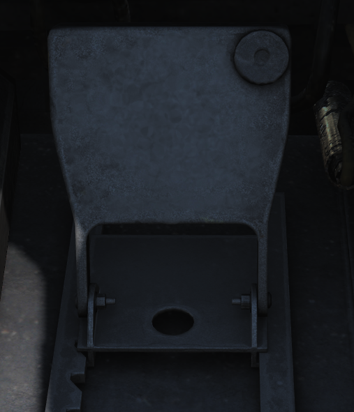

## Left and Right Footwells

### ICS Foot Button

RIO left footrest containing ICS PTT for COLD MIC intercommunication.

### Mic Foot Button

RIO right footrest containing PTT for transmission on UHF 1, V/UHF 2, or both depending on ICS setting.