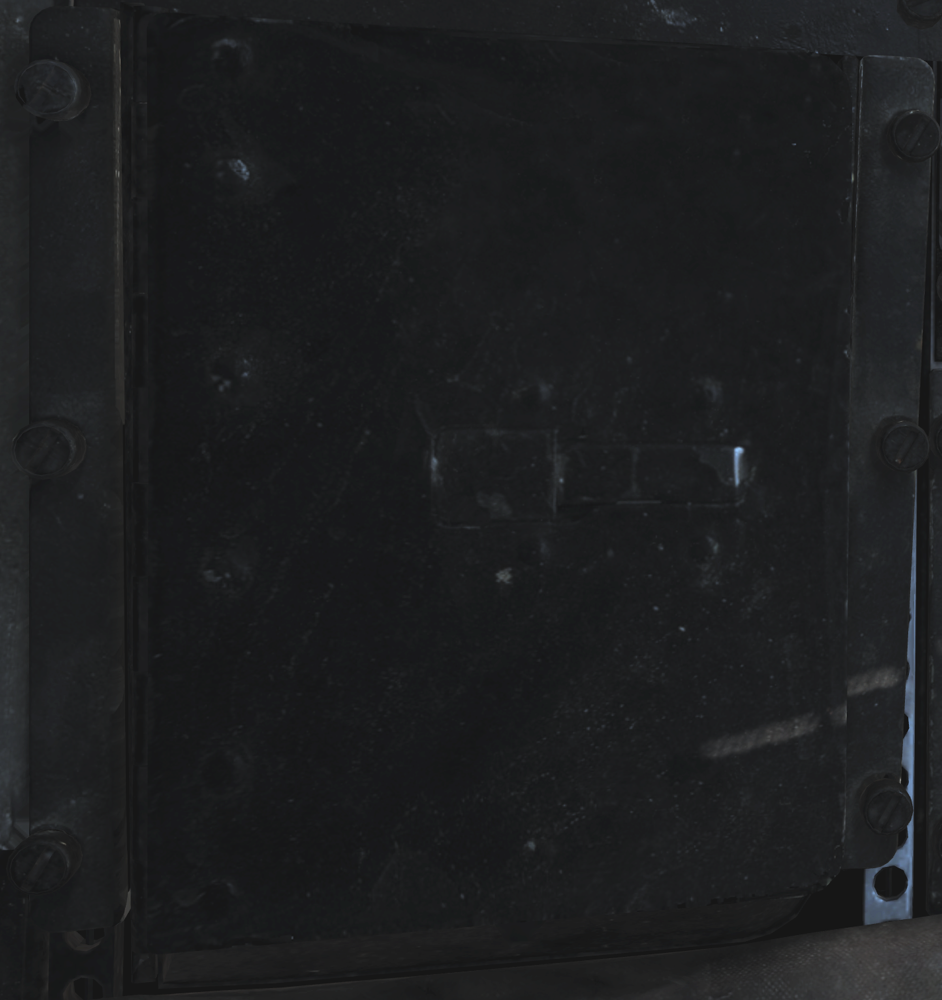
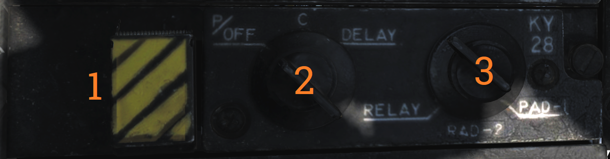
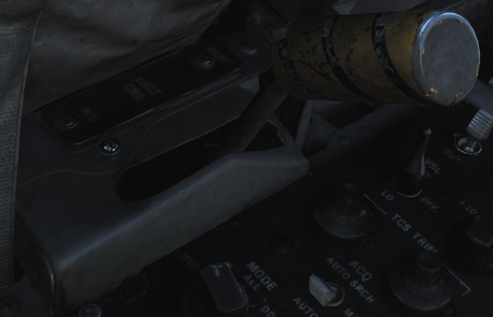
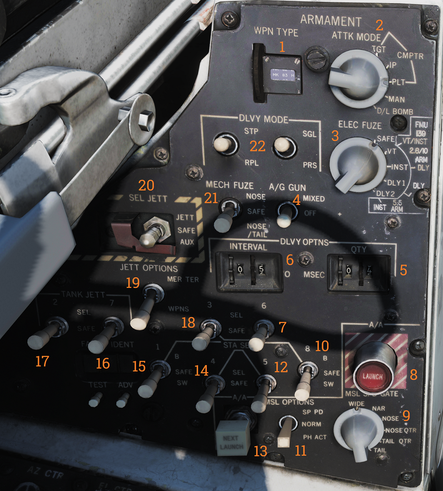

## Left Side Console

### G-Valve Button

Pressed to test inflation of g-suit.

### Oxygen-Vent Airflow Control Panel

Controls ventilation airflow to pressure suit or seat cushions and oxygen to RIO mask.

| No. | Control            | Function                                                                                    |
|-----|--------------------|---------------------------------------------------------------------------------------------|
| 1   | VENT AIRFLOW dial  | Used to control airflow through the pressure suit or seat cushions if no pressure suit is worn. |
| 2   | OXYGEN switch      | Switch with ON/OFF positions. Controls oxygen flow to the mask.                              |

### Data Stowage Compartment

The data stowage panel is a small compartment for equipment storage and mission briefing materials etc.

### TACAN Control Panel

TACAN control panel letting the RIO control TACAN if in command of it.

| No. | Control/Indicator | Function                                                                                       |
|-----|-------------------|------------------------------------------------------------------------------------------------|
| 1   | Dual rotary switch| Outer dial selects first two digits and inner dial selects last digit for TACAN channel selection. |
| 2   | GO & NO-GO lights | Lights indicating result of TACAN BIT.                                                         |
| 3   | BIT button        | Button initiating TACAN BIT.                                                                   |
| 4   | MODE switches     | Switches mode for TACAN operation and selects X or Y channels. INVERSE mode not functional.     |
| 5   | VOL knob          | Volume control knob for TACAN audio to RIO.                                                    |
| 6   | Mode knob         | Selects TACAN mode. OFF - TACAN is off. REC - Receive only. T/R - Transmit and receive, enables range readout. A/A - Air to air TACAN mode. BCN - Beacon TACAN mode. (Non-functional) |

### Communication/TACAN Command Panel

Panel controlling ICS radio settings and crewmember in control of TACAN.

| No. | Control/Indicator  | Function                                                                                      |
|-----|--------------------|-----------------------------------------------------------------------------------------------|
| 1   | XMTR SEL switch    | Selects which VHF/UHF radio the RIO PTT keys. UHF 1 - Selects the ARC-159 UHF radio. BOTH - Selects both radios. V/UHF 2 - Selects the ARC-182 VHF/UHF radio. |
| 2   | V/UHF 2 ANT switch | Selects which antenna the V/UHF 2 uses. UPR - Selects the upper antenna. LWR - Selects the lower antenna. |
| 3   | TACAN CMD switch   | Sets crewmember in command of the TACAN. Also indicates current setting.                      |
| 4   | UHF 1 VOL knob     | Volume knob controlling RIO headset volume of UHF 1 audio.                                    |
| 5   | KY MODE switch     | Functional only with KY-58 installed. Note: As the DCS F-14 is modelled with KY-28 the KY MODE switch is non-functional in DCS. |

### V/UHF 2 (AN/ARC-182) Radio

V/UHF radio 2. Radio and controls.

| No. | Control/Indicator      | Function                                                                                  |
|-----|------------------------|-------------------------------------------------------------------------------------------|
| 1   | VOL knob               | Controls volume of V/UHF 2 audio to RIO headset.                                           |
| 2   | SQL switch             | ON/OFF switch enabling squelch.                                                            |
| 3   | Frequency select switches | Toggle switches selecting set frequency.                                                  |
| 4   | FREQ/(CHAN) display    | Readout display showing selected frequency or channel.                                     |
| 5   | UHF switch             | Selector switch selecting modulation in use. Operational in the 225.000 to 399.00 MHz band. |
| 6   | BRT knob               | Knob controlling display brightness.                                                       |
| 7   | MODE knob              | MODE selector knob controlling V/UHF 2 radio mode.                                         |
| 8   | Frequency mode knob    | Outer dial on the knob, selects frequency mode.                                            |
| 9   | CHAN SEL knob          | Inner dial on the knob, selects preset channel to use.                                     |

### KY-28 Control Panel

| No. | Control               | Function                                                           |
|-----|-----------------------|--------------------------------------------------------------------|
| 1   | ZEROIZE switch        | Switch/guard used to zeroize KY-28.                                 |
| 2   | Power-mode switch     | Switch selecting KY-28 mode of operation.                          |
| 3   | Radio select switch   | Switch selecting which radio to use with KY-28.                    |

### Radar Beacon Control Panel

Panel controlling AN/APN-154 radar beacon.

| No. | Control/Indicator   | Function                                                                                       |
|-----|---------------------|------------------------------------------------------------------------------------------------|
| 1   | MODE selector       | Selector switch controlling beacon mode of operation. SINGLE - Enables beacon response to single pulse codes. DOUBLE - Enables beacon response to set double pulse code. ACLS - Enables augmentor operation for ACLS. Required for CATCC radar lockon for ACLS. |
| 2   | ACLS TEST button    | Button with green light used to indicate operation or test. When pressed with MODE in ACLS illumination indicates a successful test. The light also flashes when detecting an AN/SPN-42 radar sweeping past and illuminates when that radar has locked on for ACLS guidance. |
| 3   | PWR switch          | Switch controlling beacon power. PWR - Enables beacon and all replies depending on MODE selector. STBY - Used to warm up the system, also enables ACLS replies if the MODE selector is set to ACLS. OFF - Beacon off. |

### Liquid Cooling Control Panel

LIQ COOLING switch controlling the liquid cooling system for the AWG-9 and AIM-54. The AWG-9 circuit can be enabled independently of the AIM-54. This switch needs to be enabled for the respective system before AWG-9 operation or AIM-54 missile preparation.

### ICS Control Panel

Control panel for ICS.

| No. | Control                    | Function                                                                                                  |
|-----|----------------------------|-----------------------------------------------------------------------------------------------------------|
| 1   | VOL knob                   | Volume control knob for intercommunication audio from the pilot to the RIO.                                |
| 2   | Amplifier selection knob   | Knob selecting which amplifier to use for the RIO’s headset audio.                                         |
| 3   | ICS switch                 | Selects ICS function. RADIO OVERRIDE - Makes ICS audio override radio audio. HOT MIC - Allows talking to the pilot without pressing the PTT. COLD MIC - Allows talking to the pilot only while the PTT is pressed. |

### Eject Command Lever

A pilot initiated ejection will always eject both crew members. The EJECT CMD lever controls what happens when the RIO ejects: In PILOT mode (lever forward), only the RIO will be ejected. In MCO mode, both pilot and RIO initiated ejection will eject both crew members.

### Sensor Control Panel

Control panel for AWG-9 scan settings, the TCS, and the airborne video tape recorder.

| No. | Control/Indicator   | Function                                                                                      |
|-----|---------------------|------------------------------------------------------------------------------------------------|
| 1   | STAB switch         | Selector switch controlling ground stabilization of the radar.                                 |
| 2   | AZ CTR knob         | Azimuth control knob selecting the center of azimuth scan area.                                |
| 3   | EL CTR knob         | Elevation control knob selecting the center of elevation scan area.                            |
| 4   | VSL switch          | Selector switch spring-loaded to center which enables VSL. VSL HI or LO can be selected.       |
| 5   | AZ SCAN knob        | Azimuth scan knob selecting azimuth scan volume.                                               |
| 6   | EL BARS knob        | Elevation bar knob selecting the number of bars to scan in elevation.                          |
| 7   | TCS TRIM knobs      | Trim knobs used to calibrate TCS video in azimuth and elevation.                               |
| 8   | SLAVE switch        | Selector switch selecting which sensor is slaved to the other.                                 |
| 9   | ACQ switch          | Selector switch selecting acquisition mode for the TCS. AUTO, MAN or AUTO SRCH.                |
| 10  | FOV switch          | Selector switch selecting field of view for the TCS, WIDE or NAR (narrow).                     |
| 11  | MODE knob           | Knob controlling what the AVTR records.                                                        |
| 12  | MIN REMAIN display  | Counter showing minutes remaining for the AVTR.                                                |
| 13  | RECORD switch       | Selector switch controlling the AVTR. OFF/STBY/ON.                                             |
| 14  | Indicator lights    | Lights indicating AVTR operation. STBY, EOT (end of tape), and REC.                            |

### Computer Address Panel

The CAP is used to enter data into the WCS. The MESSAGE indicator drum and buttons work similarly to the buttons on MFDs on newer aircraft.

| No. | Control/Indicator      | Function                                                                                      |
|-----|------------------------|------------------------------------------------------------------------------------------------|
| 1   | CLEAR button           | Button clearing current TID buffer without inserting entered data.                             |
| 2   | ENTER button           | Button inserting current data from TID buffer into the WCS.                                    |
| 3   | Prefix & Numerical buttons | Numerical buttons with additional prefix selection functionality.                           |
| 4   | MESSAGE button switches | Buttons used to select functions from the MESSAGE drum.                                       |
| 5   | MESSAGE indicator drum  | Indicator drum used to indicate currently available MESSAGE functionality.                    |
| 6   | PRGM RESTRT button     | Button used to restart the program running in the WCS.                                         |
| 7   | CATEGORY knob          | Selector knob selecting current category in use on the MESSAGE indicator drum.                |
| 8   | TUNE DSBL              | Non-functional. Note: All of the buttons have indicator lights indicating operation depending on function. |

## Left Vertical Console

### Armament Panel

Main armament control panel in the RIO cockpit.

| No. | Control/Indicator        | Function                                                                                   |
|-----|--------------------------|--------------------------------------------------------------------------------------------|
| 1   | WPN TYPE selector        | Selector wheel selecting type of weapon used for WCS A/G calculation.                      |
| 2   | ATTK MODE knob           | Knob selecting which A/G attack mode to use.                                                |
| 3   | ELEC FUSE knob           | Knob selecting electric fuse setting for A/G ordnance.                                      |
| 4   | A/G GUN switch           | Selector switch controlling gun mode in A/G master mode. MIXED enables the gun in addition to selected A/G ordnance. |
| 5   | QTY selectors            | Selector wheels controlling quantity of A/G ordnance (including rockets) to be released.    |
| 6   | INTERVAL selectors       | Selector wheels controlling interval between weapons release in ripple delivery mode in milliseconds. |
| 7   | Station 6 select switch  | Switch used to select station 6 for jettison or weapons A/G delivery.                      |
| 8   | A/A LAUNCH button        | Button used for RIO launch of AIM-7 or AIM-54, hot trigger is indicated by button illumination. |
| 9   | MSL SPD GATE knob        | Knob controlling the position of missile speed gate.                                        |
| 10  | Station 8 select switch  | Switch used to select station 8 for jettison or weapons A/G delivery. B selects the lower pylon for release or jettison, the SW option is non-functional. |
| 11  | MSL OPTIONS switch       | Selector switch used to activate AIM-7 pulse doppler mode or AIM-54 active launch mode.     |
| 12  | Station 5 select switch  | Switch used to select station 5 for jettison or weapons A/G delivery.                      |
| 13  | NEXT LAUNCH button       | Button used by RIO to select a hooked target as the next target to launch at in TWS.        |
| 14  | Station 4 select switch  | Switch used to select station 4 for jettison or weapons A/G delivery.                      |
| 15  | Station 1 select switch  | Switch used to select station 1 for jettison or weapons A/G delivery. B selects the lower pylon for release or jettison, the SW option is non-functional. |
| 16  | TANK JETT station 7 switch | Switch selecting station 7 for tank jettison.                                             |
| 17  | TANK JETT station 2 switch | Switch selecting station 2 for tank jettison.                                             |
| 18  | Station 3 select switch  | Switch used to select station 3 for jettison or weapons A/G delivery.                      |
| 19  | JETT OPTIONS switch      | Switch selecting whether to jettison only WPNS (weapons) or MER/TER (weapon racks) in addition to weapons. Non-functional in modeled F-14. |
| 20  | SEL JETT switch          | Selector switch used to jettison selected stations in normal (JETT) mode or AUX (backup) mode. The AUX position is guarded. |
| 21  | MECH FUSE switch         | Selector switch used to enable and set which mechanical fuse to use for A/G ordnance.      |
| 22  | DLVY MODE switches       | Two selector switches used to select A/G delivery mode. One switch controls whether to release in singles or pairs and the other sets whether to release once or multiple times according to settings. |