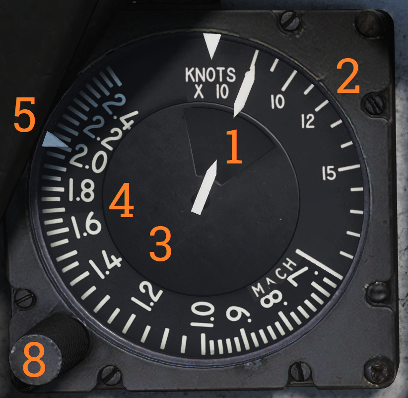

## Left Instrument Panel

### Servopneumatic Altimeter

Control and indicator for the servopneumatic altimeter.

| No. | Control/Indicator   | Function                                                                                      |
|-----|---------------------|------------------------------------------------------------------------------------------------|
| 1   | Altimeter readout   | Displays altitude digitally on three drums showing 10,000, 1,000, and 100 of feet respectively. It also displays altitude on a pointer on a circular scale indicating 100’s of feet. |
| 2   | Baroset knob        | Sets local pressure in inches of mercury (in.Hg). Only used locally on the altimeter readout, all other digital indicators (via CADC) use a set 29.92 in.Hg value. |
| 3   | Local Barometric Pressure | Indicates barometric pressure setting, also called the Kollsman Window.                   |
| 4   | Mode switch         | Three-position switch, spring-loaded to return from RESET. If power and altitude data from CADC are present, the switch can be held in RESET for 3 seconds to allow normal (servoed) mode of operation. If set to STBY or power or CADC data is absent for more than 3 seconds the system switches to backup (pressure) mode. |
| 5   | STBY flag           | Red flag reading STBY that appears if the system is in backup (stand-by) mode.                 |

### Airspeed Mach Indicator

Indicated airspeed and Mach number display.

| No. | Control/Indicator             | Function                                                                                  |
|-----|-------------------------------|-------------------------------------------------------------------------------------------|
| 1   | Airspeed dial                 | Shows indicated airspeed on three scales, two for indicated airspeed and one moving for Mach number. |
| 2   | Indicated airspeed scale (outer) | Used to indicate indicated airspeed up to 200 knots.                                        |
| 3   | Indicated airspeed scale (inner) | Used to indicate indicated airspeed from 200 knots to 850 knots. Covered by the airspeed dial until relevant. |
| 4   | Mach number scale             | Moving scale used to indicate Mach number. Moved to show the correct Mach number relative to indicated airspeed. |
| 5   | Indicated airspeed index pointer | Can be set to the desired indicated airspeed.                                              |
| 6   | Mach number index pointer     | Can be set to the desired Mach number. Not visible in image.                               |
| 7   | Safe Mach number index pointer | Shows safe Mach number calculated by the CADC. Not visible in the image.                   |
| 8   | Index knob                    | Knob with a pull-out and push-in position. One sets the indexer for indicated airspeed and the other for Mach number. |

### Standby Attitude Indicator

Standalone standby attitude indicator.

An OFF flag is visible on the left side when caged or when unpowered.

The knob below and to the right of the indicator cages/uncages the indicator and allows trim to correct pitch. In the pulled-out position, the indicator is caged. When pushed in, uncages the indicator and allows pitch trim by turning the knob.

### UHF Remote Indicator

Remote indicator displaying set frequency or channel on UHF 1 (AN/ARC-159).

| No. | Control/Indicator                  | Function                                                                                     |
|-----|------------------------------------|----------------------------------------------------------------------------------------------|
| 1   | UHF 1 remote channel/frequency indicator | Displays a readout of the frequency or channel set for the UHF 1 radio.                        |
| 2   | TEST                               | Initiates a test for the indicator, no fault resulting in 888.888 readout.                    |
| 3   | DIM                                | Controls display brightness.                                                                 |

## Center Panel

### Chaff/Flare Dispense Switches

Two switch hats on the center RIO handhold used to initiate the release of countermeasures. The switches are mirrored in regards to functionality.

| No. | Control | Function                                  |
|-----|---------|-------------------------------------------|
| 1   | Up      | Initiates a single chaff release.         |
| 2   | Down    | Initiates set chaff release program.      |
| 3   | Inboard | Initiates set jammer release program.     |
| 4   | Outboard| Initiates set flare release program.      |

### Detail Data Display Panel

Main radar control panel.

| No. | Control/Indicator         | Function                                                                                 |
|-----|---------------------------|------------------------------------------------------------------------------------------|
| 1   | TGTS switch               | Switch selecting target size for missile launch zones, WCS track calculations as well as missile ATC calculation. |
| 2   | MLC switch                | Switch selecting MLC mode of operation.                                                  |
| 3   | AGC switch                | Switch controlling AGC speed. Currently non-functional in DCS.                           |
| 4   | PARAMP switch             | Switch controlling the parametric amplification. Currently non-functional in DCS.        |
| 5   | PULSE VIDEO knob          | Knob controlling video strength of pulse video on the DDD. No effect on pulse doppler video. |
| 6   | Radar track indicator lights | Indicator lights indicating radar tracking in the STT modes. ANT TRK - Indicates the radar is tracking the target’s angle. RDROT - Indicates the target is within the range or rate gate and being tracked. JAT - Indicates the radar is tracking a jamming source’s angle. IROT - Indication of TCS angle tracking, called IROT as this was originally used for the IRST in the early -A. |
| 7   | RANGE display             | Rotary drum indicator displaying the currently selected radar range. Can also be blank if no range scale is used on the DDD. |
| 8   | RANGE buttons             | Buttons used to select radar range.                                                      |
| 9   | BRIGHT knob               | Knob used to control the brightness of the DDD by means of a polarized filter in front of the DDD. |
| 10  | IR AUDIO THRLD knob       | Knob used to control IR AUDIO threshold, non-functional with TCS.                        |
| 11  | IR AUDIO VOL knob         | Knob used to control IR AUDIO volume, non-functional with TCS.                           |
| 12  | IR GAIN knob              | Knob used to control IR GAIN, non-functional with TCS.                                   |
| 13  | XMTR CHAN wheel           | 12-position wheel used to control AWG-9 operating frequency. Currently non-functional in DCS. |
| 14  | MSL CHAN wheel            | 6-position wheel used to control missile channel used by AIM-7 or AIM-54. Currently non-functional in DCS. |
| 15  | DISPLAY buttons           | Buttons used to control what to display on the DDD. IR button non-functional with TCS.   |
| 16  | WCS MODE buttons          | Buttons used to select the current AWG-9 operating mode.                                 |
| 17  | WCS MODE display          | Rotary drum indicator displaying current WCS mode.                                       |
| 18  | Vc switch                 | Switch used to select different closing velocity scales on the DDD in PD modes.          |
| 19  | ERASE knob                | Knob used to control the intensity of the ERASE beam on the DDD, controlling how quickly the image on the DDD fades. |
| 20  | PULSE GAIN knob           | Knob used to control the gain of the AWG-9 in pulse mode, normally left in detent unless needed because of clutter or jamming. |
| 21  | ASPECT switch             | Switch used to control the rate region covered by the doppler filters in pulse doppler modes and if to use edge or centroid tracking in pulse mode. These settings correspond to expected target aspect. |
| 22  | EL indicator              | Meter with indicator needles indicating sensor elevation. Left indicator shows current actual radar antenna elevation. The right indicates commanded radar elevation while RDR is selected on HCU and TCS elevation while IR/TV is selected. |
| 23  | CCM MODES buttons         | Buttons used to set AWG-9 functionality countering jamming targets. Currently non-functional in DCS. |
| 24  | JAM/JET knob              | Control knob used to set the threshold at which a radar return is considered a jamming target. Currently non-functional in DCS. |
| 25  | ACM THRLD knob            | Control knob used to control radar sensitivity level at close ranges. Usually set automatically with the knob in the detent position. |
| 26  | PD THRLD knobs            | Control knobs used to set pulse doppler video threshold in the CLEAR (upper half of DDD) region and in the CLUTTER (lower half of the DDD) region. |
| 27  | DDD radar display         | Main AWG-9 radar display.     