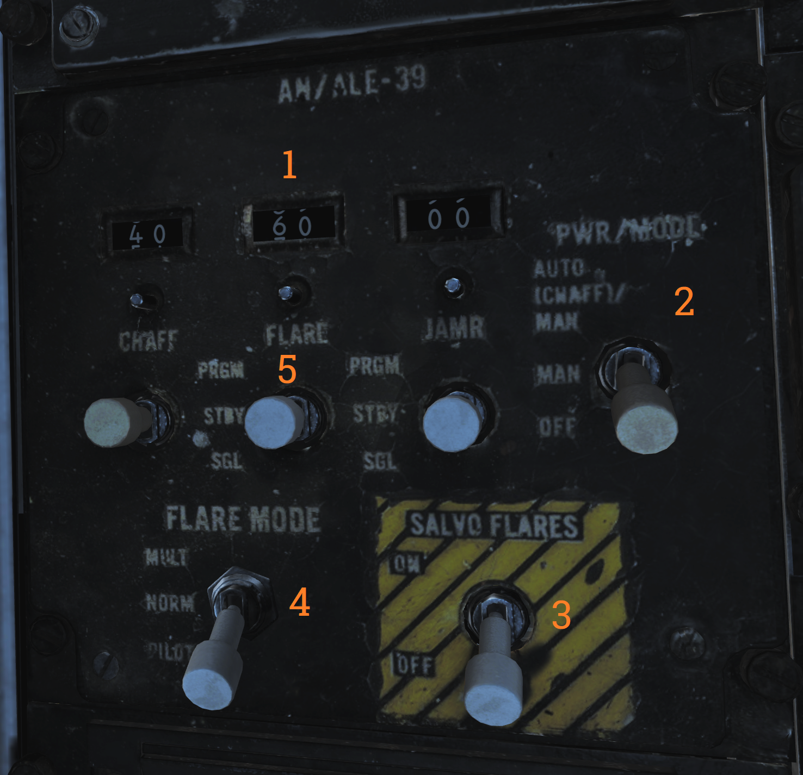
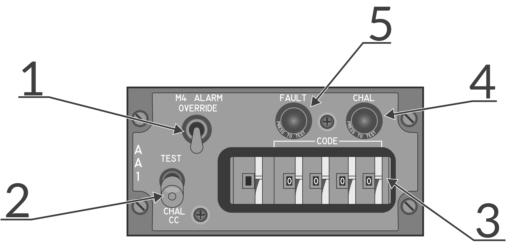
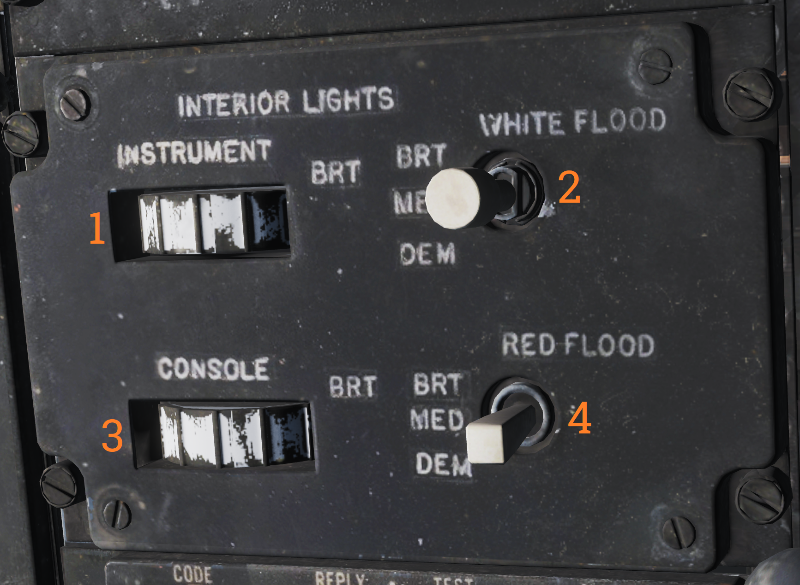

## Right Side Console

### Radar Warning Receiver Panel

| No. | Control                | Function                                                                                  |
|-----|------------------------|-------------------------------------------------------------------------------------------|
| 1   | PWR switch             | Switch controlling power to the ALR-67.                                                   |
| 2   | DISPLAY TYPE selector  | Selector switch controlling what type of threats to prioritize and display.               |
| 3   | MODE switch            | Switch spring-loaded to center (OFF) position. Can be held to OFST (offset) and LMT (limit) position to enable respective function while held. |
| 4   | TEST switch            | Switch spring-loaded to center. Momentary selection of BIT indicates BIT in ALR-67. Selection of SPL (special) while BIT page 1 is displayed shows the special BIT status page while held and then for 3 seconds when released. |
| 5   | VOL knob               | Volume knob controlling ALR-67 audio to RIO.                                              |

### Digital Data Indicator (DDI)

Digital data indicator used to display commands received via the data link.

| No. | Indicator         | Function                                                                                  |
|-----|-------------------|-------------------------------------------------------------------------------------------|
| 1   | AFT VEC           | Aircraft is being vectored to approach target from the rear hemisphere.                    |
| 2   | COL VEC           | Aircraft is being vectored on a collision course to target.                                |
| 3   | NO MSG            | No message at this time, indicates presence of data link communication while not receiving a command. |
| 4   | TO WAY PT         | Proceed to the point being indicated by target information.                                |
| 5   | HANDOVER          | TDS is handing own aircraft over to another control center.                                |
| 6   | ORBIT             | Assume orbit at present position maintaining maximum endurance.                            |
| 7   | CHALNGE           | Intercept and visually identify the target.                                                |
| 8   | ARM 1             | Intercept and destroy the indicated hostile target using AIM-54.                          |
| 9   | ARM 2             | Intercept and destroy the indicated hostile target using AIM-7.                           |
| 10  | ARM 3             | Intercept and destroy the indicated hostile target using AIM-9.                           |
| 11  | NOT CMD           | Ignore currently received heading, speed, and altitude. Also means valid command BIT not yet available. |
| 12  | FRE LAN           | Free to attack the most suitable target.                                                   |
| 13  | DIS’GAGE          | Cease fire.                                                                                |
| 14  | ABORT             | Abort action.                                                                              |
| 15  | BEAC ON           | Enable APN-154 tracking beacon.                                                            |
| 16  | BEAC DUB          | Set APN-154 to double-pulse mode.                                                          |
| 17  | DROP              | Command to release a weapon in data link A/G attack, manually or automatically if in data link attack mode. |
| 18  | BEAC OFF          | Turn off APN-154 tracking beacon.                                                          |
| 19  | RET BASE          | Return to the indicated home base.                                                         |
| 20  | WAVE OFF          | Wave off, automatic AFCS disengagement.                                                    |
| 21  | LAND CHECK        | CATCC has a data link channel available for AFCS, complete landing checklist.              |
| 22  | ACL BEAC          | Directed by carrier to enable APN-154 beacon.                                              |
| 23  | ACL RDY           | ACL has locked onto aircraft APN-154 beacon and is transmitting zero pitch and bank signals. Glideslope information is now available to the pilot. |
| 24  | A/P CPLR          | ACL is ready to take control of the aircraft for the ACL approach, autopilot should be engaged. |
| 25  | 10 SEC            | Indicates 10 seconds to the next action or waypoint. In ACL indicates that the ship's motion is taken into account for ACL. |
| 26  | ADJ A/C           | Indication from the control station of another aircraft near own aircraft.                 |
| 27  | VOICE             | Indicates ACL not available, switch to voice procedures.                                    |
| 28  | TILT              | Indicates no data link message received in the last 10 seconds. In ACL indicates no messages in the last 2 seconds, will disengage AFCS. |
| 29  | CMD CHG           | Indicates imminent or recently changed command instructions.                              |
| 30  | ALT CHG           | Indicates imminent or recently changed altitude command.                                   |
| 31  | MON ALT           | Message indicating altitude command not being followed with enough precision.             |
| 32  | MANUAL            | Indicates autopilot should not be engaged.                                                |
| 33  | SPD CHG           | Indicates imminent or recently changed speed command.                                      |
| 34  | MON SPD           | Message indicating speed command not being followed with enough precision.                |
| 35  | CMD CTRL          | Indicates aircraft under data link control for landing.                                    |
| 36  | CHG CHN           | Command to change data link channel.                                                      |
| 37  | HDG CHN           | Indicates imminent or recently changed heading command.                                    |
| 38  | CANC RPY          | TDS has canceled reply messages.                                                           |
| 39  | FWD VEC           | Aircraft is being vectored to approach the target from the front hemisphere.               |

### DECM Control Panel

Control panel for the DECM jammer (AN/ALQ-126).

| No. | Control/Indicator       | Function                                                                                 |
|-----|-------------------------|------------------------------------------------------------------------------------------|
| 1   | STANDBY light           | Orange light indicating warm-up when the system is placed in STBY. Goes out after complete warm-up. Indication during test or operation indicates a fault has occurred. |
| 2   | DECM selector           | DECM power/mode switch. Used to control power and function of DECM. OFF - Turns off power to AN/ALQ-126. STBY - Standby, applies power to warm-up system. TEST/HOLD 3 SEC - Should be held in this position for 3 seconds to prepare for system test. TEST/ACT - Starts AN/ALQ-126 BIT, used after 3 seconds in TEST/HOLD 3 SEC position. REC - Receive, enables AN/ALQ-126 to receive and analyze threat signals. Detected missile launch may force the system into repeat mode. RPT - Repeat, enables AN/ALQ-126 to use programmed responses to received threat signals. |
| 3   | AUDIO knob              | Volume knob, sets audio volume from AN/ALQ-126 to RIO headset.                          |

### Data Link Control Panel

Control panel for the data link.

| No. | Control                | Function                                                                                  |
|-----|------------------------|-------------------------------------------------------------------------------------------|
| 1   | Transmission mode switch | Sets data link transmission mode. TEST - Starts system test. NORM - Normal operational mode. A/J - Anti-jam mode. |
| 2   | Frequency select wheels  | Thumbwheels used to set data link frequency.                                             |
| 3   | Data link power switch   | Enables power to data link, also used to set AUX (auxiliary) mode.                      |

### Data Link Reply and Antenna Control Panel

Panel used to control data link alignment, reply, and antenna.

| No. | Control                | Function                                                                                  |
|-----|------------------------|-------------------------------------------------------------------------------------------|
| 1   | ANTENNA switch         | Switch selecting antenna in use for UHF 1 and data link.                                   |
| 2   | REPLY switch           | Used to transmit data link reply, transmits in NORM (normal), disabled in CANC (cancelled). |
| 3   | MODE switch            | Switch spring-loaded to TAC but held by solenoid. Enables data link alignment and waypoint update. CAINS/WAYPT - Enables data link alignment and waypoint update. TAC - Enables manual selection of frequencies, stops data link alignment. |
| 4   | ADDRESS thumbwheel     | Sets what data link address own aircraft uses. (Sets two least significant digits, others set by ground crew.) |

### AN/ALE-39 Control Panel

| No. | Control/Indicator      | Function                                                                                  |
|-----|------------------------|-------------------------------------------------------------------------------------------|
| 1   | Inventory counters     | Analog counters used to indicate remaining quantities of loaded countermeasures. Are manually set by pushing in and rotating the knob below each counter. |
| 2   | PWR/MODE switch        | Switch enabling power and selecting the operational mode of the AN/ALE-39. AUTO(CHAFF)/MAN - Allows manual release of countermeasures and automatic release of chaff by threat detection in the ECM systems. MAN - Allows manual release of countermeasures. OFF - Disables AN/ALE-39. |
| 3   | SALVO FLARES switch    | Enables parallel rapid firing of all flares. Switch needs to be lifted to move to the ON position. |
| 4   | FLARE MODE switch      | Switch selecting operational mode for launching flares. Also controls what countermeasure the DLC button on the pilot stick ejects while airborne. MULT - Multiple, each flare ejection command will eject one flare from each launcher subsection loaded with flares. Affects both manual and programmed releases. NORM - Normal, each flare ejection command will eject one flare in total. Affects both manual and programmed releases. PILOT - Enables the pilot to manually release flares with the pilot stick DLC button, the other positions release chaff with DLC button depression. |
| 5   | Countermeasure release switches | Switches spring-loaded to center which controls respective countermeasure release actuation. PRGM - Program, switch needs to be lifted to enter this position, momentary actuation initiates programmed release. STBY - No release. SGL - Single, momentary actuation releases a single countermeasure. |

### AA1 Control Panel

AN/APX-76 interrogator control panel.

| No. | Control/Indicator     | Function                                                                                   |
|-----|-----------------------|--------------------------------------------------------------------------------------------|
| 1   | M4 ALARM OVERRIDE switch | Switch disabling the mode 4 tone alarm in the RIO headset.                                 |
| 2   | TEST-CHAL CC switch   | Switch spring-loaded to center controlling IFF challenge and test. TEST - Momentary actuation, tests the AN/APX-76 by interrogating own transponder, if the same codes are set two solid lines appear on DDD at 3 and 4 miles. CHAL CC - Momentary actuation, starts a 10 second interrogation cycle only showing returns with correct mode and code on DDD. |
| 3   | CODE selector thumbwheels | Thumbwheels controlling mode and code used for interrogation. First wheel sets mode, last four set code. |
| 4   | CHAL light            | Light indicating active interrogation in progress.                                          |
| 5   | FAULT light           | Light indicating fault in AN/APX-76.                                                        |

### AN/ALE-39 Programmer

Programming panel used to program current countermeasure inventory into AN/ALE-39.

| No. | Control/Indicator     | Function                                                                                   |
|-----|-----------------------|--------------------------------------------------------------------------------------------|
| 1   | JAMR thumbwheels      | Thumbwheels used to set jammer release program. QTY - Quantity, sets quantity of jammers to release in the program. INTV - Interval, sets interval in seconds between jammer releases in the program. |
| 2   | CHAFF thumbwheels     | Thumbwheels used to set chaff release program. B-QTY - Quantity, sets quantity of chaff to release in one program salvo, can also be set to C (continuous) or R (random). B-INTV - Interval, sets the interval between chaff bursts to release in one program salvo, can also be set to R (random). S-QTY - Quantity, selects the number of salvos to release in a program. S-INTV - Interval, selects the interval between salvos in a program. |
| 3   | FLARE thumbwheels     | Thumbwheels used to set flare release program. QTY - Quantity, sets the quantity of flares to be released in a program. INTV - Interval, sets the interval between flare releases in a program. |
| 4   | LOAD control thumbwheels | Thumbwheels inputting into AN/ALE-39 what is loaded into each launcher subsection. L10 - Sets loaded countermeasure in Left 10 subsection. L20 - Sets loaded countermeasure in Left 20 subsection. R10 - Sets loaded countermeasure in Right 10 subsection. R20 - Sets loaded countermeasure in Right 20 subsection. |
| 5   | RESET switch          | Switch loading programmed settings into AN/ALE-39 and resetting sequencer switches to their starting positions. |

### Interior Light Control Panel

Panel controlling lights in the RIO cockpit.

| No. | Control                 | Function                                                                                  |
|-----|-------------------------|-------------------------------------------------------------------------------------------|
| 1   | INSTRUMENT thumbwheel   | Thumbwheel controlling instrument panel lights, 0 equals off, 1-14 sets the lights to an increasingly bright setting. |
| 2   | WHITE FLOOD switch      | Switch enabling white floodlights in the RIO cockpit. DIM and BRT (bright) settings available, switch locked to OFF unless pulled out. |
| 3   | CONSOLE thumbwheel      | Thumbwheel controlling console lights and red floodlights. 0 turns off both console and red floodlights, 1-14 sets the console lights to an increasingly bright setting. |
| 4   | RED FLOOD switch        | Switch controlling red instrument and console floodlights. BRT - Sets bright red instrument flood and console lights. MED - Red console floodlights. DIM - Dim red console floodlights. |

### Data/ADF Switch

Switch controlling the display of data and ADF on the HSD and ECMD. BOTH enables the display of the ADF bug and navigation data block. DATA enables the display of only the navigation data block. OFF disables the display of either.

### IFF Transponder Control Panel

Control panel for the AN/APX-72 transponder.

| No. | Control/Indicator      | Function                                                                                  |
|-----|------------------------|-------------------------------------------------------------------------------------------|
| 1   | MODE 4 switch          | Switch enabling mode 4.                                                                   |
| 2   | MODE 4 AUDIO/LIGHT switch | Switch enabling mode 4 audio and light monitoring. AUDIO - Enables audio monitoring of mode 4 interrogation and REPLY light monitoring of mode 4 replies. OUT - Disables audio and light monitoring of mode 4. LIGHT - Enables REPLY light monitoring of mode 4 replies. |
| 3   | MODE 4 CODE selector   | CODE selector switch, controlling what cipher code to use. ZERO - Erases both ciphers from the system. B - Selects the B cipher code for use. A - Selects the A cipher code for use. HOLD - Non-functional. |
| 4   | MODE 4 REPLY light     | Light indicating when a mode 4 reply is generated and transmitted. Can be pushed to test the light. |
| 5   | TEST light             | Light indicating correct test when the respective test switch is used. The light itself can be tested by pushing it. |
| 6   | MASTER selector        | Selector switch controlling AN/APX-72 mode of operation. OFF - Disables power to the AN/APX-72. STBY - Standby, enables standby for immediate operation upon selection of other operational modes. LOW - Activates replies to set modes in low sensitivity mode, only strong nearby interrogators are replied to. NORM - Normal, replies normally to all received interrogations. EMER - Activates emergency mode replies to mode 1, 2, and 3/A, and normal reply to mode C, regardless of mode switches. |
| 7   | MODE switches          | Switches controlling the operation of the different IFF modes. TEST - Tests the respective mode, correct operation if the TEST light illuminates. ON - Enables the respective IFF mode. OUT - Disables the respective IFF mode. |
| 8   | RAD TEST-OUT-MON switch| Switch allowing ground test and monitoring of non-mode 4 replies. RAD TEST - Not used by the aircrew. OUT - Disables test and monitoring. MON - Monitor mode 1, 2, 3, and C by illuminating the test light when replies are generated and transmitted. |
| 9   | IDENT-OUT-MIC switch   | Switch controlling the operation of the mode 1-3 IDENT function. IDENT - Momentary position enabling IDENT reply for 15 to 30 seconds after switch release. OUT - IDENT function off. MIC - Transfers IDENT control to crewmember UHF PTT, enabling IDENT reply as per IDENT each time the PTT is keyed. |
| 10  | CODE thumbwheels       | Six thumbwheels selecting the code in use for mode 1 and 3.                               |

### IFF Antenna Control/Test Panel

Panel containing controls for IFF antenna, tests, and ground cooling.

| No. | Control                  | Function                                                                                  |
|-----|--------------------------|-------------------------------------------------------------------------------------------|
| 1   | IFF ANT switch           | Switch allowing control of which antenna the IFF transponder uses. Possible to select AUTO (automatic) or LWR (lower). |
| 2   | IND LT/DDI BIT switch    | Test switch allowing manual DDI BIT and test of RIO indicator lights.                      |
| 3   | GND CLG switch           | Switch allowing the use of external air to cool aircraft systems while on the ground. OBC/CABIN - Allows for external air into the cabin and to cool electronics and AWG-9/AIM-54 with reduced performance for OBC. OFF - External air not used for these functions. AWG-9/AIM-54 - Uses the external air to cool AWG-9 and AIM-54 coolant with better performance but disables external air to cabin. |

### Mid Compression Bypass Test Panel (F-14A only)

Panel containing controls and indicators used to verify Mid Compression Bypass (MCB) circuit functionality.

| No. | Control/Indicator       | Function                                                                                 |
|-----|-------------------------|------------------------------------------------------------------------------------------|
| 1   | Left and Right test lights | Indicators illuminating with MCB Test switch activation to indicate left and right successful MCB circuit test respectively. |
| 2   | MCB Test switch          | Test switch activating MCB circuit test to verify MCB circuit functionality.             |

### Electrical Power System Test Panel

Panel used by ground crew to test aircraft electrical systems.

Note: Non-functional in DCS.

### Canopy Defog/Cabin Air Lever

The canopy air diffuser lever controls the flow of cabin air. The normal position, CABIN AIR, directs 70% of the conditioned air through the cockpit air diffusers and 30% through the canopy air diffusers. The CANOPY DEFOG position directs all airflow through the canopy air diffusers for canopy defog.

### Canopy Control Handle

The canopy control handle controls canopy operation and is located on the right cockpit wall. The handle is mounted downwards beneath the box containing the handle mechanism and the handle position texts. The canopy control handle is duplicated in the pilot cockpit.

| No. | Control | Function                                            |
|-----|---------|-----------------------------------------------------|
| 1   | BOOST   | Closes the canopy using boost, used during cold weather or with a strong headwind. |
| 2   | CLOSE   | Closes the canopy, the default position during flight. |
| 3   | HOLD    | Holds the canopy at the current position for any position other than closed. |
| 4   | OPEN    | Opens the canopy.                                    |
| 5   | AUX OPEN| Allows manual opening of the canopy if system pressure is too low. |
