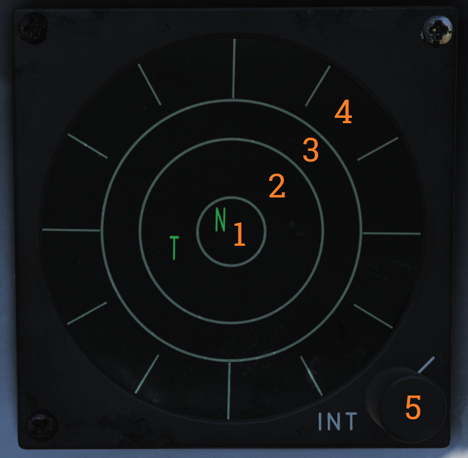
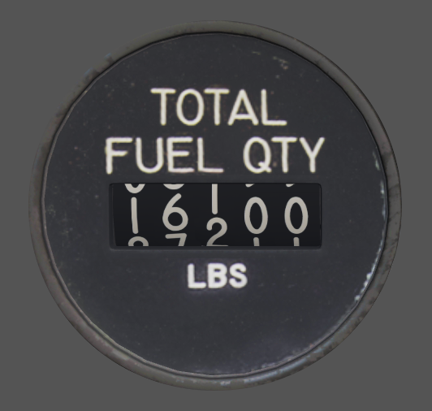
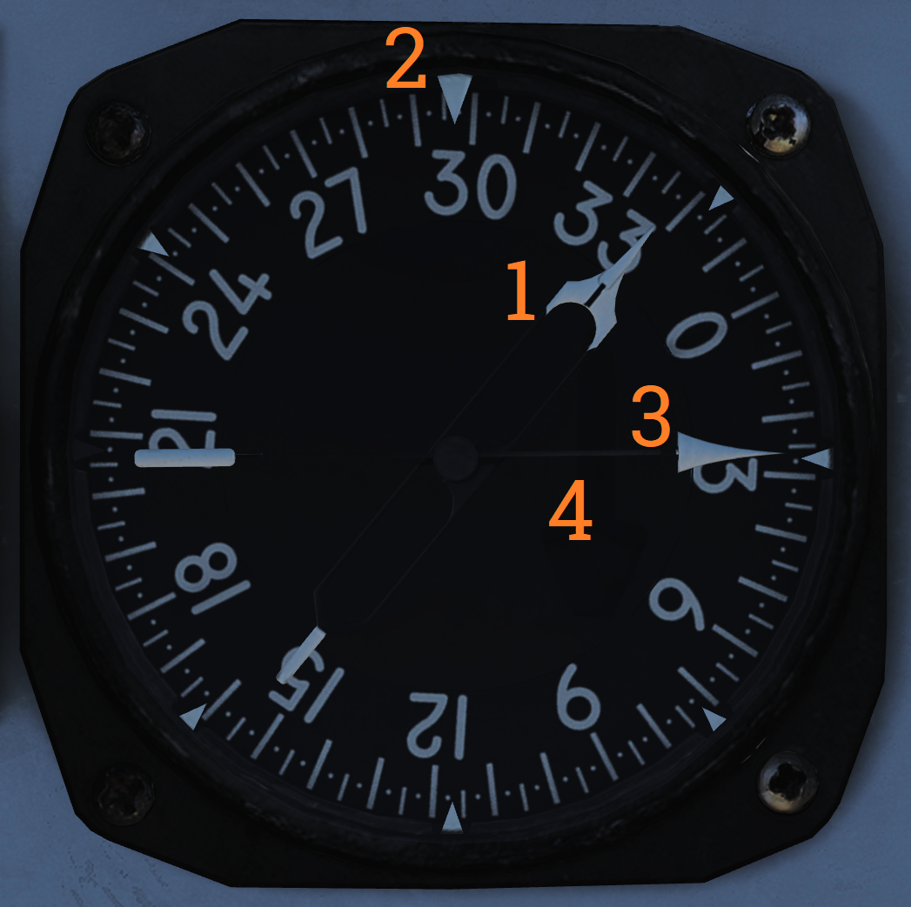

## Right Instrument Panel

### Clock

Mechanical wind-up clock.

The knob on the lower left corner is used to wind up the clock by turning it clockwise and pulling it out and turning it to set the hour and minute hands.

The control on the upper right corner is used to start, stop, and reset a 1-hour elapsed time counter.

### ALR-67 Indicator

Indicator showing emitters detected by the ALR-67 RWR (radar warning receiver) set.

| No. | Control/Indicator          | Function                                                                                |
|-----|----------------------------|-----------------------------------------------------------------------------------------|
| 1   | System status circle, area I | Upper left quadrant of 1. Shows symbol indicating the type of threats selected to be shown. N - Normal priority I - AI, airborne interceptors prioritized. A - AAA, anti-air artillery prioritized. U - Unknown emitters prioritized. F - Friendly emitters shown in addition to other threats. |
| 2   | System status circle, area II | Upper right quadrant of 1. Indicates if limited mode is selected. (Blank) - Limited mode not selected. L - Limited mode selected, display shows only 6 highest prioritized threats. |
| 3   | System status circle, area III | Lower half of 1. Displays failure codes and if offset display is selected. (Blank) - No failure detected and offset not selected. B - BIT failure. T - Thermal overload. O - Offset display selected. Threats will be separated to allow readout of overlapping symbols. Bearing accuracy degraded for displaced threats. |
| 4   | Non-lethal band            | Displays emitters not a direct threat to own aircraft, either because deemed out of range or lacking weaponry to do so. |
| 5   | Lethal band                | Displays threats that are deemed within range and capable of engaging own aircraft but not currently doing so. |
| 6   | Critical band              | Displays direct threats to own aircraft. Systems capable of engaging own aircraft and showing current intent of doing so. |
| 7   | INT knob                   | Intensity/brightness knob. Controls the brightness of the display.                       |

### Fuel Quantity Totalizer

Total fuel quantity readout, shows total fuel quantity in all aircraft tanks.

### Threat Advisory and Master Caution Lights

| No. | Indicator             | Function                                                                                   |
|-----|-----------------------|--------------------------------------------------------------------------------------------|
| 1   | MASTER CAUTION light and button | Flashes to indicate status change on the RIO caution/advisory panel. Press to reset and turn off light until the next event. |
| 2   | IFF                   | Advisory light indicating received mode 4 interrogation without own system generating a reply. |
| 3   | RCV                   | Advisory light indicating ALQ-126 is receiving a threat identification signal.             |
| 4   | XMIT                  | Advisory light indicating ALQ-126 is transmitting.                                         |
| 5   | SAM                   | Warning light, steady illumination when detecting lockon from a SAM tracking radar. Flashes when a missile launch is detected. |
| 6   | AAA                   | Warning light, steady illumination when detecting lockon from a AAA tracking radar. Flashes when AAA engagement is detected. |
| 7   | CW                    | Warning light indicating detection of a continuous wave emitter.                           |
| 8   | AI                    | Warning light, steady illumination when detecting lockon from an airborne interceptor radar. |

### Bearing Distance Heading Indicator (BDHI)

Display indicating azimuth and bearing information.

| No. | Indicator         | Function                                                                                   |
|-----|-------------------|--------------------------------------------------------------------------------------------|
| 1   | No. 2 bearing pointer | Indicates magnetic course to tuned TACAN station.                                         |
| 2   | Compass rose      | Shows current aircraft magnetic heading.                                                    |
| 3   | No. 1 bearing pointer | Indicates bearing to tuned UHF/ADF station.                                               |
| 4   | Distance counter  | Indicates slant range to tuned TACAN station in nautical miles. (Not visible in this image.) |

### Canopy Jettison Handle

Handle used to manually jettison canopy.
