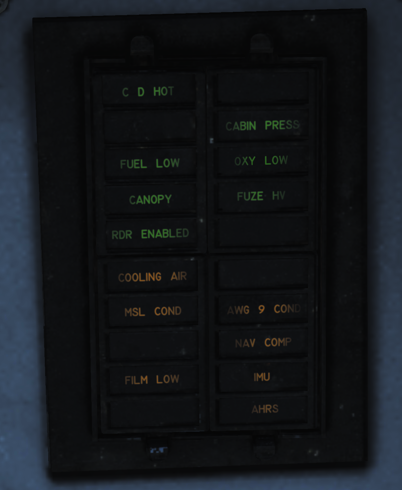

## Right Knee Panel

### Caution-Advisory Panel

| No. | Indicator    | Function                                                                                 |
|-----|--------------|------------------------------------------------------------------------------------------|
| 1   | C&D HOT      | Caution light indicating overheat in RIO controls and displays.                           |
| 2   | CABIN PRESS  | Caution light indicating cabin pressure is too low.                                       |
| 3   | FUEL LOW     | Caution light indicating fuel below 1,000 pounds in either aft and left or forward and right fuel feed groups. |
| 4   | OXY LOW      | Caution light indicating oxygen quantity is below 2 liters or pressure too low.           |
| 5   | CANOPY       | Caution light indicating canopy not down and locked.                                      |
| 6   | FUSE HV      | Caution light indicating AWW-4 electric fuse inoperative.                                 |
| 7   | RDR ENABLED  | Caution light indicating that radar operation with weight on wheels is possible.          |
| 8   | COOLING AIR  | Advisory light indicating overtemperature condition in the electronic forced air cooling system. |
| 9   | MSL COND     | Advisory light indicating overtemperature or underpressure in missile coolant flow, either of which shuts down the missile coolant pump. Can also indicate that the LIQ COOLING switch is not in the AWG-9/AIM-54 position with the WCS in STBY or ON when the Phoenix fairings are installed. |
| 10  | AWG-9 COND   | Advisory light indicating overheat or overpressure in the AWG-9 coolant flow or that the overtemperature switch has shut down the coolant pump. |
| 11  | NAV COMP     | Advisory light indicating failure in the INS or CSDC with the NAV MODE switch in INS.     |
| 12  | FILM LOW     | Advisory light indicating low remaining quantity of mission recorder film.                |
| 13  | IMU          | Advisory light indicating a failure in the inertial measuring unit or that the navigation system is in AHRS/AM mode. |
| 14  | AHRS         | Advisory light indicating that the attitude or heading information from the AHRS is unreliable. |
