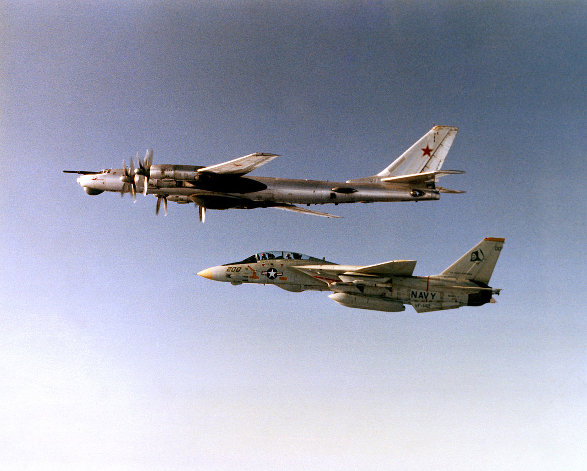
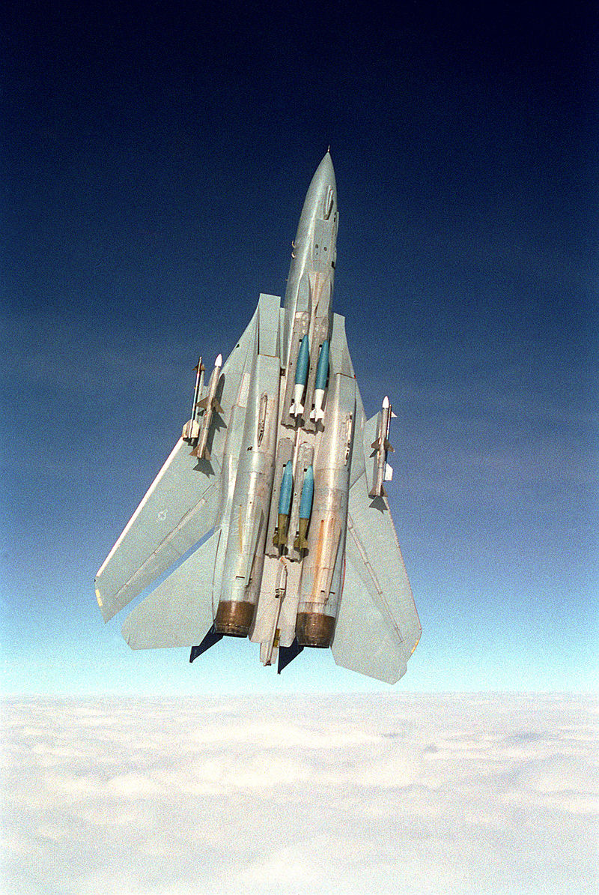
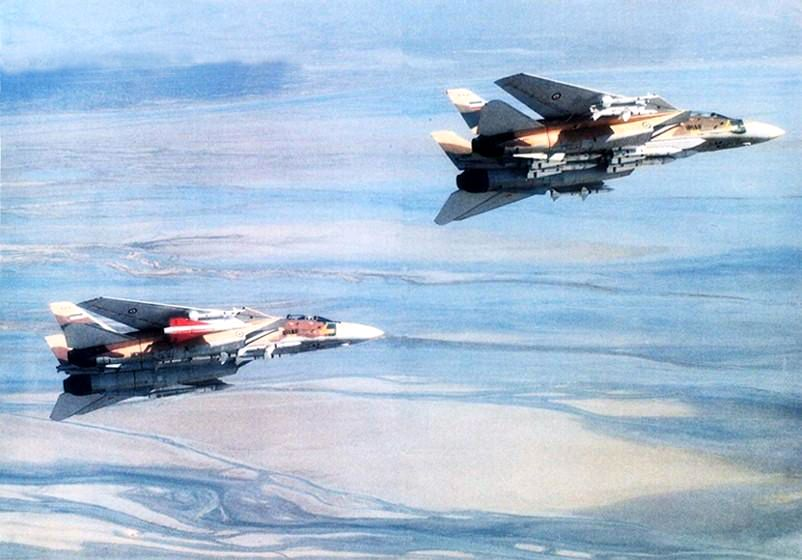
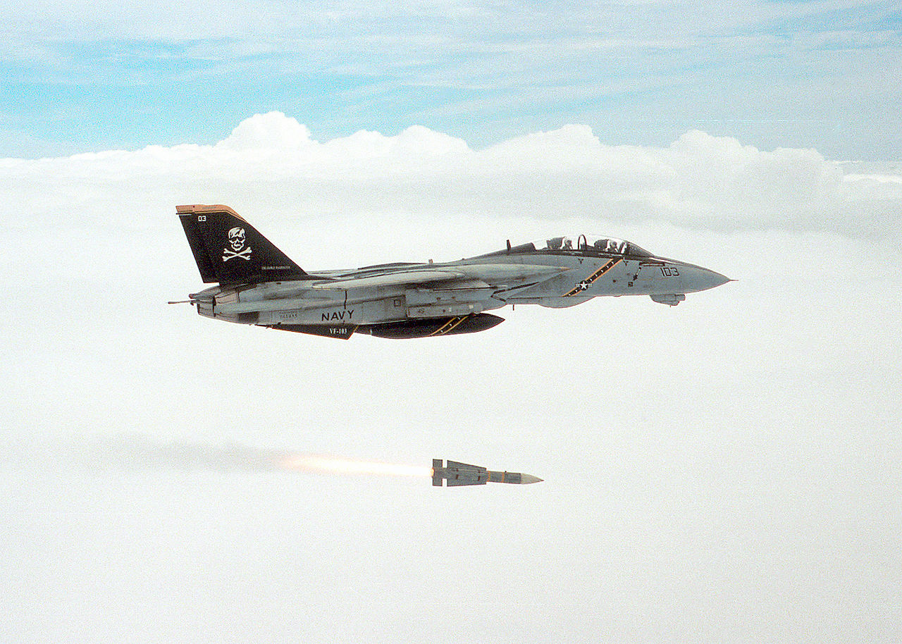

# Historical Background

## F-14 Tomcat

*U.S. Navy photo by LT J.G. Thomas Prochilo. (DN-SC-83-06680)*

The F-14 Tomcat can trace its origin back to the 1950’s and the US Navy’s need for a carrier based long range interceptor to fill the Fleet Air Defence role. It was decided that it needed an aircraft with a more advanced and longer ranged radar as well as longer ranged air-to-air missile than the F-4 Phantom.

The Navy was directed, by then defense secretary Robert McNamara, to join the Tactical Fighter Experimental or TFX program to procure this aircraft in a joint venture with the US Air Force. The Navy was opposed to this from the beginning and the proposed General Dynamics F-111B did not meet the Navy’s expectations.

Grumman, which had been brought on board by General Dynamics for the Navy F-111B, was eventually awarded a contract to begin development of an aircraft more suited to the Navy’s requirements. This led to the design that would eventually become the F-14, carrying over the radar (AN/AWG-9) and missiles (AIM-54 Phoenix) from the failed F-111B project.

The F-14 Tomcat first flew on the 21st of December 1970 and entered service on the 22nd of September 1974. The name “Tomcat” follows Grumman’s tradition of naming their aircraft after cats and also partially from the nickname “Tom’s Cat” for Vice Admiral Thomas F. Connolly who was instrumental for the development of the F-14.

### Service Life Upgrades

The first version of the F-14, the F-14A was equipped with the Pratt & Whitney TF30 and carried an IRST system in the chinpod under the nose.

The TF30 engines were generally regarded as temperamental and underpowered for the F-14A and were eventually replaced by the General Electric F110-400 engines in the F-14A+ (later F-14B).

The IRST system was rather quickly determined to be underperforming and replaced with the TCS (Television Camera Set) in the chinpod allowing for greater than visual range identification of radar tracked targets.

Both the F-14A and F-14B received continuous upgrades during their life, including new programmable cockpit displays (PTID and PMDIG) as well as a new INS system, a digital flight control system (DFCS) and an RWR system amongst others.

Eventually, the Tactical Reconnaissance mission was also added to the F-14’s portfolio, enabled by the TARPS system, allowing the Tomcat to gather photographic reconnaissance material.

### Ground Attack

*Photo by LCDR Dave Parsons. (DN-SC-93-01299)*

During the 1990’s when the aerial threat to the fleets of the US Navy lessened and with the advent of operations like Desert Storm, the ground attack role was resurrected.

The ability to carry and deliver air-to-ground munitions had been implemented in the F-14 from the beginning but ruled out by the Navy as cost and risk ineffective given the F-14’s role as a Fleet Air Defence fighter.

With the renewed interest for this role, some of the F-14As and F-14Bs were equipped to carry the LANTIRN targeting pod allowing the RIO to find and designate laser guided bombs for his own aircraft and others. Later on the ability to carry and deliver gps-guided JDAMs was also added.

Most of the LANTIRN equipped aircraft were the ones upgraded with the programmable TID or (PTID) allowing for greater integration of the LANTIRN.

### F-14D

In the 1990’s the ultimate F-14 version was beginning to see service, the F-14D.

The F-14D used the same engines as the F-14B, the GE F110-400s in addition to using the digital flight control system, which was eventually retrofitted into operational F-14As and F-14Bs as well.

In addition, the F-14D also had a newer, more advanced version of the AN/AWG-9, the AN/APG-71, as well as a whole suite of upgraded avionics along with a new chinpod combining the TCS with a new, improved IRST system.

### End of Service

The F-14 Tomcat did eventually show its age, forcing the Navy to retire it due to increased maintenance costs and the general status of the now dated airframes. Additionally, the Tomcat’s primary role, the Fleet Air Defence role, seemingly disappeared with the end of the Cold War.

The Tomcat was finally retired in a ceremony on the 22nd of September 2006 at NAS Oceana.

## Iran

*IRIAF photo circa 1986.*

The only other operator of the F-14 Tomcat was the Imperial Iranian Air Force, later the Islamic Republic of Iran Air Force, for which the Shah of Iran, Mohammad Reza Pahlavi acquired 80 Tomcats.

The eventual fall of the Shah and the rise of the Islamic Republic of Iran meant that a country now opposed to the United States had access to one of its most advanced fighter aircraft. This meant that the Iranian F-14s now lost access to new spare parts and missiles, apart from black market sources, greatly increasing the difficulty of maintaining the aircraft.

The F-14 Tomcat was used during the Iran-Iraq war, claiming a great number of air-to-air victories over the Iraqi Air Force, with some sources going so far as to claim that Iraqi pilots at times left the contested air space to avoid facing the AN/AWG-9 - AIM-54 combo.

To this date the IRIAF continues to fly the F-14 Tomcat as the sole operator. It’s not entirely known how the Iranians source their spare parts but it’s assumed that they’ve had to cannibalize inoperable aircraft to keep a portion of their fleet flying. In addition, rumours exist mentioning black market sources as well as indigenous production of some parts.

The Iranian operated Tomcats are of the earlier F-14A revisions, using the TF30 engines and lacking a TCS or IRST system.

## AIM-54 Phoenix

*U.S. Navy photo by Capt. Dana Potts. (020924-N-1955P-001)*

The AIM-54 long-range air-to-air missile was born from the same TFX program as that which eventually led to the F-14 Tomcat.

It was designed for the F-111B and then adopted for the F-14 as a long-range missile capable of long range engagement of enemy bombers in addition to hostile cruise missiles. That’s not to say that the AIM-54 Phoenix was a slouch at engaging other smaller targets as well.

Outstanding features of the AIM-54 missiles were their long range as well as their ability to be launched at up to six simultaneous targets, guided first by the AN/AWG-9 radar in the launching aircraft and then its own active radar seeker independently.

The original AIM-54 Phoenix was the AIM-54A with a mk47 rocket motor. The motor was later on upgraded, creating the mk60 motor, increasing the missile’s range. Eventually the AIM-54 itself was also upgraded, resulting in the AIM-54C with, amongst other things, an upgraded seeker head and a newer version of the mk47 producing less smoke, making the missile hard to spot visually.

The US Navy fired only three AIM-54 missiles in combat, all three over Iraq. The missiles never hit their intended targets though as two of the missiles’ rocket motors failed with the third also missing its target as it turned tail and ran.

While little is known for certain in the western hemisphere, the IRIAF claims at least 78 air-to-air victories using the AIM-54 against Iraqi MiG-21s, MiG-23s, MiG-25s, Mirage F-1s, Super Etendards and even some anti-ship cruise missiles.
