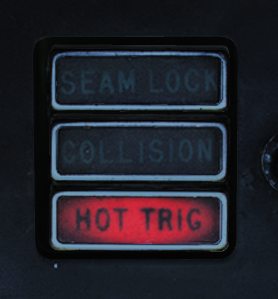

# AIM-9 Sidewinder

*U.S. Navy photo by Photographer’s Mate Airman Kristopher Wilson. (050112-N-5345W-066)*

The AIM-9 Sidewinder is a short-range air-to-air missile. It uses an infrared seeker locking on to a target's IR signature, making it capable of tracking a target both during daytime and at night.

The F-14 Tomcat is capable of carrying all Navy versions of the AIM-9 Sidewinder from the AIM-9D up to the AIM-9M. The Heatblur F-14 Tomcat is currently modeled as carrying the AIM-9L and AIM-9M.

The F-14 is capable of carrying the AIM-9 on stations 1A & B and 8A & B. Stations 1 & 8 are the glove pylons, which can each carry two AIM-9s for a total of 4. Station 1A & 8A are dedicated to carry only the AIM-9 and are normally used when only carrying two to allow station 1B & 8B to carry other munitions.

## Missile Preparation

The cooling of the AIM-9 seeker head needs to be enabled before launch. This is done by pressing the SW COOL switch on the pilot ACM panel or by selecting the ACM mode on the same panel. This commands cooling of the missile's seeker head. The missile will immediately show ready, but full seeker head performance will take at least 60 seconds.

## Seeker Head Modes
The AIM-9G introduced a seeker head capable of the Sidewinder expanded acquisition mode (SEAM), and all later Sidewinders carried by the F-14 are also capable of that mode. SEAM allows the missile seeker head to be uncaged to track a target within the seeker limits (40° from ADL), allowing the pilot to lead the target, improving missile performance. It also allows for the WCS on the F-14 to slave the seeker to a tracked target within 20° from ADL, allowing for off-boresight acquisition.

The AIM-9 on the F-14 can still use the old boresight mode where the seeker head remains slaved to ADL (2.5° field of view), but normally SEAM is used to scan the seeker about either ADL or a tracked target. This scan is not visible to the pilot and is done to increase effective seeker head field of view. As with all Sidewinders, target detection is indicated by an aural tone. That growling tone is present while scanning but increases in intensity while the seeker is looking at an IR source.

## Missile Operation
The AIM-9 Sidewinder is selected for launch with the weapon selector on the pilot stick. The weapon selector can be used to cycle which AIM-9 is selected for launch by depressing it, indicating on the ACM panel which missile is selected by a checkerboard indication in the corresponding status window. When using the AIM-9, the HUD uses the diamond to indicate a tracked target and the pipper (crosshair) to indicate current seeker head position. If a WCS track with range is available, the HUD also displays range to target and Rmin and Rmax. The VDI, DDD, and TID display the attack guidance symbology if a WCS track is present.

The basic missile boresight mode without SEAM (no scan) is commanded by depressing the BRSIT (boresight) switch on the pilot ACM panel while not having the ACM mode active. In this mode, the pilot puts the target at ADL and fires when the aural tone is present.

If the BRSIT switch is not used or the ACM mode is active, the AIM-9 will use the SEAM and set the missile to use the double-D scan pattern. If a WCS target is present, the seeker head will scan around the radar or TCS line of sight; otherwise, the missile will scan around the ADL.

To enable lock-on to a target in SEAM, the pilot depresses the CAGE/SEAM pushbutton on the left throttle. This illuminates the SEAM LOCK light on the ACM panel and uncages the seeker for 4.5 seconds, allowing it to track a target present in the seeker's field of view. If no IR source is found, the missile is again caged and the SEAM LOCK light is deactivated.

If lock-on is successful, the aural tone will remain and the SEAM LOCK light stays illuminated, allowing the pilot to launch the missile by pressing the stick trigger. After launch, the next AIM-9 will automatically be selected.

