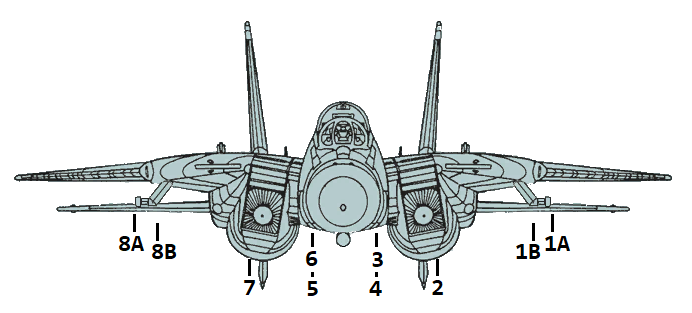

# Weapons & Stores

As a cornerstone of air forces around the globe, the F-4E's effectiveness is not
only attributed to its advanced avionics and airframe design but also to its
formidable array of weapons and stores.

The F-4E features three main types of [Air-to-Air](./air_to_air/overview.md)
Weaponry including Heat-Seeking Missiles with the [AIM-9](./air_to_air/aim_9.md)
in different [variants,](./air_to_air/aim_9.md#variants) the semi-active radar
homing missile [AIM-7](./air_to_air/aim_7.md) in different
[variants](./air_to_air/aim_7.md#variants) and a
[M61A1 Vulcan cannon](./guns.md#internal-cannon-m61a1-vulcan) that can be used
against Air and Ground Targets.

The aircraft can be armed with a variety of
[bombs](./air_to_ground/bombs/overview.md),
[rockets](./air_to_ground/rockets.md), and
[guided munitions](./air_to_ground/missiles/overview.md) to engage and
neutralize ground targets. Precision-guided munitions, such as
[laser-guided bombs](./air_to_ground/bombs/laser_guided_bombs.md), enable the
Phantom II to strike high-value targets with precision, minimizing collateral
damage and maximizing mission success.

In addition to its lethal armament, the F-4E can be configured with
[external fuel tanks](./tanks.md) to extend its operational range. The aircraft
can also carry specialized stores, including
[targeting pods](./pods.md#anavq-23-pave-spike) and
[electronic warfare (EW) systems](./pods.md#alq-131-ecm-pod).

## Loadout

The following diagram gives an overview of all stores that can be loaded on the
stations.

> 💡 In practice, not all combinations might be possible, as there are a lot of
> technical factors resulting in restrictions.

| Weapon Station         | 1A | 1B | 2  | 3  | 4  | 5  | 6  | 7  | 8B | 8A | Total  |
|------------------------|----|----|----|----|----|----|----|----|----|----|--------|
|   AIM-9                | 1  |    |    |    |    |    |    |    |    | 1  | 4      |
|   AIM-7                |    | 1  |    | 1  | 1  | 1  | 1  |    | 1  |    | 6      |
|   AIM-54               |    | 1  |    | 1  | 1  | 1  | 1  |    | 1  |    | 6      |
|   Mk-81                | 2  | 4  |    | 3  | 3  |    | 4  | 2  |    |    | 18     |
|   Mk-82                | 2  | 4  |    | 3  | 3  |    | 4  | 2  |    |    | 18     |
|   Mk-82AIR             | 2  | 4  |    | 3  | 3  |    | 4  | 2  |    |    | 18     |
|   Mk-82 Snake Eye      | 2  | 4  |    | 3  | 3  |    | 4  | 2  |    |    | 18     |
|   Mk-83                | 1  | 3  |    | 1  | 1  |    | 3  | 1  |    |    | 10     |
|   Mk-84                |    | 1  |    | 1  |    |    | 1  |    | 1  |    | 4      |
|   Mk-20                | 2  | 2  |    | 1  | 1  |    | 2  | 2  |    |    | 10     |
|   GBU-10               |    |    |    | 1  |    |    | 1  |    |    |    | 2      |
|   GBU-12               | 1  |    |    | 1  |    |    | 1  |    |    | 1  | 4      |
|   GBU-16               |    |    |    | 1  |    |    | 1  |    |    | 1  | 4      |
|   GBU-24               |    |    |    | 1  |    |    |    |    |    | 1  | 2      |
|   BDU-33               |    | 3  |    | 3  | 3  | 3  | 3  |    | 3  |    | 18     |
|   LAU-10 (Zuni)        |    | 2  |    | 2  | 1  |    | 2  |    | 2  |    | 7 (28) |
|   ADM-141A TALD        |    |    |    | 1  | 1  | 1  | 1  |    |    | 1  | 4      |
|   SUU-25 F/A Flare     |    |    |    |    | 2  | 2  |    |    |    |    | 4 (16) |
|   LAU-138 Chaff Adapter   | 1  |    |    |    |    |    |    |    |    | 1  | 2   |
|   Smokewinder          | 1  |    |    |    |    |    |    |    |    | 1  | 4      |
|   TACTS                | 1  |    |    |    |    |    |    |    |    | 1  | 2      |
|   LANTIRN              |    |    |    |    |    |    |    |    |    | 1  | 1      |
|   FPU-1 Fuel Tank      |    |    | 1  |    |    |    |    | 1  |    |    | 2      |
|   CNU-188 External Baggage Container   | | | | 1 | | | 1 | | | | 2 |
