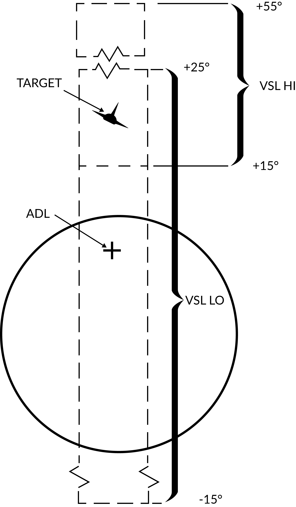

# General Radar Operation

The AN/AWG-9 radar in the F-14 is an all-weather, multi-mode pulse doppler radar using the X-band (X-band being 8-12 GHz). It was designed specifically to be a long range radar system capable of guiding up to 6 AIM-54 Phoenix missiles using its track while scan mode. One originally envisioned scenario was its use as a long range fleet defender intercepting russian bombers and attack aircraft threatening the fleet. During the F-14’s later service life this mission transitioned more towards the anti-fighter side, a mission for which it was very well adapted.

The AN/AWG-9 radar has two basic operational modes, pulse and pulse doppler, each with its own pros and cons. Below is a table listing function, weapons capability, expected range and target data available.

| Mode               | Function                                                                                      | Weapons capability                                 | Detection-range |
|--------------------|-----------------------------------------------------------------------------------------------|------------------------------------------------------------|-----------------|
| **Pulse**          |                                                                                               |                                                            |                 |
| Pulse Search       | Medium range search and detection, secondary air-to-ground.                                   | Boresight missiles.                                        | 60nm            |
| Pulse STT          | Short to medium range single target track and missile launch.                                 | Gun and missiles, AIM-7 in CW and AIM-54 in active launch. | 50nm            |
| **Pulse Doppler**  |                                                                                               |                                                            |                 |
| Pulse Doppler Search | Long range search and detection.                                                            | Boresight missiles.                                        | 110nm           |
| Range While Search | Long range search, detection and ranging.                                                     | Boresight missiles.                                        | 90nm            |
| Track While Search | Long range search, detection, multiple target track and missile guidance.                     | AIM-54, multiple target capability.                        | 90nm            |
| Pulse Doppler STT  | Long range single target track and missile guidance.                                          | Gun and all missiles. AIM-7 in PD and CW and AIM-54 in PD and active. | 90nm            |

> Detection-range approximation for a 5m²-target.

## Pulse Mode

In the pulse mode of operation the AN/AWG-9 does not use pulse doppler filtering which means that it can be used to detect targets at all aspects and also be used for rudimentary ground mapping. On the pro side this means that the radar in this mode cannot be notched as it does not need to have a relative speed to register the target. The downside however is that the radar does not have an easy way of differentiate between unwanted ground reflections and real targets meaning that aircraft can hide in the ground clutter near the ground. Because of this and the increased difficulty from trying to differentiate real targets from the general background noise without doppler filtering means that the range in the pulse modes are less than in the pulse doppler modes.

The radar has two pulse modes, pulse search and pulse single target track (P-STT).

### Pulse Search

Pulse search is used to search for and find airborne targets at range.

It is possible to use this radar mode as a basic ground mapper as well which can be useful for navigation and navigational fixes and can also be used in a pinch to detect larger surface targets like ships. Keep in mind though that the radar is not built with this as its main function and that a real air-to-ground radar will outperform it handily.

In this mode the radar cannot by itself differentiate targets and generate tracks meaning that the WCS will not generate track files and display anything on the TID. This also means that pulse search is not capable of guiding missiles.

The DDD in this mode will display a radar image indicating the azimuth and range of targets at selected scale and it is possible to transition to P STT using the RDR mode with the HCU stick. It is possible to select ground or aircraft stabilized modes of operation using the STAB switch on the sensor control panel.

### Pulse Single Target Track (P STT)

Pulse STT is used to track a single target, like pulse search mode it is not susceptible to notching but it is to ground clutter. The fact that the STT modes use gates to track the target, in this case range gates, means that it is less susceptible to ground clutter but a target close enough to the ground that the ground return enters the range gates would be likely to shake the lock.

As it is only in the pulse doppler modes that the missile guidance commands can be sent pulse STT is limited to launching AIM-7s in CW mode and AIM-54s in active launch mode limiting their ranges. At short ranges, ACM ranges, it is possible to use the ASPECT switch to set what aspect of the target to track, this is just to counter different types of countermeasures. As an example, if set to NOSE the radar will be less susceptible to chaff as the radar weights its track towards the targets leading edge (nose) away from the chaff being launched behind the target.

A successful track is indicated by the ANT TRK and RDROT indicator lights on the DDD, meaning that the antenna is tracking the target and that the target is within the range gates. If the target is jamming with sufficient strength, negating a range track, the radar will transition to a jam angle track instead, indicated by the JAT indicator light on the DDD illuminating instead of the RDROT. When range tracking is again possible at closer ranges the radar will transition to that instead.

The DDD in this mode will be similar to the pulse search mode but the antenna will be locked onto the target and not scan. Additionally the DDD will show the range gates around the target, a closing rate symbol at the right scale and applicable attack symbology if a valid missile is selected.

## Pulse Doppler Mode

In pulse doppler mode the AN/AWG-9 uses doppler filters to filter out unwanted returns, enhancing target detection and thus increasing detection range. The pros of this mode being that, as said, targets can be detected at greater ranges, ground returns mostly eliminated and missile guidance commands be sent to AIM-7 and AIM-54 missiles. The AIM-54 both in TWS and STT and the AIM-7 in STT only. The biggest con of this mode being that it is susceptible to notching as a target returning zero relative speed will be filtered out.

The pulse doppler modes of the AN/AWG-9 are, pulse doppler search, range while search, track while scan and pulse doppler STT. The three search modes have a common DDD display, the main difference being that pulse doppler search has a slightly better range as the other two modes need to process FM-ranging to enable range indication of tracked targets.

### Pulse Doppler Search

The DDD in the pulse doppler search modes displays returns at azimuth versus rate (closing speed) meaning that by reading only the DDD the RIO can only discern target closing speed and azimuth. The display indicates observed closure rate vs the ground (with own airspeed subtracted) as opposed to relative closure rate. While this means that a target directly ahead, moving directly towards the radar, will show true target airspeed this speed varies with target aspect and radar antenna azimuth. This reason for this is that the radar itself only reads relative airspeed which is then modified by subtracting own airspeed for display on the DDD.

At the bottom edge of the DDD the AGC-trace is displayed indicating radar return intensity enabling the RIO to discern jamming targets by their return strength. The jamming targets are shown as jamming strobes on the TID if they exceed the set jamming threshold (set by the JAM/JET knob on the DDD).

The scale shown on the DDD (what rate region is shown) can be set by the Vc switch on the DDD panel. X-4 sets the scale to 800 knots opening to 4 000 knots closing, NORM sets the scale to 200 knots opening to 1 000 knots closing and VID sets the scale to 50 knots opening to 250 knots closing. The operating range of the doppler filters can also be configured by the ASPECT switch on the same panel, NOSE sets 600 knots opening to 1 800 knots closing, BEAM sets 1200 knots closing to 1200 knots opening and TAIL sets 1 800 knots opening to 600 knots closing. This allows the RIO to optimize the doppler filters for a known target closing speed and this affects the whole radar processing unlike the Vc switch which only affects the DDD.

Because of the way the radar operates the doppler filters it will have two blind ranges. The main lobe clutter (MLC) region which contains most of the ground returns, including those returning with zero groundspeed and is 266 knots wide, centered around own aircraft groundspeed (133 knots slower and 133 knots faster). This is the reason that the radar can be notched as a target with the same relative groundspeed as the ground will also be filtered out. This is however only true for look-down conditions as when the radar antenna looks up into the sky this filter isn’t necessary and can be turned off. If the MLC switch on the DDD panel is in AUTO the radar will automatically turn off the MLC filter if looking more than 3 degrees above the horizon. It can also be turned off manually by the RIO but if the antenna looks down this can make the displays unusable in RWS and TWS as all of the ground returns will be sent to the computer for tracking. In whichever case, with the MLC filter off, the target cannot notch the AN/AWG-9 if it is above the radar.

The second filter, and second blind spot, of the radar is the zero doppler filter. This blind area is centered around a closure rate of negative own groundspeed, meaning a target moving away from own aircraft at the same speed as own aircraft. This blind area is a hardware limitation as it is a doppler radar mode it cannot detect targets without a doppler shift. The resulting blind area is 200 knots wide, meaning that a chased target moving at a speed of within 100 knots (+/-) of own groundspeed will be invisible to the radar. This means that when chasing a fleeing target it may very well be necessary to use the pulse modes instead.

Both filters vary with azimuth as own airspeed relative to target varies with aspect. Relative airspeed from a target at 45° will be less than a target at 0° as own speed vector will be pointing away from it slightly. This is the reason for the mainlobe clutter trace presenting a curve on the DDD as the observed speed of the returning ground returns will vary with azimuth.

Target groundspeed 900 knots, own airspeed 1200 knots. See table below for details, line of sight rate is the sum of target and own aircraft relative rate.

| Look Angle | Line of Sight Rate | Target Heading |
|------------|---------------------|----------------|
| 60°        | 1490                | 180°           |
| 45°        | 1500                | 120°           |
| 30°        | 1428                | 100°           |
| 0°         | 1200                | 90°            |
| 30°        | 672                 | 80°            |
| 45°        | 210                 | 60°            |
| 60°        | -300                | 0°             |

**Note**: Position 4 has the target in a flanking or “notching” position making it disappear inside the MLC filter or MLC ground return. In a look-up situation with the MLC filter disabled the target would still be visible.

Additionally, all pulse doppler search modes use ground stabilization exclusively and thus the STAB switch is inoperative.

### Pulse Doppler Search

The pulse doppler search mode is used mainly as a kind of early warning mode. It is the search mode with the greatest detection range but it can display no range to the RIO, only closure rate. For this reason, the TID can display no track information.

### Range While Search (RWS)

In range while search a frequency measuring ranging mode is added (FM ranging) to allow the radar to measure range of tracked targets in addition to closure rate. This additional processing does however mean that the effective range of the radar is somewhat lesser. The display on the DDD is the same as in pulse doppler search, the TID however also shows tracks in this mode showing the targets as tracks momentarily as they’re scanned and displaying their position and altitude. The targets are shown for a maximum of two seconds or until the antenna again scans the same bar at the same azimuth at which time it is removed unless detected again. Maximum number of concurrently shown tracks are 48.

### Track While Scan (TWS)

The track while scan mode uses the same FM ranging as RWS with the same reduction in range compared to pulse doppler search and the DDD display is also the same. The main difference that the computer establishes track files and tracks up to 24 targets concurrently of which 18 can be shown on the TID at any given time.

As the computer routine calculating these tracks need a set track refresh time of 2 seconds this limits available azimuth scan area and bar settings to either 20° 4 bars or 40° 2 bars. When entering TWS the computer automatically selects the ±20° 4 bar scan disregarding the RIO set scan volumes unless those are set to ±40° 2 bars in which case that is used instead.

The TWS mode is also the only mode enabling guidance of the AIM-54 at multiple targets (up to six), and as soon as engagable targets are detected the computer starts assigning them a missile priority number according to optimal missile firing sequence.

The TWS has two submodes available, TWS Auto and TWS Manual, which one is used is selected by the RIO with the corresponding button on the DDD panel. What differs between the two is that in TWS auto the computer takes control of used scan volume and scan pattern azimuth and elevation as soon as target tracks are present. The WCS computer automatically tries to optimise the scan volume and direction so that tracking of the prioritized targets is maximised. If not selected before launch the WCS overrides as soon as the first AIM-54 is launched and selects TWS Auto.

In TWS the pilot is guided to the computed centroid of the tracked targets via the navigational cues and this centroid is also displayed on the TID as a small x-shaped cross.

For additional information about TWS symbology and missile guidance see TWS and TID Symbology.

### Pulse Doppler Single Target Track (PD STT)

The pulse doppler STT works and looks much like the pulse STT mode. It does however have the same advantages and disadvantages compared to pulse STT as the other pulse doppler modes compared to the pulse modes. This means that while much better at tracking a target close to the ground it is however vulnerable to notching.

The DDD display for pulse doppler STT looks like pulse STT display except that the target return and antenna azimuth display is moved to the left side of the screen and a generated synthetic target marker is displayed at the correct azimuth instead. This is so that the targets range can be displayed by the synthetic target unlike the other pulse doppler modes which only shows closure rate. The other symbology on the DDD in this mode are the same as in pulse STT.

Unlike in pulse STT however the AN/AWG-9 can send missile guidance commands in pulse doppler STT enabling launch of AIM-7 and AIM-54 in pulse doppler mode. This is the mode with the greatest launch ranges for those missiles with the disadvantage, in the case of the AIM-54, of only being able to engage one target at a time.

## Transitional Modes

The transitional modes are the ones used to transition into the single target tracks from the search modes, ACM modes, via TCS or between the two STT modes.

### HCU Stick in Radar Mode

When using the AN/AWG-9 radar in the different search modes it’s possible to manually use the HCU stick with radar mode selected to select a target on the DDD for STT lock.

Pressing the HCU trigger to half-action while in radar mode displays the acquisition gates on the DDD and enables the supersearch mode in the radar. In supersearch mode the antenna does a ±10° search pattern at the selected amount of bars around the acquisition gates.

The acquisition gates can then be steered over the detected position of the target with the HCU, left/right used to steer azimuth and up/down used to steer range or rate depending on if pulse or pulse doppler is used. The antenna elevation is then fine-tuned using the elevation vernier on the HCU until the target return is visible within the acquisition gates. At that time the RIO can then select full-action on the HCU trigger, commanding the radar to attempt a lockon at the commanded azimuth, range/rate and elevation.

If successfully executed the radar then transitions into the respective STT mode and the correct indicators on the DDD illuminates. Pulse STT is used if transitioning from pulse search and pulse doppler STT if transitioning from any of the pulse doppler search modes.

### TWS STT Acquisition

In TWS it is possible to attempt an STT lockon by hooking a track on the TID and then selecting either pulse STT or pulse doppler STT on the DDD panel. The WCS computer then commands the antenna in supersearch to the hooked tracks azimuth, range/rate and elevation and attempts a lockon if a target is detected.

Unlike in a manual HCU acquisition this process is completely automated but its success rate is also less than a manual transition.

### ACM Modes

The AN/AWG-9 has three distinct ACM acquisition modes. Pilot lockon mode (PLM), vertical scan lockon (VSL) and manual rapid lockon (MRL).

The ACM modes are listed in priority order, the different modes overriding other modes lower in the prioritization. This means that PLM always overrides VSL and lower modes and VSL overrides PAL and lower modes but not PLM and so on.

All of the modes can be exited by the RIO selecting half-action and release on the HCU except PLM which will be in effect until the pilot releases the PLM button.

#### Pilot Lockon Mode (PLM)

The PLM is the ACM mode with the highest priority, it always overrides any other radar mode and is enabled when the pilot presses the PLM button on the front of the right throttle. Depression of that button commands the antenna to the armament datum line (ADL) and causes it to lock onto the first target seen out to 5 NM.

Thus the procedure to use PLM is for the pilot to fly the ADL marker on the HUD over the target and then press and hold the PLM button until lockon occurs. The PLM continues until a target is detected and transition to pulse STT occurs or the PLM button is released making the radar transition to pulse search instead.

#### Vertical Scan Lockon (VSL)

The VSL mode is enabled by the pilot or the RIO and is used to acquire a target at own aircraft's current heading from an elevation of -15° to +55°. The RIO can use the VSL switch on the sensor control panel in the RIO cockpit. Two submodes are available by placing the switch into either VSL HI (high) or VSL LO (low) and releasing it back to center. The pilot can enable VSL HI or LO by selecting UP or DN respectively on the target designate switch when not in A/G mode.

This commands the antenna to start a volume 5° wide in a circular fashion. If VSL HI is commanded the vertical area covered is from +15° to +55° and if VSL LO is commanded the area covered is from -15° to +25°. VSL is indicated on the HUD by the diamond moving with antenna line of sight indicating its current position.

When a target is detected within 5 NM the radar transitions into pulse STT, otherwise it continues in VSL until another mode is selected.

#### Pilot Automatic Lockon (PAL)

PAL is enabled by the pilot selecting DES on the target designate switch when not in A/G mode.

PAL commands the antenna to an 8-bar ±20° scan pattern locking onto the first target detected out to 15 NM. This mode is indicated by the diamond on the HUD following current antenna line of sight.

#### Manual Rapid Lockon (MRL)

The manual rapid lockon (MRL) mode allows the RIO to quickly acquire a target within the antenna limits out to 5 NM. When the MRL button on the right side of the HCU stick is depressed it commands the radar to start a one-bar supersearch pattern out to 5 NM.

The HCU stick controls the supersearch pattern in azimuth and elevation (left/right controlling azimuth and up/down controlling elevation). The DDD displays a normal supersearch pattern in 5 NM scale and additionally two tick marks are shown at the edge of the scan pattern indicating current elevation.

When the target is visible the RIO commands full-action to acquire the target and transfer to pulse STT. If only half-action is commanded after entering into MRL and then released the radar transfers back to pulse search.

### TCS Slave Radar Acquisition

The TCS can be used to track a target in angle while still using the radar for range and rate. When selecting the radar to be slaved to the TCS line of sight via the sensor control panel (SLAVE in the RDR position) the radar will still be active but pointing in the direction of the TCS line of sight while the TCS has an active track instead of scanning.

From this state it is possible to command half-action and then position the acquisition gates at the target video and then command full-action. This will result in either pulse doppler slaved or pulse slaved mode depending on previous radar mode. It is also possible to switch using the P STT and PD STT button on the DDD panel.

The resulting submode entered is equivalent to an STT mode where the TCS is instead used to track the target's angle rather than the radar itself. The radar is still used to track range and rate, on the DDD the IROT lights instead of the ANT ROT, IROT relating to IR tracking which has been replaced by the TCS in the modeled F-14 versions.

This mode can be used to guide missiles, active and CW modes if in pulse and in PD if in pulse doppler. If the SLAVE switch is set to INDEP from this mode the system reverts to true pulse STT or pulse doppler STT depending on current mode.

### Transition Between the Two STT Modes

If necessary it is possible to transition between pulse STT and pulse doppler STT by pressing the corresponding button. If the transition fails the radar reverts to the respective search mode of the commanded STT mode (pulse search if pulse STT was selected and vice versa).

### Transition Back to Search

If the RIO wishes to transition back to a search mode he commands half-action and releases it causing the radar to return to pulse search if in pulse STT and pulse doppler search if in pulse doppler STT.

If the radar loses target lock in STT and cannot reacquire it reverts to the respective search mode as when the RIO transitions manually via half-action.

VSL and MRL can also be reset and returned to search the same way but PLM being prioritized means that the only way to deselect PLM is either target lockon and transition to pulse STT or the pilot selecting the PLM button again telling the radar to return to pulse search.
