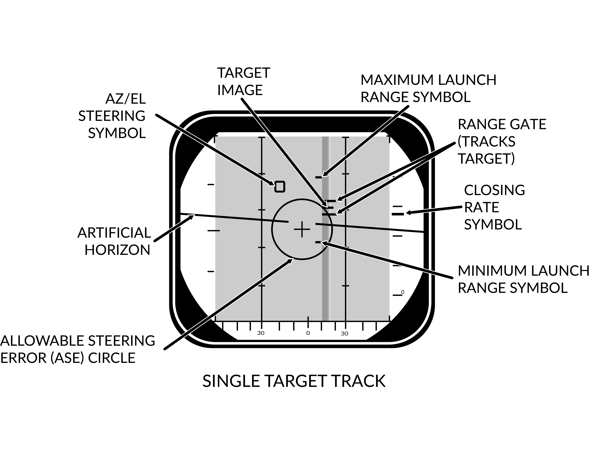
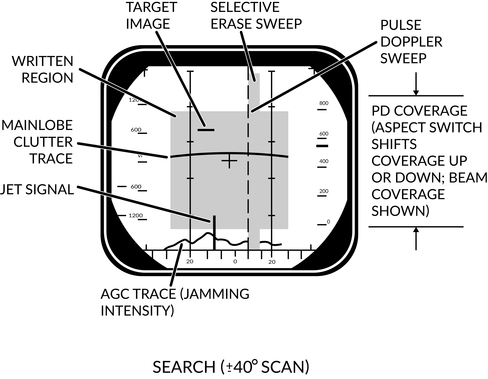
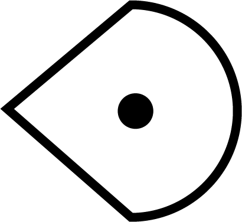
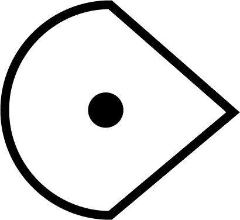
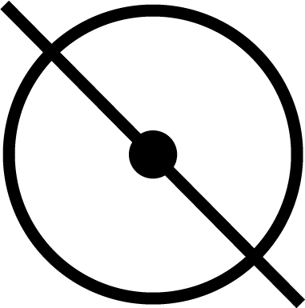
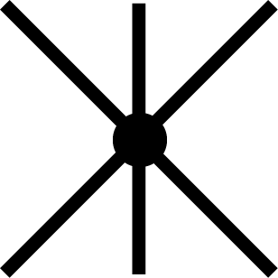
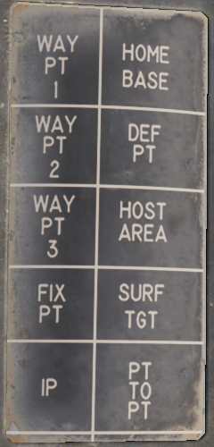
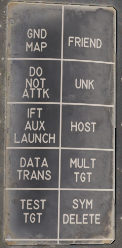

# Radar Interface

The AN/AWG-9 weapons control system (WCS) is an integrated system containing the F-14’s main sensors and computer providing detection, tracking, and engagement of targets in the air-to-air and air-to-ground roles.

## Detail Data Display (DDD) and Panel

The DDD is the main control panel and display for the radar part of the AN/AWG-9 system. It contains all the controls for the radar except the scan volume and stabilization controls which are on the sensor control panel.

### TGTS, MLC, AGC and PARAMP Switches

The upper left part of the DDD panel contains four switches (1-4) controling amplification, mainlobe clutter (MLC) suppression and target size parameters.

The TGTS (targets) switch selects expected target size which is used by the WCS to calculate missile launch zones and set parameters for target tracking in the radar. It also sets the range at which the missile ATC is sent, SMALL being 6NM, NORM 10NM and LARGE 13NM. The selected position of this switch might negatively affect target tracking and engagement if set incorrectly.

The MLC switch controls how the system supresses the MLC in the radar system while in pulse doppler mode. The OUT position disables the system while the IN position enables it. The AUTO position automatically enables the MLC filter if the antenna look-up angle is less than 3°.

The AGC switch controls the automatic gain control and is used in the pulse doppler modes to allow control of the time constant used for the AGC. Normally (NORM position) the AGC uses a longer time constant to calculate a mean value used for amplification. If the radar is operating in a jammed environment or heavy clutter is present the AGC can be set to use a faster time constant to mitigate these factors but this setting can also make the radar less sensitive to real targets.

The PARAMP, parametric amplifier switch allows for manual control of the parametric amplifier which is used to amplify weaker targets in all radar modes. Normally the WCS controls when to use the PARAMP depending on range but if tracking an unusually strong target it can be used to disable PARAMP to lessen the effect from background noise. If set to off manually it lessens the detection range by approximately 35%.

| Switch | Function |
|--------|----------|
| **TGTS (targets) switch** | Selects expected target size used by the WCS to calculate missile launch zones and set parameters for target tracking in the radar. Sets the range at which the missile ATC is sent: SMALL (6NM), NORM (10NM), LARGE (13NM). Incorrect setting might negatively affect target tracking and engagement. |
| **MLC switch** | Controls how the system suppresses the MLC in the radar system while in pulse doppler mode. OUT disables the system, IN enables it, and AUTO enables the MLC filter if the antenna look-up angle is less than 3°. |
| **AGC switch** | Controls the automatic gain control used in the pulse doppler modes. NORM uses a longer time constant for amplification; FAST is used in jammed or heavy clutter environments but can make the radar less sensitive to real targets. |
| **PARAMP (parametric amplifier) switch** | Allows manual control of the parametric amplifier to amplify weaker targets in all radar modes. Disabling PARAMP reduces detection range by approximately 35%. |

**Note**: AGC, PARAMP, and TGTS switches are currently not implemented.

### AWG-9 Range Selection and Tracking Indication

In the upper central part of the DDD panel are located the controls and indicators for setting the radar range in the search modes. Below these are also present the indicators for radar tracking while in the single target track (STT) modes.

The six round buttons (8), which are labelled 5, 10, 20, 50, 100 and 200, are used to set desired radar range in pulse modes and IFF range, they also set the scale on the pilot target range displays. The buttons are mutually exclusive as only one range can be selected at a time. In pulse search this setting affects the PRF of the radar and the scale on the DDD and if set to 20nm or greater range it also enables pulse compression.

The range display drum (7) indicates currently displayed scale on the DDD for the pulse modes and is blank when using pulse-doppler. It can also show ±10 for when using the IFF interrogator in the STT modes.

Below these are the four radar track indicator lights which are used to indicate how the radar tracks the target in STT.

- **ANT TRK**: Indicates the radar is tracking the target angle (azimuth and elevation).
- **RDROT**: Indicates the target is in the range or rate gate.
- **JAT**: Indicates the antenna is tracking a jamming source’s angle.
- **IROT**: Indicates target angle tracking via TCS.

### IR AUDIO Controls

The IR AUDIO controls (10-12) in the upper right part of the DDD panel were used with the original IR-sensor and are non-functional in modelled F-14 versions.

## Radar and Missile Frequency Selectors

The thumbwheels in the upper rightmost part of the DDD panel are used to control the AN/AWG-9 radar emitter’s frequency (13) and the missile control channel used with the AIM-7 and AIM-54 (14). Adjustment of these might be needed to avoid interference from other AN/AWG-9 equipped aircraft or other external sources. The WCS reads the missile channel for the AIM-7 as the missiles are prepared as they need to be tuned and changing the channel after this will not affect a change unless the preparation sequence is restarted.

> **Note**: Non-functional in DCS currently.

### Radar Mode Selectors

In the lower right part of the DDD panel are located the controls for display mode and radar mode and its indicator drum. The display mode buttons (15) selects what mode is currently selected for display on the DDD. The RDR, radar, mode is the normally selected mode. The IR mode is non-functional as the IR system is not installed. The IFF button enables the IFF interrogator in one of its two operational modes, for more detail see the IFF section in the General design and systems overview chapter.

The radar mode buttons (16) selects the operational mode of the AN/AWG-9 radar. The two STT buttons, pulse-doppler single target track (PD STT) and pulse single target track (P STT), enables selection of an STT mode if available and relevant. These are used to automatically attempt an STT lockon onto a hooked TID target or to transfer between these two STT modes. The pulse doppler search button (PD SRCH) selects the PD SEARCH mode of the radar. The range-while-search button (RWS) selects the RWS mode of the radar. The two track-while-scan buttons (TWS AUTO and TWS MAN) selects their respective TWS modes for use in the radar. The pulse search button (PULSE SRCH) selects the pulse search mode of the radar.

The indicator drum (17) shows currently selected radar mode. Apart from TWS MAN, TWS AUTO, RWS which refers to their respective modes it can also show MRL (manual rapid lockon), A-G (air-to-ground), VSL (vertical scan lockon), OPTTRK (TCS track), PLM (pilot lockon mode), PULSE (for both pulse search and pulse STT), PD (for both pulse dopple search and PD STT) and PAL (pilot automatic lockon mode).

| Button | Function |
|--------|----------|
| **Display mode buttons (15)** | RDR, radar, mode is normally selected.    IR mode is non-functional as the IR system is not installed.    IFF button enables the IFF interrogator in one of its two operational modes. |
| **Radar mode buttons (16)** | STT buttons:    **PD-STT** (Pulse-Doppler STT) and **P-STT** (Pulse STT).   Search buttons:   PD SRCH (pulse doppler search),   RWS (range-while-search)  TWS AUTO and TWS MAN (track-while-scan)  PULSE SRCH (pulse search). |

**Indicator drum (17)**:
- Shows currently selected radar mode: TWS MAN, TWS AUTO, RWS, MRL (manual rapid lockon), A-G (air-to-ground), VSL (vertical scan lockon), OPTTRK (TCS track), PLM (pilot lockon mode), PULSE (pulse search and pulse STT), PD (pulse doppler search and PD STT), and PAL (pilot automatic lockon mode).

### Aspect and Vc Switches

On opposite sides of the DDD itself are located the ASPECT and VC switches. The Vc switch (18) controls the rate scale on the DDD in the pulse doppler search modes. X-4 sets the scale to 800 knots opening to 4,000 knots closing, NORM sets the scale to 200 knots opening to 1,000 knots closing and VID sets the scale to 50 knots opening to 250 knots closing.

The ASPECT switch (21) controls two different things depending on radar mode. In the pulse doppler search modes it controls the rate processing windows of the radar, NOSE sets 600 knots opening to 1,800 knots closing, BEAM sets 1,200 knots closing to 1,200 knots opening and TAIL sets 1,800 knots opening to 600 knots closing. In the short pulse STT modes the switch sets the system tracking mode to the corresponding echo edge or centroid to counteract countermeasures like chaff and specific jammer modes.

### Elevation Indicator

The elevation indicator scale, EL, (22) is used to indicate the sensor elevations. The left (RDR) needle indicates current actual radar elevation. This indicator will move with the antenna in the radar search modes.

If the HCU is set to RDR the right (IR/TV/EC) needle indicates the currently set elevation center of the antenna scan pattern. This is usefull in STT as it enables the RIO to set the antenna elevation center to use when you eventually revert to search.

If the HCU is set to IR/TV the right needle instead displays current TCS elevation.

### Counter-Countermeasure Mode Controls

In the lower leftmost corner are located the three counter-countermeasure mode buttons. These controls functionality to counter different jammers affecting the system. (Not currently implemented)

### Radar and DDD Control Knobs

Spread out on the DDD panel are eight different knobs controlling differing functions on the DDD and radar. On the upper left side of the DDD is located the PULSE VIDEO control knob (5) which controls the video intensity on the DDD for the pulse modes. It affects only the DDD display, not the radar itself.

On the upper right side of the DDD is located the BRIGHT control knob (9) which adjusts a polarized filter which allows for mechanical control of the brightness of the DDD, mainly used in low light conditions.

On the lower left side of the DDD is located the PULSE GAIN control knob (20) which controls the radar gain in the pulse modes. This control affects the gain of the radar directly. Normally left in the detent at the fully clockwise position which allows the WCS to control it automatically.

On the lower right side of the DDD is located the ERASE control knob (19) which controls the strength of the erase beam on the DDD. The erase beam is what erases the indications continually on the DDD and thus affects how long the after-image of the detected targets will remain.

On the left side of the DDD panel are located the PD THRLD (26), JAM/JET (24) and ACM THRLD (25) control knobs. The pulse-doppler threshold knobs (PD THRLD) controls the threshold at which an echo is regarded as a contact, displayed on the DDD and tracked on the TID in RWS and TWS. The CLEAR knob controls the clear region threshold (upper half of the DDD) and the CLUTTER knob controls the clutter region (lower half of the DDD). Normally left in the clockwise NORM detents, letting the WCS automatically control them.

The JAM/JET control knob selects the threshold of what jamming intensity signal strength is needed to regard an emitter as a jammer and make it indicate a jammer strobe on the TID. The ACM THRLD sets the threshold for what to regard as a target at ACM ranges. Normally left in the counter-clockwise detent, letting the WCS automatically control it.

| Knob | Function |
|------|----------|
| **PULSE VIDEO (5)** | Controls video intensity for pulse modes. |
| **BRIGHT (9)** | Adjusts brightness of the DDD. |
| **PULSE GAIN (20)** | Controls radar gain in pulse modes. |
| **ERASE (19)** | Controls the strength of the erase beam on the DDD. |
| **PD THRLD (26)** | Controls threshold for echo as contact in pulse-doppler modes. |
| **JAM/JET (24)** | Sets jamming intensity signal threshold. |
| **ACM THRLD (25)** | Sets threshold for target at ACM ranges. |

>**Note**: JAM/JET and ACM THRLD not currently implemented in DCS.

## Detail Data Display

| Mode           | Search                     | STT                      |
|----------------|----------------------------|--------------------------|
| **Pulse**      |  |  |
| **Pulse-Doppler** |  |  |

The DDD screen itself shows either only radar return data or radar returns combined with symbology depending on radar mode.

In the pulse search mode the display shows only radar returns and the a visual representation of the radar sweep and erase sweep. The screen shows range vs azimuth in this mode. In pulse doppler modes the AGC TRACE is added on the bottom showing supposed jamming intensity of the detected targets. The screen shows rate vs azimuth in these modes.

In the two STT modes the display shows, in addition to the return from the target, the tracking gates (either range or range rate gate), a closing rate indication on the right side and the attack symbology if in air-to-air mode and a missile is selected.

In pulse STT the target is displayed at the correct azimuth and range while in pulse doppler STT the target is shifted to the left side of the display and a generated target symbol is at the correct azimuth instead. In pulse doppler STT the AGC TRACE is added as well to give an indication of jamming strength. For information about the attack symbology see the VDIG section.

> **Note**: AGC TRACE not yet implemented.

When the IFF interrogator is activated it superimposes the IFF information on top of the normal radar picture if in pulse search. In pulse doppler search the DDD switches to range vs azimuth at the previously set range scale while the IFF information is shown and in PD STT, if the target is hooked on the TID the DDD switches to a ±10 scale centered on the target while the IFF returns are shown.

## Tactical Information Display (TID) and Associated Controls

The TID is the main data display for the WCS. It displays a tactical picture to the RIO which is used to identify and select targets for the long range weapons on the F-14 Tomcat. Think of it as a top down map showing the relative coordinates of all presented tracks and symbols, but without a representation of the ground/surface features (map). It is also used in secondary roles as a display for entering data into the WCS, for navigation, for INS alignment and for the on board checkout, OBC.

### TID Display Control Knobs**:

On the upper edge of the TID are two display control knobs (2 & 4). The left one controls the contrast of the TCS display and the right one controls the overall brightness of the TID. Both settings will depend on user preference and ambient lighting.

### INS and Navigational Controls**:

On the upper left corner of the TID is the status display for the INS (1), used to indicate status of the INS and its alignment.

To the sides of the TID are located two selector knobs. The one on the left side (12) controls and selects the INS or AHRS mode to use. It also allows for INS alignment.

On the right side is the selector knob (6) controlling the source used when destination steering is selected by the pilot. Selects between the different waypoints stored in the WCS. MAN position is used only for aircraft with TARPS mounted.

Adjacent to this selector is a readout drum on the upper right edge of the TID (5). It’s used to indicate the type of steering information currently displayed to the pilot.

Possible steering type shown are: destination (DEST), data link command heading (D/L), azimuth lead collision steering (LD CLSN), collision steering (CLSN), lead pursuit steering (LD PURST), pursuit steering (PURST), TACAN radial (TACAN) and manually set commanded heading (MAN).

### TID Data Readout Drum

Above the TID is located the data readout indicator drum (3). It’s used to indicate the source of the data displayed on the TID text readouts. Possible readouts are: the different waypoints in the navigational system (WAY PT, ST, FIX PT, IP and HB), own aircraft (OWN A/C), first priority target (TGT 1) and SYMBOL.

Symbol indicates that the readout displays data for a hooked symbol on the TID which doesn’t have its own indicator text on the drum. The drum can also show a blank face to indicate the data source as one not having its own indicator text and which has no symbol on the TID.

### TRACK HOLD and CLSN buttons

Below the selector knobs on the sides of the TID are two buttons with indicator lights, one on each side. The lights illuminates green to indicate selection.

On the left side is the TRACK HOLD button (11) which enables the track hold function. Normally targets on the TID in TWS mode are retained 14 seconds after last observation. The track hold function extends this two 2 minutes for all tracks. If disabled it reverts to the standard 14 second period, whereafter the targets will be dropped if no new observations occur.

On the right side is the CLSN button (7) enabling collision steering to currently tracked target or centroid if in TWS. This selection overrides the current steering information presented to the pilot with the collision steering, only exception being if the pilot selects the ACM.

### TID Control Panel
Below the TID is the TID control panel (8). It contains 8 buttons selecting what symbology to show on the TID, these illuminates green when active. It also contains two selector knobs controlling display scale and TID mode. The buttons are:

| Control/Indicator | Function                                                                                                                                                                                                                       |
|-------------------|-------------------------------------------------------------------------------------------------------------------------------------------------------------------------------------------------------------------------------|
| RID DISABLE       | Not implemented.                                                                                                                                                                                                              |
| ALT NUM           | Altitude numerals, enables display of track altitudes on the left side of track symbols. Shows a single digit representing ten-thousands of feet, 1 as an example indicating an altitude of between 5 000 and 15 000 feet.     |
| SYM ELEM          | Symbology elements, enables display of all supplementary symbology of tracks and waypoints. If deselected all tracks and waypoints are represented only as dots on the TID.                                                   |
| DATA LINK         | Enables display of data link tracks.                                                                                                                                                                                          |
| JAM STROBE        | Enables display of jam strobes on the TID. Jamming targets exceeding the JAM/JET setting on the DDD are shown if enabled. Not yet implemented.                                                                                |
| NON-ATTK          | Non-attack, enables or disables display of targets which aren’t possible to engage. Friendly targets being an example.                                                                                                        |
| VEL VECTOR        | Velocity vector, enables display of velocity vectors on tracks.                                                                                                                                                              |
| LAUNCH ZONE       | Enables display of weapon launch zones depending on selected missile type. These replace the velocity vectors on relevant targets. This function is automatically enabled by the WCS 60 seconds prior to a target entering maximum launch range. |

### TID Data Readouts

| Indicator | Function |
|-----------|----------|
| **Buffer Register** | Shows data currently being entered into the WCS. |
| **Data Readouts** | Displays data from hooked tracks or own aircraft. |
| **Computer Run Indicators** | Shows WCS program cycles. |
| **Antenna Elevation** | Shows radar antenna elevation. |
| **Scan Pattern Limits** | Shows altitude limits of selected scan pattern. |
| **Navigation Status** | Shows status of the navigation system. |
| **Target Closing Rate** | Shows closing rate of STT or TWS hooked target. |
| **Selected Weapon** | Indicates selected air-to-air weapon. |

### TID Symbology

| Element                                             | Shape             | Function                                                                                                                                                                                                                                                                                                                                                                                                                            |
|-----------------------------------------------------|-------------------|-------------------------------------------------------------------------------------------------------------------------------------------------------------------------------------------------------------------------------------------------------------------------------------------------------------------------------------------------------------------------------------------------------------------------------------|
| **Center Dot**                                      |   | Marks coordinates of symbol, basic component of all symbols representing a coordinate.                                                                                                                                                                                                                                                                                                                                              |
| **Own Aircraft**                                    |   | Symbol representing own aircraft. Antenna scan limits, jamming strobes emanate from this symbol. Moves and has a velocity vector in ground stabilized mode. Stationary in aircraft stabilized and attack modes. If the symbol moves outside of TID presentation a line is drawn from the center of the display to the edge of the display indicating direction of the own aircraft symbol.                                             |
| **TID Cursor**                                      |  | Circle used as a hook cursor. Controlled by the HCU when in TID mode. Half-action on the HCU enables display of the symbol and also enables the HCU stick to move the cursor. The cursor location is set by stick deflection. Full-action on the HCU hooks (selects) the closest symbol if one is present within 0.125 inches of cursor center. The hooked symbol gets brighter to indicate hook.                                              |
| **TWS Steering Centroid**                           |  | Steering centroid of TWS tracks selected by WCS for weapons engagement.                                                                                                                                                                                                                                                                                                                                                             |
| **Unknown Onboard Sensor Target**                   |   | Unknown sensor track in RWS, TWS, and STT modes.                                                                                                                                                                                                                                                                                                                                                                                    |
| **Hostile Onboard Sensor Target**                   |   | Track in TWS and STT modes designated as hostile by RIO.                                                                                                                                                                                                                                                                                                                                                                            |
| **Friend Onboard Sensor Target**                    |   | Track in TWS and STT modes designated as friendly by RIO.                                                                                                                                                                                                                                                                                                                                                                           |
| **Angle-Tracked Radar Target**                      |   | Radar target tracked only in angle (jamming target).                                                                                                                                                                                                                                                                                                                                                                                |
| **Angle-Tracked Radar Target with Altitude Difference** |   | Radar target being tracked in angle only and range being computed by altitude difference ranging.                                                                                                                                                                                                                                                                                                                                   |
| **TCS-Angle Tracked Target**                        |  | Target being tracked in angle by TCS.                                                                                                                                                                                                                                                                                                                                                                                               |
| **TCS-Angle Tracked Target with Altitude Difference**   |  | Target being tracked in angle by TCS and range being computed by angle difference ranging.                                                                                                                                                                                                                                                                                                                                          |
| **Unknown Data Link Target**                        |  | Data link track identified as unknown by source.                                                                                                                                                                                                                                                                                                                                                                                    |
| **Hostile Data Link Target**                        |  | Data link track identified as hostile by source.                                                                                                                                                                                                                                                                                                                                                                                    |
| **Friend Data Link Target**                         |  | Data link track identified as friendly by source.                                                                                                                                                                                                                                                                                                                                                                                   |

| **Manually Entered Reference Points**               |                   |                                                                                                                                                                                                                                                                                                                                                                                             |
|-----------------------------------------------------|-------------------|---------------------------------------------------------------------------------------------------------------------------------------------------------------------------------------------------------------------------------------------------------------------------------------------------------------------------------------------------------------------------------------------|
| **Home base**                                       |  | Waypoint representing home base, carrier or airfield.                                                                                                                                                                                                                                                                                                                                                                               |
| **Waypoint**                                        |  | WCS navigational waypoint, supplanted by number indicating waypoint 1, 2 or 3.                                                                                                                                                                                                                                                                                                                                                      |
| **Defended Point**                                  |  | Waypoint used to show area to protect.                                                                                                                                                                                                                                                                                                                                                                                              |
| **Fixed Point**                                     |  | Generic fixed-point waypoint.                                                                                                                                                                                                                                                                                                                                                                                                       |
| **Hostile Area**                                    |  | Waypoint indicating a hostile area.                                                                                                                                                                                                                                                                                                                                                                                                 |
| **Surface Target**                                  |  | Waypoint indicating a surface target.                                                                                                                                                                                                                                                                                                                                                                                               |
| **IP**                                              |  | Waypoint used for air-to-ground engagement, see Computer Initial Point.                                                                                                                                                                                                                                                                                                                                                             |

| **Data Link Reference Points**                      |                   |                                                                                                                                                                                                                                                                                                                                                                                             |
|-----------------------------------------------------|-------------------|---------------------------------------------------------------------------------------------------------------------------------------------------------------------------------------------------------------------------------------------------------------------------------------------------------------------------------------------------------------------------------------------|
| **Home Base**                                       |  | Data link waypoint representing home base.                                                                                                                                                                                                                                                                                                                                                                                          |
| **Waypoint**                                        |  | Data link generic waypoint.                                                                                                                                                                                                                                                                                                                                                                                                         |
| **Data Link Fixed Point**                           |  | Data link waypoint representing a fixed point.                                                                                                                                                                                                                                                                                                                                                                                      |
| **Data Link Surface Target**                        |  | Data link waypoint representing a surface target.                                                                                                                                                                                                                                                                                                                                                                                   |

| **Position Symbol Modifiers**                       |                   |                                                                                                                                                                                                                                                                                                                                                                                             |
|-----------------------------------------------------|-------------------|---------------------------------------------------------------------------------------------------------------------------------------------------------------------------------------------------------------------------------------------------------------------------------------------------------------------------------------------------------------------------------------------|
| **Mandatory Attack**                                |  | Additional symbology on a TWS track (horizontal bar through center dot) selected as mandatory attack by the RIO. Only one target can be designated thusly and always receives an engagement priority number.                                                                                                                                                                                                                       |
| **Data link Destroy**                               |  | Additional symbology on a data link track (horizontal bar through center dot) designated to be destroyed by data link source. Does not affect target prioritization in WCS.                                                                                                                                                                                                                                                         |
| **Do Not Attack**                                   |  | Additional symbology on a TWS or data link track (vertical bar through center dot) designated as do not attack (by RIO) or disengage (via data link). If set by RIO removes target from WCS target prioritization.                                                                                                                                                                                                                   |
| **Multiple Targets**                                |  | Additional symbology on a TWS or data link track (horizontal bar on left side of symbol) indicating that the track represents multiple targets. Can be set manually by RIO or received via data link.                                                                                                                                                                                                                                |
| **Data Link Challenge**                             |  | Additional symbology on a data link track (small V with apex at center dot) representing data link command to visually identify target.                                                                                                                                                                                                                                                                                             |
| **Track Extrapolated**                              |  | Additional symbology on TWS or STT track (small X with center at center dot) indicating that no update to target has occurred within 8 seconds. Track will be deleted after 14 seconds or 2 minutes if track hold function is enabled.                                                                                                                                                                                              |
| **Hooked Symbol**                                   | Symbol brightens   | When a symbol is hooked by HCU or CAP functions it brightens to indicate hook.                                                                                                                                                                                                                                                                                                                                                      |
| **Target Under Missile Attack**                     | Symbol brightens   | In TWS and STT symbols of tracks being engaged by own aircraft brightens during computed missile flight time plus 15 seconds to indicate missile engagement in progress.                                                                                                                                                                                                                                                            |
| **Target in Optimum Missile Launch Zone**           | Symbol blinks      | In TWS and STT symbols, launch zones and firing order numerics of target tracks blink when time to optimum missile range is less than 8 seconds.                                                                                                                                                                                                                                                                                    |
| **Altitude Numerics**                               |  | When altitude numerics are selected for display a number on the left side of the tracks indicate track altitude to nearest ten thousands of feet. The number four as an example indicates an altitude between 35,000 and 45,000 feet. Available on radar and data link tracks.                                                                                                                                                       |
| **Firing Order Numerics**                           |  | Indicates AIM-54 phoenix target prioritization (1 to 6) in WCS when in the TWS mode. Next missile launch will target track with number 1 and remove the number from that track to advance the other 5 track numbers one step to prepare for next launch. Mandatory attack selection on a target forces the WCS to always include that target in the prioritization. Next launch selection automatically sets hooked target as number one. |
| **Time-to-Impact (TTI)**                            |  | After AIM-54 launch the firing order number on a track is replaced with the TTI or time-to-impact indication, showing WCS calculated time until missile intercepts the target track. When the AIM-54 active command is sent the TTI numbers flash to indicate this.                                                                                                                                                                   |
| **Velocity Vector**                                 |  | Velocity vector emanating from center dot of tracks when velocity vector display is selected. Vector direction represents track heading and length represents track speed so that the max indicated speed (1,800 knots) is 1.5 inches on the TID. In TID ground stabilized mode the vector direction represents track true heading and the vector length represents track ground speed.                                                 |
| **Launch Zone Vectors**                             |  |  TUMR (Time Until Minimum Range), TUOR (Time Until Optimum Range) and TUIR (Time Until In-Range/Maximum Range). The launch zone vectors are activated manually by the RIO or when time to maximum launch range is less than 60 seconds and replaces the normal track velocity vectors.                                                                                                                      |
| **Jamming Strobe**                                  |  | Line extending from own aircraft symbol to edge of TID to indicate a jammer exceeding the set JAM/JET threshold.                                                                                                                                                                                                                                                                                                                    |
| **Radar Antenna Scan Pattern Azimuth Limits**       |  | The limits of the radar scan pattern in azimuth is displayed as two dashed lines extending from own aircraft symbol. Each dash and space represent 20 nautical miles each in all radar modes. In STT the two lines converge to a single tracking strobe to indicate that the antenna tracks a single target.                                                                                                                                                                 |
| **Data Link Jamming Strobe**                        |  | Jamming strobe received via data link indicated by a line emanating from a data link point towards the jammers direction.                                                                                                                                                                                                                                                                                                           |
| **Data Link Pointer**                               |  | Brightened cursor (circle) around a data link track used to indicate data link operator concern about the specific track.                                                                                                                                                                                                                                                                                                           |
| **Data link Priority Kill**                         |  | Additional symbology on a data link track indicating a target that must be destroyed. Will not by itself affect WCS prioritization.                                                                                                                                                                                                                                                                                                 |
| **Artificial Horizon**                              |  | Artificial horizon on TID representing aircraft roll and pitch. Angle of the line represents roll and vertical deflection on display represents pitch.                                                                                                                                                                                                                                                                               |
| **Steering Guidance Symbol**                        |  | Symbol representing steering error from optimal missile launch direction. Should be placed by the pilot as near as possible to the center of the ASE circle and at launch should be inside of that same circle.                                                                                                                                                                                                                     |
| **Allowable Steering Error Circle**                 |  | ASE circle used to indicate the allowable steering error for missile launch. Size varies with attack geometry, mode and selected missile.                                                                                                                                                                                                                                                                                           |
| **Breakaway Indication**                            |  | Large cross appearing in the center of the TID when target range is less than minimum missile launch range or gun firing range.                                                                                                                                                                                                                                                                                                     |
> Note: Some of these symbols pertain to functions not yet implemented in DCS.

## Navigation Command and Control Grid (NAV GRID)

The Navigation Command and Control Grid or NAV GRID was designed to enable easy navigation and CAP control from a common fixed reference point. It enables TID readout of bearing and range from that set reference point, called YY. While NAV GRID is active displayed range and bearing on the TID for hooks and own aircraft is indicated relative YY. Additionally it also displays a grid extending from YY along a set threat axis. The purpose of the grid itself is to allow for quick position reference while a precise readout is available for a hooked target. This is where the name NAV GRID originates.

Lastly it also allows for display of something called Voice Codes. These are displayed for current hook alternating with the altitude readout on the TID if ALT NUM is selected for display. It indicates bearing from YY in tens (15 reading as 150 as an example) followed by a letter indicating range. A would indicate 0-50nm while B indicates 50-100nm and so on for consecutive letters.

The standard NAV GRID display mode is GND STAB and this allows for the grid itself to be visible. If A/C STAB or ATTK display modes are selected only the Voice Code display functionality is retained but it addition to the normal functionality the Ownship Symbol will always display its Voice Code.

As default the grid origin, YY, is positioned at the edge of the TID extending outwards along the set threat axis. The grid can be set to have between 1 and 6 sectors display, all being outlined meaning that the one sector display will have 2 lines delineating the limits and 6 having 7 lines. The size of the sectors depend on the total grid coverage, which can be up to 180 degrees, which is then divided into the selected number of sectors. Along the sector demarkation lines are drawn range indicator marks at 50nm intervals, the 50nm marks being shorter than the even 100nm markers.

The ground stab view as well as the grid can be offset as normal by the RIO via the HCU. To reset the offset, cycle to any aircraft stabilized mode and back to GND STAB.

While the original purpose of this functionality was intended for fleet defence use it works perfectly fine as a bulls-eye reference in DCS with YY set to the bulls-eye. The only real limitation being the grid only displaying along the threat axis and not all around.

## Operation

### **NAV GRID entry**:
| | | |
|--|--|--|
| 1. | Set the TID MODE knob to GND STAB. | |
| 2. | Select D/L category on the CAP CATEGORY knob. |  |
| 3. | Select the CAP MESSAGE button corresponding to NAV GRID. |  |
| 4. | Enter grid coverage angle using the ALT/4 button on the CAP. | Press CLEAR, ALT/4 and enter desired grid coverage angle followed by ENTER. |
| 5. | Enter numbers of grid sectors using the NBR/2 button on the CAP. | Press CLEAR, NBR/2 and enter desired numbers of sectors followed by ENTER. |
| 6. | Enter YY location using the LAT/1 and LONG/6 or RNG/5 and BRG/0 CAP buttons. | Press CLEAR, LAT/1 and enter desired latitude followed by ENTER. Repeat for longitude using LONG/6 or use RNG/5 and BRG/0 instead of both for YY location referenced from own aircraft position. |
| 7. | Enter the threat axis using the HDG/8 CAP button. | Press CLEAR, HDG/8 and enter desired threat axis extending from YY followed by ENTER. |

### **NAV GRID exit**:
- Deselect the CAP MESSAGE button corresponding to NAV GRID under the D/L category on the CAP.

### **NAV GRID in DCS**:
When hot spawning in DCS YY will be set to mission bulls-eye for your faction and threat axis will be set from YY to first valid waypoint in the following order: HA, DP, ST, FP, 3, 2, 1 and HB or own aircraft position at spawn if none of those waypoints are present.

When cold starting with Jester he has to be commanded to adjust these parameters via the Jester wheel. He can enter YY using the same methods available for waypoints as well as entering a waypoint’s location as YY.

With a human RIO he/she will have to enter it manually.

## Hand Control Unit (HCU)

### HCU Power Controls and Indicators

The controls on the HCU stick are: the action trigger switch (11), elevation vernier control (10), the OFFSET button (9) and the MRL button (8). The action trigger on the forward side of the stick has two detents, the half-action first detent and the full-action second detent. Half-action enables display of the cursor for the selected mode except when in TCS mode where it enables stick control of TCS elevation and azimuth. In the radar mode it additionally enables the super search acqusition mode in the radar (See chapter about radar transitional modes for more information). Full-action, when enabled tells the TCS to lockon to a target in the TCS mode if a target is present in its acquisition gates. In the radar mode it tells the radar to attempt lockon to a target in the radar range/rate gates at the set azimuth. In the DDD and TID modes it marks the current cursor position or, in the case of the TID mode, tries to hook a symbol if present within 0.125 inches on the display.

The elevation vernier control is a thumbwheel on the left side of the stick used in the TCS and radar modes to fine tune sensor elevation ±4° for target acquisition, this elevation deflection is added to the normal sensor elevation control. The OFFSET button on the top of the stick is used to offset any of the TID tactical displays, moving the own aircraft symbol to the TID cursor spot hook (if present) and the rest of the symbology relative to that. This function is reset and all the symbols are moved to the original positions by cycling the TID display mode selector to another mode and back. The MRL button on the right side of the stick is used to enable the manual rapid lockon mode (MRL) for target acquisition. See Manual Rapid Lockon (MRL) for more information.

The stick itself functions differently depending on selected HCU mode. In all cases the stick is only enabled with the action trigger depressed and all modes control sensor or cursor position absolutely meaning that a given deflection of the stick always moves the sensor or cursor to the same position. In the TCS mode X (up/down) controls TCS elevation and Y (left/right) controls TCS azimuth. In the radar mode X controls the range or rate of the radar acquisition gate on the DDD and Y controls the gate in azimuth in a similar fashion. In the two cursor modes X controls up/down of the cursor on the respective screen and Y controls left/right of the same.

- **IR/TV overtemp indicator (2)**, **power reset indicator (4)**, **WCS power indicator (6)**.
- **IR/TV switch (1)**: Controls power to the TCS.
- **WCS XMT switch (7)**: Controls power to the WCS computer system and displays.

### HCU Mode buttons

The four lighted buttons on the left side (12) of the HCU stick are the HCU mode buttons which illuminates green to indicate which one is active, they are mutually exclusive. The IR/TV button selects TCS mode, allowing the HCU stick and controls to control the TCS. The RDR button selects radar mode, allowing the HCU stick and controls to control the radar acquisition cursor on the DDD allowing for transition from radar search modes to STT. The DDD CURSOR button selects DDD cursor mode, allowing the HCU stick and controls to control the DDD cursor used to indicate ground coordinates when using the radar for ground mapping. This is used for radar navigational fixes or for selecting a position on the DDD radar display for use as a waypoint. The TID CURSOR button selects TID cursor mode, allowing the HCU stick and controls to control the TID cursor used to hook (select) symbology on the TID for symbology control and data readout.

- **IR/TV**: Selects TCS mode.
- **RDR**: Selects radar mode.
- **DDD CURSOR**: Selects DDD cursor mode.
- **TID CURSOR**: Selects TID cursor mode.

### HCU Control Stick

The controls on the HCU stick are: the action trigger switch (11), elevation vernier control (10), the OFFSET button (9) and the MRL button (8). The action trigger on the forward side of the stick has two detents, the half-action first detent and the full-action second detent. Half-action enables display of the cursor for the selected mode except when in TCS mode where it enables stick control of TCS elevation and azimuth. In the radar mode it additionally enables the super search acqusition mode in the radar (See chapter about radar transitional modes for more information). Full-action, when enabled tells the TCS to lockon to a target in the TCS mode if a target is present in its acquisition gates. In the radar mode it tells the radar to attempt lockon to a target in the radar range/rate gates at the set azimuth. In the DDD and TID modes it marks the current cursor position or, in the case of the TID mode, tries to hook a symbol if present within 0.125 inches on the display.

The elevation vernier control is a thumbwheel on the left side of the stick used in the TCS and radar modes to fine tune sensor elevation ±4° for target acquisition, this elevation deflection is added to the normal sensor elevation control. The OFFSET button on the top of the stick is used to offset any of the TID tactical displays, moving the own aircraft symbol to the TID cursor spot hook (if present) and the rest of the symbology relative to that. This function is reset and all the symbols are moved to the original positions by cycling the TID display mode selector to another mode and back. The MRL button on the right side of the stick is used to enable the manual rapid lockon mode (MRL) for target acquisition. See Manual Rapid Lockon (MRL) for more information.

The stick itself functions differently depending on selected HCU mode. In all cases the stick is only enabled with the action trigger depressed and all modes control sensor or cursor position absolutely meaning that a given deflection of the stick always moves the sensor or cursor to the same position. In the TCS mode X (up/down) controls TCS elevation and Y (left/right) controls TCS azimuth. In the radar mode X controls the range or rate of the radar acquisition gate on the DDD and Y controls the gate in azimuth in a similar fashion. In the two cursor modes X controls up/down of the cursor on the respective screen and Y controls left/right of the same.

**HCU Control Stick**:
- **Action trigger switch (11)**: Controls cursor display and super search acquisition mode.
- **Elevation vernier control (10)**: Fine tunes sensor elevation.
- **OFFSET button (9)**: Offsets TID tactical displays.
- **MRL button (8)**: Enables manual rapid lockon mode.

### Computer Address Panel (CAP)

The computer address panel (CAP) is the RIO’s main interface for controlling and entering/reading data into/from the WCS computer.

### Numeric Keypad (3):

The upper part of the CAP contains a numeric keypad with additional buttons for clearing input (CLEAR), entering input (ENTER) and two buttons for selecting S/W and N/E prefixes for coordinates. Some of the number keys has an additional function selecting a prefix for data display and/or entry. The keys containing functions and what those are:
| Key | Function |
| ---: | ----- |
| 1 | LAT - Latitude, selects latitude for display and entry. |
| 2 | NBR - Number, used for IFT and BITs. |
| 3 | SPD - Speed, selects speed for display and entry. |
| 4 | ALT - Altitude, selects altitude for display and entry. |
| 5 | RNG - Range, selects range for display and entry. |
| 6 | LONG - Longitude, selects longitude for display and entry. |
| 8 | HDG - Heading, selects heading for display and entry. |
| 0 | BRG - Bearing, selects bearing for display and entry. |

## CAP Message Matrix Indicator Drum and buttons

The middle/lower part of the panel contains the message buttons and indicator drum and its CATEGORY selector knob. Its functionality is somewhat akin to the buttons on a MFD in a more modern system except that instead of a screen the drum is used to display the current functionality of the buttons.

The current functionality of the buttons are chosen by selecting a category on the CATEGORY selector knob, movement of the selector turns the display drum to indicate selected category’s button functionality. When a function or symbol hook is in use the corresponding message button illuminates to indicate activation.

The matrixes and corresponding functionality of the different categories are as follows:

### BIT (Built in Test)

|  | The BIT category contains message button functions pertaining to BIT initiation of different aircraft systems. These might be functions normally run during OBC during startup or separate tests only available from here.    This will be detailed in a separate chapter about on board tests and BIT when implemented, not currently implemented in this simulation. |
|------------------------|--------------------------------------------------------------------------------------------------------------------------------------------------------------------------------------------------------------------------------------------------------------------------------------------------------------------------------------------------------------------------|

### SPL (Special)

|  | The SPL category contains various message button functions not contained under the other categories. Currently only the IP TO TGT function is implemented and used for the Computer Initial Point air to ground mode, see Computer Initial Point.    It also contains a button for manually initiating the OBC routine (OBC BIT), a button for displaying latest OBC results (MAINT DISP) and a button for clearing the latest OBC results (OBC DISPL). These and the other functions are not yet implemented. |
|------------------------|--------------------------------------------------------------------------------------------------------------------------------------------------------------------------------------------------------------------------------------------------------------------------------------------------------------------------------------------------------------------------|

### NAV (Navigation)

|  | The NAV category contains message button functions used for navigational fixes and updating data used by for INS operation and alignment.    The OWN A/C (own aircraft) button selects own aircraft for data readout and entry, the same as hooking the own aircraft symbol on the TID. Its used to enter data critical for INS alignment like aircraft coordinates and altitude (and heading and speed if on a moving carrier) and can also be used for readout of the various data available about own aircraft.    The STORED HDG ALIGN button is used to store and indicate if a stored heading align is available. It also allows deselection of the function resulting in a normal alignment.    The WIND SPD HDG button selects entry and display of wind data, can also be used to enter wind speed and heading manually for backup navigation.    The MAG VAR (HDG) button is used to display and enter magnetic variation used by the navigational system.    The four FIX buttons, TACAN FIX, RDR FIX (radar), VIS FIX (visual) and FIX ENABLE are used to update aircraft position to correct for INS drift. Basic function is the selection of type of fix followed by FIX ENABLE to enter it into the system. Full procedures for these fixes can be found in the navigational section in this chapter.    The two TARPS buttons are non-functional in a non TARPS aircraft. |
|------------------------|--------------------------------------------------------------------------------------------------------------------------------------------------------------------------------------------------------------------------------------------------------------------------------------------------------------------------------------------------------------------------|

### TAC DATA (Tactical Data)

|  | The TAC DATA category contains message button functionality allowing for hook/selection of the different waypoints available in the WCS navigational system. The same hook can be made via HCU hook on the TID. Hooking the waypoints enables them to be updated via the CAP keypad.    The PT TO PT button is non-functional. |
|---------------------------------|----------------------------------------------------------------------------------------------------------------------------------------------------------------------------------------------------------------------------------------------------------------------------------------------------------|

### DATA LINK

|  | The DATA LINK category contains message button functionality for RIO data link responses to data link controller commands. The WILCO (will comply), CANTCO (can not comply) tells the controller if own aircraft can or can not comply to a command. POINT enables the RIO to mark a hooked track sent to the controller for special attention. ENGAGE likewise indicates own intention to engage a hooked track.    The NAV GRID button enables the NAV GRID functionality on the TID, see Navigation Command and Control Grid (NAV GRID).    The TID AVIA button enables the AVIA display on the TID. Not yet implemented.    The F/F NAV UPDATE allows for Link-4C fighter to fighter navigational updates. See the navigation chapter.    Remaining buttons are non-functional. |
|----------------------------|----------------------------------------------------------------------------------------------------------------------------------------------------------------------------------------------------------------------------------------------------------------------------------------------------------|

### TARGET DATA

|  | The TARGET DATA category contains message button functionality used to modify hooked track symbols. The FRIEND, UNK (Unknown), HOST (Hostile) and MULT TGT (Multiple Target) message functions are used to mark a hooked symbol as the respective category (multiple target can be set in addition to the other three).    The DO NOT ATTK button sets a target as a do not attack target, removing it from the WCS firing order.    The DATA TRANS (Data Transfer) function enables a hooked jam strobe to be correlated with another hooked track symbol. This is used to allow the WCS to better use both data sources to track the target. The strobe needs to be hooked before the symbol. Currently not implemented.    TEST TGT (Test Target) calls up a simulated test target in the WCS for test purposes. Currently not implemented.    The SYM DELETE (Symbol Delete) allows the RIO to manually drop/remove a track or waypoint from the TID if no longer relevant. Own aircraft and data link track symbols can not be removed.    IFT AUX LAUNCH and GND MAP are non-functional. |
|-----------------------------|----------------------------------------------------------------------------------------------------------------------------------------------------------------------------------------------------------------------------------------------------------------------------------------------------------|

### Program Restart Button

Below the message readout and buttons are two final buttons on the panel. The PRGM RESTRT (Program Restart) button resets the currently running program in case of a computer hang-up. A computer hang-up is indicated when the computer run indicator digits on the TID stops cycling. The last button is the TUNE DSBL button which is non-functional in this F-14 version.

### Data Readout/Entry Procedure
- Selection of symbol/function -> Prefix selection for display -> Data entry.

Data readout and entry on the TID always follows the following sequence: Selection of symbol/function -> Prefix selection for display -> Data entry.

Selection of desired symbol or function can be achieved either via TID hook or via the CAP MESSAGE buttons available under the different categories on the CAP DRUM.

Most data readout prefixes displays multiple readouts, as an example calling up either latitude and longitude shows both and calling up range also displays bearing and vice versa but the selected prefix is the one used for data entry.

To select another prefix for data readout without reselecting the message function the CLEAR key on the CAP is used, this resets the readout and allows for selection of a new prefix. As it’s possible that depression of a prefix button is read as a data entry if a prefix is already selected it’s normally recommended to reset using CLEAR before reselecting a new prefix. This makes the recommended sequence: Selection of symbol/function -> CLEAR -> Prefix selection for display -> Data entry.

To enter new data into selected prefix the RIO enters desired data after the prefix selection, checks it is correct and then enters it with the ENTER key. The TID readout is then updated with the new data. To clear the data without entering it, instead use the CLEAR key.

## Sensor Control Panel

The sensor control panel contains the main controls for the AN/AWG-9 radar antenna scan patterns. It also contains various TCS controls, a control allowing the RIO to slave the radar to the TCS and vice versa and controls for the airborne video tape recorder (AVTR).

### Antenna Search Pattern Selection

The upper half of panel contains controls for the radar antenna scan pattern. The STAB (stabilization) switch controls whether the radar antenna scan pattern is stabilized relative to the horizon (IN) or not. If in OUT instead meaning that the scan pattern is relative to the F-14 aircraft armament datum line (ADL). The WCS computer can override this setting if necessary. The AZ CTR (azimuth control) and EL CTR (elevation control) knobs sets the elevation and azimuth centerpoint of the antenna scan pattern. The azimuth control moves the azimuth scan center within 65° degrees of the aircraft centerline, this is disabled if azimuth scan width is set to ±65° as it already scans the whole available azimuth range. Do not move the scan pattern so that it scans outside of 65° from aircraft centerline as this might damage the antenna as it might hit the antenna azimuth stops. The elevation control moves the elevation position of the bottom bar of the elevation scan pattern relative to zero elevation. It can move from -76° to +54°. Both control knobs have marked centerpoints, being aircraft centerline and zero elevation respectively.

The AZ SCAN (azimuth scan) and EL BARS (elevation bars) selector knobs controls the size of the antenna scan pattern. The AZ SCAN selector knob has four settings, ±10°, ±20°, ±40° and ±65°. The EL BARS selector knob also has four settings, 1, 2, 4 or 8 bars. 1 bar being 2.3°, 2 bars 3.6°, 4 bars 6.3° and 8 bars 11.5°. The reason for the elevation coverage not equalling one bar times the number of bars being that the bars overlap slightly.

The last radar control on the panel is the VSL switch. Momentary selection of VSL HIGH or LOW activates the vertical scan lockon acquisition mode (VSL). (See Vertical Scan Lockon (VSL))

### TCS Controls

On the right side of the panel the SLAVE switch controls which sensor is slaved to the other or none slaved at all. In the center position the sensors move individually from each other. In RDR the radar is slaved to the TCS line of sight while a TCS track is present. In TCS the TCS is slaved to the radar line of sight if a an STT or JAT exists. Both modes can be used to allow a sensor to guide a sensor to lock onto whatever the other sensor is currently tracking.

The TCS TRIM knobs controls TCS calibration in azimuth (AZ) and elevation (EL). This is used to calibrate the TCS line of sight to be equal to the radar line of sight. Normally this is done by locking a target in STT, setting slave to TCS and then fine-tuning the calibration knobs until the TCS looks directly at the locked target.

The last two switches controlling the TCS are the ACQ (acquisition) and FOV (field of view) switches. The ACQ switch controls how the TCS locks onto targets. AUTO SRCH means the TCS will move by itself in a limited search pattern trying to find a target. MAN (manual) means the TCS only locks onto targets if commanded to by the HCU in TCS mode and AUTO means the TCS automatically tries to lock onto targets entering its field of view. The FOV switch sets whether the WIDE or NAR (narrow) field of view is used by the TCS.

The lower part of the panel contains controls for the airborne video tape recorder (AVTR) controlling and indicating power mode and time remaining on tape. This is currently not modelled in DCS.

