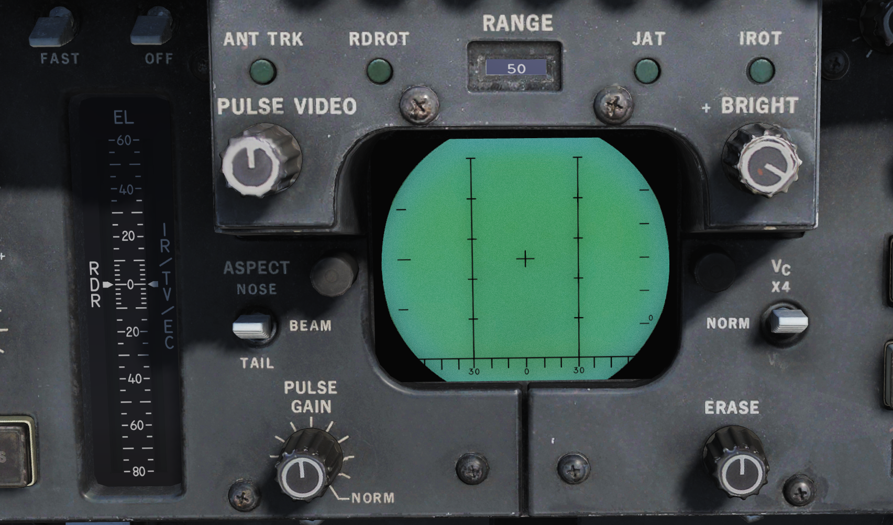
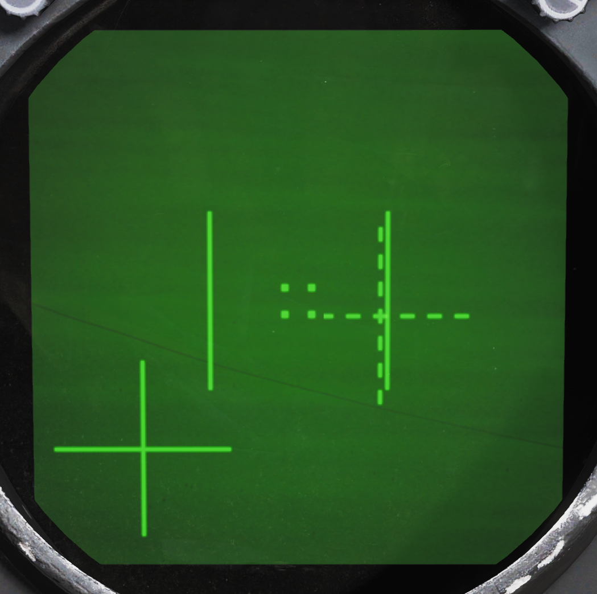

# AN/AXX-1 TCS General Operation

*U.S. Navy photo by Photographer’s Mate Airman Justin S. Osborne. (030418-N-0382O-591)*

The television camera set, or TCS, was constructed as a replacement for the IRST which was present in the first F-14As produced. When the IRST was found to have insufficient capability it was decided to replace it with the TCS giving the F-14 a long range visual identification capability.

The TCS is located underneath and behind the radar radome, just in front of the nose gear well. It contains an aircraft stabilized high resolution (for its time) closed circuit television camera. The sensor has two fields of view (FOV), narrow (NFOV) which is 0.44° or 10X magnification and wide (WFOV) which is 1.42° or 4X magnification. The gimbal limits are +/- 15° except upwards which is limited to +11° and the TCS is capable of independent contrast lock or being slaved to the AN/AWG-9 radar.

The TCS is controlled by the RIO using the sensor control panel, DDD, TID and the HCU. Video from the sensor can be displayed on the TID and the VDI in the front seat. Also, the video can be recorded using the airborne video tape recorder for later review. (Not currently implemented in DCS.)

## TCS Controls and Symbology

The controls for the TCS are located in the RIO cockpit at the sensor control panel, the DDD and the HCU/TID. The pilot display control panel contains a switch allowing display of TCS video on the VDI.

### Sensor Control Panel

The controls on the sensor control panel for the TCS are; the TCS trim knobs, the SLAVE switch, the field of view, FOV, switch and the acquire, ACQ, switch.

The TCS TRIM knobs control TCS sensor line of sight, LOS, calibration relative to the AN/AWG-9 radar LOS. If needed these can be used to trim the TCS so that the two sensors LOS correlate. They have a ±2° range of motion and the easiest way to check and calibrate the TCS is to lock up a friendly target in STT and adjust the knobs until the TCS LOS is correctly aimed at the locked target.

The SLAVE switch controls which sensor is controlled by the other. If set to RDR the radar is slaved to the TCS as long as an optical track exists. If set to INDEP each sensor operates independently of the other. And if set to TCS the TCS is slaved to radar LOS as long as an STT track exists.

The FOV, field of view switch controls what FOV is used in the TCS. WIDE sets the 1.42°, 4X magnification FOV and NAR sets the narrow 0.44°, 10X magnification FOV.

Lastly the ACQ, acquire switch controls the acquisition mode in use in the TCS. AUTO SRCH enables an automatic acquisition mode with a search pattern, enabling acquisition of the closest target even if outside current FOV. MAN selects purely manual acquisition with the HCU where the target needs to be pointed at directly. AUTO sets an automatic acquisition mode without a search pattern making the TCS snap to a target as long as it’s inside the TCS FOV.

### DDD

The DDD contains two indicators pertaining to the TCS.

The DDD EL meter shows current elevation of the TCS sensor LOS as long as the IR/TV mode is selected on the HCU.

The IROT light indicates the presence of a TCS track. The IROT acronym is inherited from the IRST which the TCS replaced.

### HCU/TID

The HCU contains the power switch and indicator for the TCS as well as a button enabling selection for using the HCU to control the TCS while the TID itself has a control knob enabling display of the TCS video on the TID as well as a brightness and contrast control for the video on the TID.

The IR/TV power switch is located on the top left corner on the HCU panel and controls power to the TCS. OFF disables all power to the TCS. STBY enables power to the cooling fans and heaters in the TCS. IR/TV supplies power to all systems in the TCS, allow 1-2 minutes for the TCS to spin up and deliver video. TCS symbology on the TID on the other hand will be available directly. There is also no need to select the STBY position first, setting the switch to IR/TV directly works fine.

The indication light next to the power switch indicates a TCS over temperature condition is lit. If present the TCS should be powered off to prevent damage to the system.

The IR/TV button next to the HCU stick enables HCU stick control of the TCS sensor, half-action to manually control sensor LOS and full-action to command target acquisition.

On the TID display control the TID MODE switch set to TV enables display of the TCS video on the TID. Note that this disables the TID repeat on the HSD.

Finally, the CONTRAST and BRIGHTNESS knobs on the upper part of the TID can be used to control the TCS video shown on the TID.

### Symbology

On the TID in non TV mode, a TCS track is indicated by a 1.5” strobe at TCS LOS azimuth with a hollow circle at the end.

The symbology on the video feed from the TCS has indicators for the FOV and two crosshairs indicating TCS LOS relative own aircraft, GACH, and AN/AWG-9 radar LOS relative TCS LOS, RACH. Additionally, the track window is indicated by 4 small squares representing each corner of that window.

The field of view lines are shown when in the wide FOV indicating the size of the area visible when switching to the narrow FOV. They consist of two parallel lines together creating the sides of an imaginary box indicating the narrow FOV size.

The gimbal angle crosshairs or GACH, which is a solid cross, indicate deflection of the TCS LOS from the aircraft datum line, ADL. GACH crosshair in center indicates TCS LOS along ADL and deflection towards the edges indicate deflection towards the gimbal limits with the video edges being maximum deflection.

RACH or radar angle crosshairs, a dashed crosshair, indicate radar antenna LOS when inside the current TCS FOV. When the sensors are slaved to one another RACH and GACH will coincide creating a single solid crosshair.

The track window indicates the area that the TCS contrast tracker is currently locked on to if it has acquired a target. When not in an active track these squares collapse into the center of the display being 2% of the screen width when in manual mode and 5% when in an auto mode.

## TCS Operation

All acquisition modes of the TCS have in common that they can be controlled using the HCU in IR/TV mode. Selection of the IR/TV button on the HCU enables this mode and also sets the DDD EL meter (right indicator) to show current TCS sensor LOS elevation. Half-action enables the HCU to directly control the LOS of the TCS and full-action commands target acquisition using the selected acquisition mode.

For manual, MAN, TCS acquisition mode this means that the HCU must be used in half-action to position the tracking window indication over the target and then selecting full-action. If successfully acquired the track window will then expand to encompass the target and tracking will begin.

In automatic, AUTO acquisition mode half-action works the same but when selecting full-action for acquisition the TCS will instead automatically try to lock on to the target closest to the center in the current FOV. Automatic search, AUTO SRCH mode further enhances this by enabling a search pattern around the commanded FOV (by moving the sensor LOS) acquiring the first found target.

When using the TCS slave to radar option the two auto modes will automatically try to lock on to the STT target as soon as it exists and the TCS has been slewed to that target, enabling a fully automatic track of a target locked in STT. Additionally, as soon as a track is acquired from an STT lock the TCS will compare its own LOS to the radar LOS to check if the correct target has been locked, if the two LOS differ by more than a couple of degrees during a 3-second window a new acquisition will be attempted. The manual mode will also slave to radar LOS but will not lock on, instead just following the radar LOS.

To unlock a tracked target when not being slaved to radar, select half-action and release.

For information about RDR slaved to TCS check relevant header under AN/AWG-9 in this chapter.
